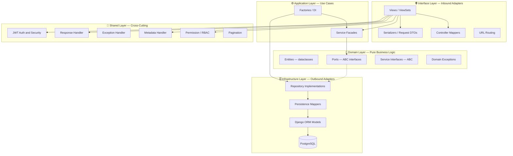
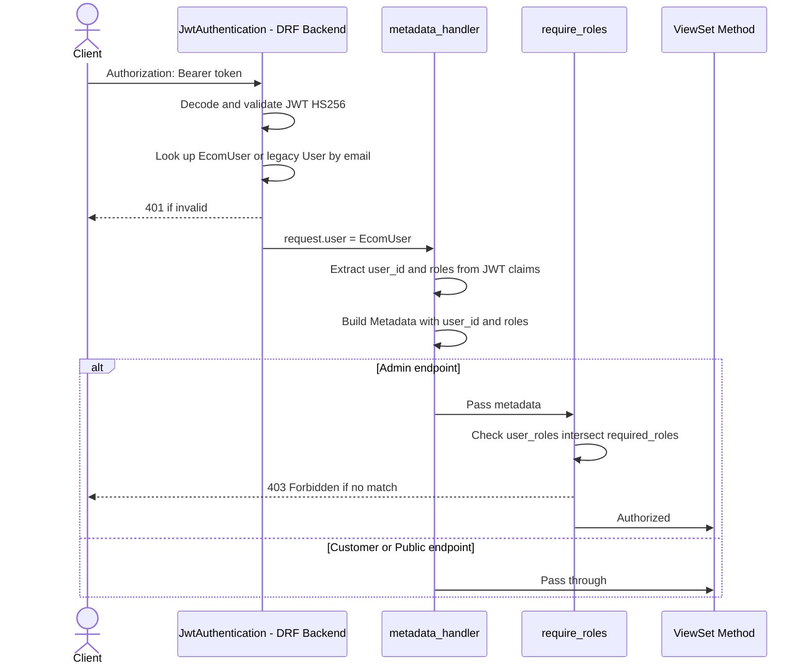

# 🏗️ SETEC eCommerce Service — Architecture Guide

> **Audience**: Developers (human & AI) working on this codebase.
> **Last Updated**: 2026-09-11

---

# 📌 TABLE OF CONTENTS

```
LEVEL 1: What is this project? .................. Line ~30
LEVEL 2: How does each feature work? ............ Line ~320
LEVEL 3: How should AI modify it? ............... Line ~900
```

---
---

# LEVEL 1 — WHAT IS THIS PROJECT?

---

## 1.1 — Project Summary

| Key | Value |
|---|---|
| **Name** | SETEC eCommerce Service |
| **Type** | REST API backend for a multi-store eCommerce platform |
| **Framework** | Django 5.0 + Django REST Framework 3.16 |
| **Architecture** | Hexagonal (Ports & Adapters) / Clean Architecture |
| **Database** | PostgreSQL (via `psycopg2-binary`) |
| **Auth** | Custom JWT (PyJWT + `HS256`) — access + refresh tokens |
| **File Storage** | Cloudinary (image uploads) |
| **Python** | 3.x with virtual environment (`.venv/`) |
| **API Versioning** | URL-based — `/api/v1/` |
| **Client** | Flutter mobile app (primary consumer) |

---

## 1.2 — Architecture Overview

This project follows **Hexagonal Architecture** (a.k.a. Ports & Adapters / Clean Architecture). The core principle is **dependency inversion** — business logic never depends on frameworks, databases, or HTTP. Dependencies flow **inward** toward the domain.



---

## 1.3 — Layer Breakdown

### 💎 Domain Layer (`domain/`)

> **The heart of the system.** Pure Python, zero framework imports.

| Sub-folder | Purpose | Convention |
|---|---|---|
| `entity/` | `@dataclass` value objects representing business concepts | One file per aggregate root (e.g., `product.py` may contain `Product`, `ProductImage`, `ProductVariant`) |
| `ports/` | Abstract Base Classes (`ABC`) defining repository contracts | Named `{Feature}RepositoryInterface` |
| `service/` | Abstract Base Classes defining service contracts | Named `{Feature}ServiceInterface` |
| `exception/` | Domain-specific business exceptions | Named `{Feature}Exception`, extending `BaseAPIException` with factory class methods (`.not_found()`, `.already_exists()`, etc.) |

**Key rule**: Domain entities are **framework-agnostic dataclasses**. They do NOT import Django, DRF, or ORM models.

---

### ⚙️ Application Layer (`application/`)

> **Use-case orchestration.** Implements domain service interfaces.

| Sub-folder | Purpose | Convention |
|---|---|---|
| `{feature}_service_facade.py` | Concrete implementation of `{Feature}ServiceInterface` — orchestrates repos, enforces business rules, maps to response dicts | Named `{Feature}ServiceFacade` |
| `factory/` | Factory functions that wire dependencies (DI without a container) | Named `{feature}_service_factory.py` — returns `{Feature}ServiceInterface` |

**Factory pattern** (manual Dependency Injection):
```python
# application/category/factory/category_service_factory.py
def category_service_factory() -> CategoryServiceInterface:
    repo = CategoryRepositoryInterfaceImpl()
    return CategoryServiceFacade(repo)
```

**Facade pattern**: Each facade receives repository port(s) via constructor injection and delegates to them. Some facades receive multiple repos (e.g., `CartServiceFacade` receives both `cart_repo` and `product_repo`).

---

### 🗄️ Infrastructure Layer (`infrastructure/`)

> **Outbound adapters.** Talks to the database via Django ORM.

Lives entirely under `infrastructure/persistence/`:

| Sub-folder | Purpose | Convention |
|---|---|---|
| `models/` | Django ORM model classes (the actual DB schema) | Named `{feature}_model.py`. Model class names match the domain concept (e.g., `Category`, `Product`). All models use UUID primary keys. |
| `repository/` | Concrete implementations of domain repository ports | Named `{Feature}RepositoryInterfaceImpl`. Queries ORM models, maps to/from domain entities via persistence mappers. |
| `mapper/` | Bidirectional mappers: ORM model to/from Domain entity | Named `{Feature}PersistenceMapper` with `from_entity(orm_model) -> domain_entity` and `to_model(domain_entity) -> orm_model` |
| `migrations/` | Standard Django migrations | Auto-generated |

**Soft delete pattern**: All major entities use `deleted_at` (nullable `DateTimeField`). Queries always filter `deleted_at__isnull=True`.

**Audit trail**: Models track `created_by`, `updated_by`, `deleted_by` (FK to `EcomUser`).

---

### 🌐 Interface Layer (`interface/`)

> **Inbound adapters.** HTTP entry points (REST API controllers).

| Sub-folder | Purpose | Convention |
|---|---|---|
| `view/` | DRF `ViewSet` classes — one per access level (e.g., `category_admin_view.py`, `category_public_view.py`) | Instantiate service via factory at class level. Each method is decorated with `@metadata_handler` and optionally `@require_roles`. |
| `serializer/request/` | DRF `Serializer` classes for request validation (input DTOs) | Named `{Feature}Request`, `{Feature}PartialRequest` |
| `serializer/response/` | `@dataclass` response DTOs (output shape) | Named `{Feature}Response` |
| `serializer/mapper/` | Controller mappers: validated request to domain entity, domain entity to response dict | Named `{Feature}ControllerMapper` with `from_request()` and `to_response()` |
| `url/` | Django URL routing files | Named `{feature}_url.py`, `{feature}_admin_url.py`, `{feature}_public_url.py` |

**View lifecycle** (every endpoint follows this):
1. `@metadata_handler` extracts JWT into `Metadata` object (user_id, roles)
2. `@require_roles("admin")` checks RBAC (if admin endpoint)
3. View validates request body with DRF serializer
4. View calls service facade method
5. View returns via `ResponseHandler.api_success(data)` / `.api_created()` / `.api_list()`

---

### 🔧 Shared Layer (`shared/`)

> **Cross-cutting concerns** used across all layers.

| Module | Purpose | Key Classes/Functions |
|---|---|---|
| `security/` | JWT generation, validation, extraction, authentication backend | `JwtUtil`, `JwtAuthentication`, `AuthException` |
| `metadata_handler/` | `@metadata_handler` decorator — extracts user identity from JWT into `Metadata` | `Metadata` dataclass, `metadata_handler()` decorator |
| `permission_handler/` | RBAC decorator — enforces role-based access | `@require_roles("admin")` |
| `responseutils/` | Standardized API response formatting | `ResponseHandler` with `.api_success()`, `.api_created()`, `.api_list()`, `.api_error()`, `.api_no_content()` |
| `exceptionalhandler/` | Global DRF exception handler + base exception class | `custom_exception_handler`, `BaseAPIException` |
| `pagination/` | Pagination query parsing utilities | `api_paging`, `page_number_util` |

---

## 1.4 — Project Structure (Full Tree)

```
setec_ecom_service/
|
+-- _config/                           # Django project settings
|   +-- settings.py                    # Main settings (DB, JWT, CORS, DRF config)
|   +-- urls.py                        # Root URL routing (all /api/v1/* routes)
|   +-- wsgi.py / asgi.py              # WSGI/ASGI entry points
|   +-- __init__.py
|
+-- domain/                            # CORE — Pure Python business logic
|   +-- address/                       #   +-- entity/ ports/ service/ exception/
|   +-- auth/                          #   +-- entity/ ports/ service/ exception/
|   +-- cart/                          #   +-- entity/ ports/ service/ exception/
|   +-- category/                      #   +-- entity/ ports/ service/ exception/
|   +-- conversation/                  #   +-- entity/ ports/ service/ exception/
|   +-- favorite/                      #   +-- entity/ ports/ service/ exception/
|   +-- legal_document/                #   +-- entity/ ports/ service/ exception/
|   +-- notification/                  #   +-- entity/ ports/ service/ exception/
|   +-- order/                         #   +-- entity/ ports/ service/ exception/
|   +-- product/                       #   +-- entity/ ports/ service/ exception/
|   +-- review/                        #   +-- entity/ ports/ service/ exception/
|   +-- search_history/                #   +-- entity/ ports/ service/ exception/
|   +-- shipment/                      #   +-- entity/ ports/ service/ exception/
|   +-- store/                         #   +-- entity/ ports/ service/ exception/
|   +-- support_ticket/                #   +-- entity/ ports/ service/ exception/
|   +-- tag/                           #   +-- entity/ ports/ service/ exception/
|   +-- upload/                        #   +-- entity/ ports/ service/ exception/
|   +-- user/                          #   +-- entity/ ports/ service/ exception/
|
+-- application/                       # USE CASES — Service facades + factories
|   +-- address/                       #   +-- {feature}_service_facade.py
|   +-- auth/                          #   +-- factory/
|   +-- cart/                          #       +-- {feature}_service_factory.py
|   +-- category/
|   +-- conversation/                  #   (Same pattern for every feature)
|   +-- favorite/
|   +-- home/                          #   Special: aggregates category + store + product
|   +-- legal_document/
|   +-- notification/
|   +-- order/
|   +-- product/
|   +-- review/
|   +-- search_history/
|   +-- shipment/
|   +-- store/
|   +-- support_ticket/
|   +-- tag/
|   +-- upload/
|   +-- user/
|
+-- infrastructure/                    # PERSISTENCE — Django ORM adapters
|   +-- persistence/
|       +-- models/                    #   Django ORM models (15+ model files)
|       +-- repository/                #   Port implementations (15+ repos)
|       +-- mapper/                    #   Persistence mappers (15+ mappers)
|       +-- migrations/                #   Django migrations
|       +-- management/                #   Custom management commands
|       +-- apps.py                    #   Django app config
|       +-- tests.py / tests_rbac.py   #   Test suites
|
+-- interface/                         # HTTP LAYER — DRF views + serializers
|   +-- address/                       #   +-- view/  (admin + public/customer views)
|   +-- auth/                          #   +-- serializer/
|   +-- cart/                          #       +-- request/   (DRF input serializers)
|   +-- category/                      #       +-- response/  (dataclass output DTOs)
|   +-- conversation/                  #       +-- mapper/    (controller mappers)
|   +-- favorite/                      #   +-- url/     (route definitions)
|   +-- home/
|   +-- legal_document/                #   (Same pattern for every feature)
|   +-- notification/
|   +-- order/
|   +-- product/
|   +-- review/
|   +-- search_history/
|   +-- shipment/
|   +-- store/
|   +-- support_ticket/
|   +-- tag/
|   +-- upload/
|   +-- user/
|
+-- shared/                            # CROSS-CUTTING CONCERNS
|   +-- security/                      #   JWT auth, token utils, auth views
|   +-- metadata_handler/              #   @metadata_handler decorator
|   +-- permission_handler/            #   @require_roles RBAC decorator
|   +-- responseutils/                 #   ResponseHandler (standard JSON envelope)
|   +-- exceptionalhandler/            #   Global exception handler + BaseAPIException
|   +-- pagination/                    #   Pagination utilities
|
+-- _impl/                             # INTERNAL DOCS — specs, SQL schema, plans
+-- manage.py                          # Django CLI entry point
+-- requirement.txt                    # Python dependencies
+-- openapi.yaml                       # OpenAPI 3.x specification
+-- frontend_integration_guide.md      # API integration guide for Flutter
+-- .env / .env.example                # Environment configuration
+-- .gitignore / LICENSE
```

---

## 1.5 — Dependency Rules

```
ALLOWED dependency directions:

  Interface  -->  Application  -->  Domain
  Interface  -->  Shared
  Application --> Domain
  Application --> Interface (controller mappers only — minor violation)
  Infrastructure --> Domain (implements ports)
  Infrastructure --> Shared (for exceptions)

FORBIDDEN dependencies:

  Domain  --X-->  Django / DRF / ORM / Infrastructure
  Domain  --X-->  Application
  Domain  --X-->  Interface
  Infrastructure --X--> Application
  Infrastructure --X--> Interface
```

> **Known Architectural Note**: The application facades currently import controller mappers from the interface layer (e.g., `CategoryServiceFacade` imports `CategoryControllerMapper`). This is a practical shortcut — the mapping could live in the application layer instead, but it works because the mapper only depends on domain entities and simple dataclasses.

---

## 1.6 — API Response Envelope

All API responses follow a standard envelope:

```json
{
  "data": { "..." },
  "meta": { "request_id": "...", "page": 1, "page_size": 20, "total": 100, "has_next": true },
  "errors": []
}
```

Error responses:
```json
{
  "data": null,
  "meta": { "request_id": "..." },
  "errors": [{ "code": "CATEGORY_NOT_FOUND", "message": "Category not found" }]
}
```

---

## 1.7 — Authentication and Authorization Flow



**JWT Claims** (`token_type: "ecom"`):
- `sub` — user email
- `user_id` — UUID string
- `role` — single or comma-separated roles (e.g., `"customer"` or `"customer,admin"`)
- `session_id` — UUID of active session
- `iat` / `exp` — timestamps

**Roles**: `customer`, `admin`

---

## 1.8 — URL Structure

| Route Prefix | Auth | Role | Purpose |
|---|---|---|---|
| `api/v1/public/*` | None | Guest | Read-only catalog (categories, stores, products, tags, reviews) |
| `api/v1/admin/*` | JWT | Admin | CRUD management for all resources |
| `api/v1/auth/*` | Varies | Any | Register, login, logout, refresh, password reset, verify |
| `api/v1/users/*` | JWT | Customer | Profile management |
| `api/v1/cart/*` | JWT | Customer | Shopping cart operations |
| `api/v1/orders/*` | JWT | Customer | Place, list, cancel orders |
| `api/v1/addresses/*` | JWT | Customer | Shipping address CRUD |
| `api/v1/favorites/*` | JWT | Customer | Wishlist toggle/list |
| `api/v1/conversations/*` | JWT | Customer | Chat/messaging |
| `api/v1/notifications/*` | JWT | Customer | Push notification list |
| `api/v1/support/*` | JWT | Customer | Support ticket management |
| `api/v1/shipments/*` | JWT | Customer | Track shipments |
| `api/v1/search-history/*` | JWT | Customer | Recent search terms |
| `api/v1/legal-documents/*` | JWT | Customer | Terms/privacy docs |
| `api/v1/uploads/*` | JWT | Customer | File/image uploads (Cloudinary) |
| `api/v1/home/*` | Optional JWT | Any | Home page aggregation |
| `api/v1/stores/*` | None | Guest | Legacy Flutter compatibility alias |
| `api/v1/products/*` | None | Guest | Legacy Flutter compatibility alias |
| `api/v1/categories/*` | None | Guest | Legacy Flutter compatibility alias |

---
---

# LEVEL 2 — HOW DOES EACH FEATURE WORK?

---

## 2.1 — Category Flow

**Domain Entity**: `Category` — hierarchical tree (self-referencing `parent_id`), supports nested categories with `children` list, soft-deletable.

**Endpoints**:
| Method | Route | Auth | Action |
|---|---|---|---|
| GET | `/api/v1/public/categories/` | None | List active root categories (supports `?parent_id=`) |
| GET | `/api/v1/public/categories/tree/` | None | Full active category tree |
| GET | `/api/v1/public/categories/{id}/` | None | Active category by UUID ID |
| GET | `/api/v1/public/categories/search/?slug={slug}` | None | Active category by slug (query param) |
| GET | `/api/v1/admin/categories/` | Admin | List all (incl. inactive, supports `?parent_id=`) |
| POST | `/api/v1/admin/categories/` | Admin | Create category |
| GET | `/api/v1/admin/categories/{id}/` | Admin | Get by UUID ID |
| GET | `/api/v1/admin/categories/search/?slug={slug}` | Admin | Get by slug (query param) |
| PUT | `/api/v1/admin/categories/{id}/` | Admin | Full update (UUID only) |
| PATCH | `/api/v1/admin/categories/{id}/` | Admin | Partial update (UUID only) |
| DELETE | `/api/v1/admin/categories/{id}/` | Admin | Soft delete (UUID only) |

**Request Flow (Create)**:
```
CategoryAdminView.create()
  -> @metadata_handler extracts user_id
  -> @require_roles("admin")
  -> CategoryRequest serializer validates body
  -> category_service.create(validated_data, actor_id)
    -> CategoryServiceFacade.create()
      -> repo.exists_by_slug() — uniqueness check
      -> repo.get_by_id(parent_id) — validate parent exists
      -> CategoryControllerMapper.from_request() -> Category entity
      -> repo.create(category, actor_id)
        -> CategoryPersistenceMapper.to_model() -> ORM model
        -> model.save() -> DB INSERT
        -> CategoryPersistenceMapper.from_entity() -> Category entity
      -> CategoryControllerMapper.to_response() -> dict
  -> ResponseHandler.api_created(result)
```

**Business Rules**:
- **Path vs Query Parameter Convention**:
  - UUID is the **only** permitted path parameter (`{id}`). Slug is **never** used as a path parameter.
  - Slug lookups are strictly query parameter-based (`/search/?slug={slug}`) for `GET` operations only.
  - Slug does not support write operations; `PUT`, `PATCH`, and `DELETE` strictly accept UUID path parameters.
- Slug must be unique across all non-deleted categories
- Parent category must exist if `parent_id` is provided
- Category cannot be its own parent
- Soft delete only (sets `deleted_at`, preserves data)
- Public API returns only `status='active'` categories

---

## 2.2 — Product Flow

**Domain Entities**: `Product` (aggregate root), `ProductImage`, `ProductVariant`, `VariantOption`, `Tag`

**Endpoints**:
| Method | Route | Auth | Action |
|---|---|---|---|
| GET | `/api/v1/public/products/` | Optional JWT | List active products (paginated, filterable) |
| GET | `/api/v1/public/products/{id}/` | Optional JWT | Product detail by ID |
| GET | `/api/v1/public/products/{store_slug}/{product_slug}/` | Optional JWT | Product by store+slug |
| GET | `/api/v1/public/products/{id}/images/` | None | Product images |
| GET | `/api/v1/public/products/{id}/variants/` | None | Product variants |
| GET | `/api/v1/public/products/{id}/reviews/` | None | Product reviews (paginated) |
| GET | `/api/v1/public/products/{id}/favorite-state/` | JWT | Check if favorited |
| — | (Admin CRUD routes under `/api/v1/admin/products/`) | Admin | Full management |

**Key Design**:
- Products belong to a `Store` and a `Category`
- Optional JWT on public endpoints — if authenticated, `is_favorite` is populated per product
- Filters on list: `store_id`, `category_id`, `tag_id`, `search`, `min_price`, `max_price`, `sort_by`
- Two response shapes: "card" (list/grid) and "detail" (full with images, variants, tags)
- Pagination via `ResponseHandler.api_list(data, page, page_size, total)`

---

## 2.3 — Cart Flow

**Domain Entities**: `Cart`, `CartItem`, `CartTotals`

**Endpoints**:
| Method | Route | Auth | Action |
|---|---|---|---|
| GET | `/api/v1/cart/` | JWT | Get or create active cart |
| POST | `/api/v1/cart/items/` | JWT | Add item to cart |
| PATCH | `/api/v1/cart/items/{id}/` | JWT | Update item (qty, selection) |
| DELETE | `/api/v1/cart/items/{id}/` | JWT | Remove item from cart |
| POST | `/api/v1/cart/select-all/` | JWT | Select/deselect all items |
| GET | `/api/v1/cart/checkout-preview/` | JWT | Checkout preview with totals |

**Key Design**:
- One active cart per user (status = `"active"`)
- Adding duplicate product+variant increments quantity instead of creating new item
- `unit_price_snapshot` — price is captured at add-to-cart time
- `is_selected` flag per item — only selected items count toward totals
- `CartTotals` computed: `subtotal_amount`, `shipping_amount`, `discount_amount`, `tax_amount`, `total_amount`
- Cart facade depends on both `CartRepositoryInterface` and `ProductRepositoryInterface` (to look up product prices)

**Business Flow (Add Item)**:
```
CartServiceFacade.add_item(user_id, data)
  -> Get or create active cart
  -> Validate product exists via product_repo.get_by_id()
  -> Check for existing item (same product + variant)
    -> If exists: increment quantity, save
    -> If new: snapshot price, create CartItem, save
  -> Return full updated cart with recalculated totals
```

---

## 2.4 — Order Flow

**Domain Entities**: `Order` (aggregate root), `OrderItem`, `OrderStatusEntry`

**Endpoints**:
| Method | Route | Auth | Action |
|---|---|---|---|
| POST | `/api/v1/orders/` | JWT | Place order(s) from cart |
| GET | `/api/v1/orders/` | JWT | List user's orders (paginated) |
| GET | `/api/v1/orders/{id}/` | JWT | Order detail |
| POST | `/api/v1/orders/{id}/cancel/` | JWT | Cancel order |
| GET | `/api/v1/orders/{id}/status-history/` | JWT | Order status history |
| GET | `/api/v1/admin/orders/` | Admin | List all orders (filterable) |
| PATCH | `/api/v1/admin/orders/{id}/status/` | Admin | Update order status |

**Key Design**:
- Placing an order creates **one order per store** from the cart's selected items
- Idempotency key prevents duplicate order placement
- Order items snapshot product name, variant name, SKU, and unit price at placement time
- Status lifecycle: `pending` -> `confirmed` -> `processing` -> `shipped` -> `delivered` (or `cancelled`)
- `OrderStatusEntry` tracks every status transition with timestamp and optional note
- Cart is marked `checked_out` after successful order placement
- Monetary fields use `Decimal` for precision

---

## 2.5 — Auth Flow

**Domain Entity**: `AuthToken`

**Endpoints**:
| Method | Route | Auth | Action |
|---|---|---|---|
| POST | `/api/v1/auth/register/` | None | Create account |
| POST | `/api/v1/auth/login/` | None | Login, returns JWT |
| GET | `/api/v1/auth/me/` | JWT | Get current user profile |
| POST | `/api/v1/auth/logout/` | JWT | Revoke session(s) |
| POST | `/api/v1/auth/refresh/` | JWT | Refresh access token |
| POST | `/api/v1/auth/forgot-password/` | None | Request password reset |
| POST | `/api/v1/auth/reset-password/` | None | Reset password with token |
| POST | `/api/v1/auth/verify-email/` | JWT | Mark email as verified |
| POST | `/api/v1/auth/verify-phone/` | JWT | Mark phone as verified |

**Key Design**:
- Registration creates `EcomUser` + `UserProfile` + `UserSecuritySettings`
- Login validates credentials, creates `UserSession` (tracks IP, user-agent), returns JWT
- Passwords hashed with Django's `make_password` (PBKDF2 by default)
- Logout revokes session by setting `revoked_at` timestamp
- Forgot password uses in-memory token store (non-persistent — development only)
- Dual user model support: `EcomUser` (new) + `User` (legacy) — JWT authentication checks both

> **Architectural Note**: `AuthServiceFacade` directly imports Django ORM models (`EcomUser`, `UserProfile`, etc.) rather than going through a repository port. This is a pragmatic deviation — auth logic is tightly coupled to the user persistence model.

---

## 2.6 — User Profile Flow

**Domain Entity**: `User`, `UserProfile`, `UserSecuritySettings`, `UserSession`

**Endpoints**:
| Method | Route | Auth | Action |
|---|---|---|---|
| GET | `/api/v1/users/profile/` | JWT | Get full profile |
| PATCH | `/api/v1/users/profile/` | JWT | Update profile |
| PATCH | `/api/v1/users/profile/avatar/` | JWT | Update avatar |
| GET | `/api/v1/users/sessions/` | JWT | List active sessions |
| DELETE | `/api/v1/users/sessions/{id}/` | JWT | Revoke specific session |

---

## 2.7 — Store Flow

**Domain Entity**: `Store`

**Endpoints**:
| Method | Route | Auth | Action |
|---|---|---|---|
| GET | `/api/v1/public/stores/` | None | List active stores (paginated) |
| GET | `/api/v1/public/stores/{id}/` | None | Active store by UUID ID |
| GET | `/api/v1/public/stores/search/?slug={slug}` | None | Active store by slug (query param) |
| GET | `/api/v1/public/stores/{id}/products/` | Optional JWT | Products for store by UUID ID (paginated) |
| GET | `/api/v1/public/stores/search/products/?slug={slug}` | Optional JWT | Products for store by slug (query param, paginated) |
| GET | `/api/v1/admin/stores/` | Admin | List all stores (active + inactive, paginated) |
| POST | `/api/v1/admin/stores/` | Admin | Create store |
| GET | `/api/v1/admin/stores/{id}/` | Admin | Get store by UUID ID |
| GET | `/api/v1/admin/stores/search/?slug={slug}` | Admin | Get store by slug (query param) |
| PUT | `/api/v1/admin/stores/{id}/` | Admin | Full update store (UUID only) |
| PATCH | `/api/v1/admin/stores/{id}/` | Admin | Partial update store (UUID only) |
| DELETE | `/api/v1/admin/stores/{id}/` | Admin | Soft delete store (UUID only) |

**Business Rules**:
- **Path vs Query Parameter Convention**:
  - UUID is the **only** permitted path parameter (`{id}`). Slug is **never** used as a path parameter.
  - Slug lookups are strictly query parameter-based (`/search/?slug={slug}`) for `GET` operations only.
  - Slug does not support write operations; `PUT`, `PATCH`, and `DELETE` strictly accept UUID path parameters.
- Slug must be unique across all non-deleted stores
- Soft delete only (sets `deleted_at`, preserves data)
- Public API returns only `status='active'` stores

---

## 2.8 — Favorite (Wishlist) Flow

**Endpoints**:
| Method | Route | Auth | Action |
|---|---|---|---|
| GET | `/api/v1/favorites/` | JWT | List user's favorites (paginated) |
| POST | `/api/v1/favorites/` | JWT | Add product to favorites |
| DELETE | `/api/v1/favorites/{product_id}/` | JWT | Remove from favorites |

**Key Design**: Toggle-style — adding an already-favorited product is idempotent. The `is_favorite` flag is injected into product responses when the user is authenticated.

---

## 2.9 — Shipment Flow

**Domain Entities**: `Shipment`, `ShipmentEvent`

**Endpoints**:
| Method | Route | Auth | Action |
|---|---|---|---|
| GET | `/api/v1/shipments/{order_id}/` | JWT | Get shipment for order |
| GET | `/api/v1/admin/shipments/` | Admin | List all shipments |
| POST | `/api/v1/admin/shipments/` | Admin | Create shipment |
| PATCH | `/api/v1/admin/shipments/{id}/` | Admin | Update shipment |
| POST | `/api/v1/admin/shipments/{id}/events/` | Admin | Add tracking event |

**Status lifecycle**: `pending` -> `picked_up` -> `in_transit` -> `out_for_delivery` -> `delivered` (or `returned`)

---

## 2.10 — Home Page Flow

**Special Feature**: The Home endpoint is a **composite/aggregation** service.

```
HomeServiceFacade.get_home(user_id)
  -> category_service.list_active()[:8]              — top 8 categories
  -> store_service.list_active(page=1, size=8)       — 8 featured stores
  -> product_service.list_active({}, page=1, size=12) — 12 featured products
  -> Return combined response
```

No dedicated domain entity — it composes existing services.

---

## 2.11 — Other Features (Same Pattern)

| Feature | Domain | Key Concepts |
|---|---|---|
| **Review** | `review/` | Product reviews with rating (1-5), moderation status (`pending`/`published`/`rejected`), admin approval |
| **Tag** | `tag/` | Product tagging for filtering, admin CRUD + public list |
| **Notification** | `notification/` | User notifications, read/unread status, admin broadcast |
| **Conversation** | `conversation/` | Chat between users, message history |
| **Search History** | `search_history/` | Per-user recent search term storage + deletion |
| **Support Ticket** | `support_ticket/` | Customer support tickets with status tracking |
| **Legal Document** | `legal_document/` | Terms of service, privacy policy — versioned documents |
| **Address** | `address/` | Shipping address CRUD per user |
| **Upload** | `upload/` | File upload to Cloudinary, returns URL |

**All features follow the identical 4-layer pattern**: Entity -> Port -> Facade -> View.

---
---

# LEVEL 3 — HOW SHOULD AI MODIFY THIS PROJECT?

---

## 3.1 — AI Coding Rules

### Rule 1: Follow the Hexagonal Pattern — No Shortcuts

Every new feature or modification **must** follow the existing layer structure:

```
domain/{feature}/entity/       -> Dataclass entities
domain/{feature}/ports/        -> Repository ABC
domain/{feature}/service/      -> Service ABC
domain/{feature}/exception/    -> Domain exceptions
application/{feature}/         -> Service facade + factory
infrastructure/persistence/models/      -> ORM model
infrastructure/persistence/repository/  -> Repo impl
infrastructure/persistence/mapper/      -> Persistence mapper
interface/{feature}/view/      -> ViewSet(s)
interface/{feature}/serializer/request/  -> Request DTOs
interface/{feature}/serializer/response/ -> Response DTOs
interface/{feature}/serializer/mapper/   -> Controller mapper
interface/{feature}/url/       -> URL routing
```

### Rule 2: Domain Stays Pure

- **NEVER** import Django, DRF, or ORM anything inside `domain/`
- Domain entities are `@dataclass` only — no Django `models.Model`
- Domain exceptions extend `BaseAPIException` (the only shared dependency)
- Domain ports use `ABC` + `@abstractmethod` only

### Rule 3: Use Factory-Based Dependency Injection

- Never instantiate repositories directly in views
- Always create/modify the factory in `application/{feature}/factory/`
- Views call the factory at **class level**: `service = {feature}_service_factory()`

### Rule 4: Two Mapper Types — Don't Confuse Them

| Mapper | Location | Direction |
|---|---|---|
| **Controller Mapper** | `interface/{feature}/serializer/mapper/` | Request dict <-> Domain Entity <-> Response dict |
| **Persistence Mapper** | `infrastructure/persistence/mapper/` | Domain Entity <-> ORM Model |

### Rule 5: Exception Pattern

All domain exceptions must:
1. Extend `BaseAPIException` (from `shared.exceptionalhandler.base_api_exception`)
2. Use `@classmethod` factory methods with descriptive names: `.not_found()`, `.already_exists()`, etc.
3. Include an error code string: `"CATEGORY_NOT_FOUND"`, `"INVALID_PARENT_CATEGORY"`

```python
class FeatureException(BaseAPIException):
    @classmethod
    def not_found(cls, message="Feature not found"):
        return cls.create(status.HTTP_404_NOT_FOUND, message, "FEATURE_NOT_FOUND")
```

### Rule 6: View Decorator Stack

Every view method must use this decorator order:
```python
@metadata_handler(required_user_id=True)   # Always first
@require_roles("admin")                     # Only for admin endpoints
def method(self, request, *, metadata):     # metadata is keyword-only
```

For public endpoints: `@metadata_handler(required_user_id=False)`
For optional auth: `@metadata_handler(required_user_id=False, optional_user_id=True)`

### Rule 7: Response Format

- Success: `ResponseHandler.api_success(data)`
- Created: `ResponseHandler.api_created(data)`
- Deleted: `ResponseHandler.api_no_content()`
- List: `ResponseHandler.api_list(items, page, page_size, total)`
- Error: Raise domain exception — the global handler formats it

### Rule 8: Soft Delete Everywhere

- Never use hard deletes on user-facing data
- Set `deleted_at = timezone.now()` and optionally `deleted_by_id`
- Always filter `deleted_at__isnull=True` in queries

### Rule 9: UUID Primary Keys

- All new ORM models must use `id = models.UUIDField(primary_key=True, default=uuid.uuid4, editable=False)`

### Rule 10: Audit Fields

All new models should include:
```python
created_at = models.DateTimeField(auto_now_add=True)
created_by = models.ForeignKey(EcomUser, null=True, blank=True, on_delete=models.SET_NULL, related_name='+')
updated_at = models.DateTimeField(auto_now=True)
updated_by = models.ForeignKey(EcomUser, null=True, blank=True, on_delete=models.SET_NULL, related_name='+')
deleted_at = models.DateTimeField(null=True, blank=True)
deleted_by = models.ForeignKey(EcomUser, null=True, blank=True, on_delete=models.SET_NULL, related_name='+')
```

---

## 3.2 — Where to Make Changes (Decision Tree)

```
What are you changing?
|
+-- Adding a NEW FEATURE (new resource/entity)?
|   -> Create ALL files across all 4 layers (see Rule 1)
|   -> Register URLs in _config/urls.py
|   -> Create Django migration: python manage.py makemigrations
|
+-- Adding a new ENDPOINT to an existing feature?
|   -> Add method to domain service interface
|   -> Implement in application facade
|   -> May need new repository port method + impl
|   -> Add view method + URL route
|   -> Add request/response serializers if needed
|
+-- Changing BUSINESS LOGIC?
|   -> Modify the application/{feature}/{feature}_service_facade.py
|   -> If new data needed: extend domain entity + persistence mapper + ORM model
|
+-- Changing DATABASE SCHEMA?
|   -> Modify infrastructure/persistence/models/{feature}_model.py
|   -> Update persistence mapper
|   -> Update domain entity if new fields exposed
|   -> Run: python manage.py makemigrations && python manage.py migrate
|
+-- Changing AUTH / PERMISSIONS?
|   -> JWT logic: shared/security/jwt_util.py
|   -> Auth views: shared/security/auth_view.py OR interface/auth/
|   -> RBAC decorator: shared/permission_handler/permission_required.py
|   -> Metadata extraction: shared/metadata_handler/request_header_utillity.py
|
+-- Changing API RESPONSE FORMAT?
|   -> Controller mapper: interface/{feature}/serializer/mapper/
|   -> Response DTO: interface/{feature}/serializer/response/
|   -> Global envelope: shared/responseutils/response_handler.py
|
+-- Fixing a BUG?
    -> Use the Trace-Before-Modify workflow (Section 3.3)
```

---

## 3.3 — Trace-Before-Modify Workflow

Before modifying any code, **trace the full request path** to understand the impact:

### Step 1: Find the URL route
```
_config/urls.py -> interface/{feature}/url/{feature}_url.py
```

### Step 2: Find the View
```
interface/{feature}/view/{feature}_view.py -> which method handles the request?
```

### Step 3: Find the Service call
```
View method -> which service facade method is called?
application/{feature}/{feature}_service_facade.py
```

### Step 4: Find the Repository calls
```
Facade -> which repo methods are called?
domain/{feature}/ports/{feature}_repository.py (interface)
infrastructure/persistence/repository/{feature}_repository_impl.py (implementation)
```

### Step 5: Find the Mappers
```
Controller mapper: interface/{feature}/serializer/mapper/{feature}_controller_mapper.py
Persistence mapper: infrastructure/persistence/mapper/{feature}_persistence_mapper.py
```

### Step 6: Find the ORM Model
```
infrastructure/persistence/models/{feature}_model.py
```

**Minimum file trace for ANY change** (read these before editing):

| # | File | Why |
|---|---|---|
| 1 | `domain/{feature}/entity/*.py` | Understand the data shape |
| 2 | `domain/{feature}/ports/*.py` | Understand the repository contract |
| 3 | `application/{feature}/*_facade.py` | Understand the business logic |
| 4 | `interface/{feature}/view/*.py` | Understand the HTTP handler |
| 5 | `infrastructure/persistence/models/*.py` | Understand the DB schema |

---

## 3.4 — Architecture Constraints (Hard Rules)

> **Violating these will break the architecture. Do not deviate.**

| # | Constraint | Rationale |
|---|---|---|
| 1 | **No ORM imports in `domain/`** | Domain must be framework-agnostic |
| 2 | **No direct DB queries in views** | Views delegate to service facades only |
| 3 | **No `Response(...)` in facades** | Facades return plain dicts, views handle HTTP |
| 4 | **No business logic in repositories** | Repos only do CRUD + query — decisions belong in facades |
| 5 | **No repository instantiation in views** | Use factories for DI |
| 6 | **All new models need UUID PKs** | Consistency with existing schema |
| 7 | **All deletes are soft deletes** | Data preservation policy |
| 8 | **All admin endpoints require `@require_roles("admin")`** | RBAC enforcement |
| 9 | **All auth endpoints require `@metadata_handler`** | Consistent identity extraction |
| 10 | **Monetary fields use `Decimal`** | Avoid floating-point precision errors |

---

## 3.5 — Adding a New Feature (Step-by-Step Checklist)

When adding a completely new feature (e.g., "Coupon"), create these files in order:

```
1. domain/coupon/
   +-- __init__.py
   +-- entity/coupon.py              <-- @dataclass Coupon
   +-- ports/coupon_repository.py    <-- CouponRepositoryInterface(ABC)
   +-- service/coupon_service.py     <-- CouponServiceInterface(ABC)
   +-- exception/coupon_exception.py <-- CouponException(BaseAPIException)

2. infrastructure/persistence/
   +-- models/coupon_model.py        <-- Django ORM model
   +-- mapper/coupon_persistence_mapper.py
   +-- repository/coupon_repository_impl.py

3. application/coupon/
   +-- __init__.py
   +-- coupon_service_facade.py      <-- CouponServiceFacade
   +-- factory/coupon_service_factory.py

4. interface/coupon/
   +-- __init__.py
   +-- view/coupon_view.py           <-- CouponView(ViewSet)
   +-- serializer/
   |   +-- request/coupon_request.py
   |   +-- response/coupon_response.py
   |   +-- mapper/coupon_controller_mapper.py
   +-- url/coupon_url.py

5. _config/urls.py                   <-- Add route include

6. Terminal:
   python manage.py makemigrations
   python manage.py migrate
```

---

## 3.6 — Common Pitfalls

| Pitfall | Why It's Wrong | Correct Approach |
|---|---|---|
| Importing `from django.db import models` in domain entities | Couples domain to Django ORM | Use `@dataclass` from `dataclasses` |
| Writing SQL/ORM queries in views | Bypasses architecture layers | Call service facade then repo |
| Using `float` for prices | Floating-point precision errors | Use `Decimal` from `decimal` |
| Hard deleting rows | Loses audit trail, breaks FK integrity | Set `deleted_at`, filter `deleted_at__isnull=True` |
| Skipping the factory, instantiating repos directly in views | Breaks DI, makes testing harder | Use `{feature}_service_factory()` |
| Putting validation logic in the repository | Repos do CRUD only | Put business rules in the facade |
| Returning `Response(...)` from a facade | Facades are HTTP-agnostic | Return `Dict[str, Any]`, let the view wrap it |
| Forgetting `@metadata_handler` decorator | No user identity extracted | Always decorate, even with `required_user_id=False` |

---

## 3.7 — Technology Reference

| Dependency | Version | Purpose |
|---|---|---|
| Django | 5.0.1 | Web framework |
| djangorestframework | 3.16.1 | REST API toolkit |
| PyJWT | 2.10.1 | JWT token handling |
| psycopg2-binary | 2.9.10 | PostgreSQL adapter |
| django-environ | 0.11.2 | Environment variable management |
| django-cors-headers | 4.9.0 | CORS for frontend clients |
| cloudinary | 1.41.0 | Image upload/hosting |
| bcrypt | 5.0.0 | Password hashing support |
| gunicorn | 22.0.0 | Production WSGI server |
| pillow | 11.3.0 | Image processing |

---

*End of Architecture Guide.*
