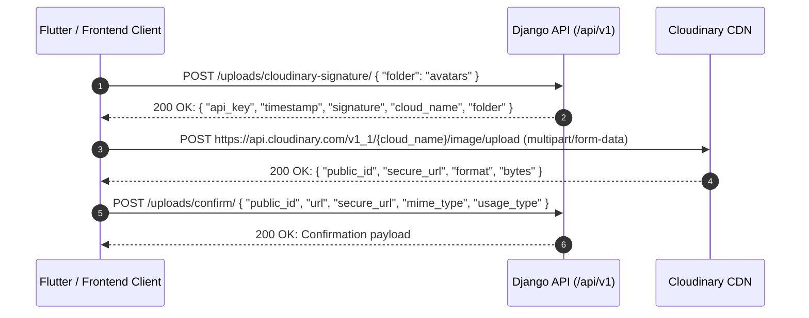

 # SETEC eCommerce REST API — Frontend Integration Guide & Reference

A complete, practical, and exhaustive API integration reference for Flutter (web/mobile) and web frontend developers connecting to the SETEC eCommerce backend services.

---

## Table of Contents
1. [Architecture & Base URLs](#1-architecture--base-urls)
2. [Authentication, JWT & Session Lifecycle](#2-authentication-jwt--session-lifecycle)
3. [Standard Response & Error Envelopes](#3-standard-response--error-envelopes)
4. [Test User Accounts (Seed Credentials)](#4-test-user-accounts-seed-credentials)
5. [Three-Tier Route Architecture & RBAC Overview](#5-three-tier-route-architecture--rbac-overview)
   - [5.1 Route Classification Summary](#51-route-classification-summary)
   - [5.2 Public Routes (No Authentication Required)](#52-public-routes-no-authentication-required)
   - [5.3 Customer Routes (Customer Authentication Required)](#53-customer-routes-customer-authentication-required)
   - [5.4 Admin Routes (Admin Role Required)](#54-admin-routes-admin-role-required)
6. [Cloudinary Direct Upload Flow](#6-cloudinary-direct-upload-flow)
7. [SECTION 1: Public Routes (Accessible Without Login)](#7-section-1-public-routes-accessible-without-login)
   - [7.1 Customer Registration & Auth Entrypoints](#71-customer-registration--auth-entrypoints)
   - [7.2 Home Feed](#72-home-feed)
   - [7.3 Categories (Storefront)](#73-categories-storefront)
   - [7.4 Stores Catalog](#74-stores-catalog)
   - [7.5 Tags Catalog](#75-tags-catalog)
   - [7.6 Products Catalog & Search](#76-products-catalog--search)
   - [7.7 Product Reviews & Ratings (Storefront)](#77-product-reviews--ratings-storefront)
   - [7.8 Legal Documents (Public Storefront)](#78-legal-documents-public-storefront)
8. [SECTION 2: Customer Routes (Accessible After Customer Login)](#8-section-2-customer-routes-accessible-after-customer-login)
   - [8.1 Auth Session Management](#81-auth-session-management)
   - [8.2 User Profile & Account Settings](#82-user-profile--account-settings)
   - [8.3 Shipping Addresses](#83-shipping-addresses)
   - [8.4 Shopping Cart & Checkout Preview](#84-shopping-cart--checkout-preview)
   - [8.5 Orders & Checkout](#85-orders--checkout)
   - [8.6 Shipments & Tracking](#86-shipments--tracking)
   - [8.7 Favorites & Wishlist](#87-favorites--wishlist)
   - [8.8 Search History](#88-search-history)
   - [8.9 Customer Reviews Management](#89-customer-reviews-management)
   - [8.10 Conversations & Chat Messages](#810-conversations--chat-messages)
   - [8.11 In-App Notifications](#811-in-app-notifications)
   - [8.12 Customer Support Tickets](#812-customer-support-tickets)
   - [8.13 Legal Agreement Acceptance](#813-legal-agreement-acceptance)
   - [8.14 Cloudinary Media Uploads](#814-cloudinary-media-uploads)
9. [SECTION 3: Admin Routes (Accessible by Admin Only)](#9-section-3-admin-routes-accessible-by-admin-only)
   - [9.1 Admin Categories Management](#91-admin-categories-management)
   - [9.2 Admin Stores Management](#92-admin-stores-management)
   - [9.3 Admin Products Management](#93-admin-products-management)
   - [9.4 Admin Tags Management](#94-admin-tags-management)
   - [9.5 Admin Orders & Fulfillment Management](#95-admin-orders--fulfillment-management)
   - [9.6 Admin Shipments & Tracking Management](#96-admin-shipments--tracking-management)
   - [9.7 Admin Reviews Moderation](#97-admin-reviews-moderation)
   - [9.8 Admin Notification Broadcasts](#98-admin-notification-broadcasts)
   - [9.9 Admin Support Ticket Resolution](#99-admin-support-ticket-resolution)
   - [9.10 Admin Legal Documents Governance](#910-admin-legal-documents-governance)

---

## 1. Architecture & Base URLs

### 1.1 Server Endpoints

| Environment | Base URL | Description |
|---|---|---|
| **Localhost (Direct / Web)** | `http://localhost:8000/api/v1` | Local development environment |
| **Android Emulator** | `http://10.0.2.2:8000/api/v1` | Host loopback alias for Android emulators |
| **iOS Simulator** | `http://localhost:8000/api/v1` | Mac loopback |
| **Staging** | `https://staging-api.setec-ecommerce.com/api/v1` | Cloud staging server |
| **Production** | `https://api.setec-ecommerce.com/api/v1` | Live production cluster |

> [!NOTE]
> All route paths documented in Section 7 are relative to the `/api/v1` base URL unless otherwise specified.
> The backend operates with `APPEND_SLASH = False`. Always include the trailing slash `/` as defined in each route specification.

### 1.2 OpenAPI Specification
- The machine-readable OpenAPI 3.0 specification file is located at [`openapi.yaml`](file:///Users/devit009/Documents/dev/setec_ecom_service/openapi.yaml).
- Can be imported into Postman, Insomnia, Swagger Editor, or used with `openapi-generator-cli` to generate Dart/Flutter models and HTTP clients (`dio`, `http`).

---

## 2. Authentication, JWT & Session Lifecycle

### 2.1 Authorization Header
For all protected routes, include the Bearer token in the standard HTTP header:
```http
Authorization: Bearer <access_token>
```

### 2.2 JWT Token Details
- **Algorithm**: HMAC-SHA256 (`HS256`)
- **Default Expiration (TTL)**: 7 days (`604,800,000 ms`)
- **Standard Token Claims**:
```json
{
  "sub": "customer@example.com",
  "user_id": "9b1deb4d-3b7d-4bad-9bdd-2b0d7b3dcb6d",
  "role": "customer",
  "session_id": "e3b0c442-98fc-1c14-9afb-4c7fa43d63b2",
  "token_type": "ecom",
  "iat": 1756540800,
  "exp": 1757145600
}
```

### 2.3 Session Management & Token Refresh Flow
1. **On Login / Register**: The client receives an `access_token` and active `session_id`.
2. **Session Persistence**: The backend creates an active `user_sessions` record tracking IP, user-agent, device, and last active timestamp.
3. **Refreshing**: Call `POST /auth/refresh/` before expiration to issue a fresh JWT token without requiring the user to re-enter credentials.
4. **Revocation / Logout**: Call `POST /auth/logout/` or `DELETE /users/me/sessions/{session_id}/` to invalidate a specific device session or all sessions.
5. **Account Status Enforcement**: Inactive (`status == 'inactive'`) or suspended (`status == 'blocked'`) accounts receive `401 Unauthorized` or `403 Forbidden`.

---

## 3. Standard Response & Error Envelopes

All Phase 1 eCommerce endpoints return responses standardized in one of three envelope shapes:

### 3.1 Single Object / Mutation Envelope (`SuccessEnvelope`)
HTTP Status: `200 OK` or `201 Created`
```json
{
  "data": {
    "id": "e6727282-5a21-4f18-b218-c2b5ec28b6d1",
    "name": "Wireless Noise Cancelling Headphones"
  },
  "meta": {
    "request_id": null
  },
  "errors": []
}
```

### 3.2 Paginated List Envelope (`ListEnvelope`)
HTTP Status: `200 OK`
```json
{
  "data": [
    {
      "id": "e6727282-5a21-4f18-b218-c2b5ec28b6d1",
      "name": "Product 1"
    }
  ],
  "meta": {
    "page": 1,
    "page_size": 20,
    "total": 45,
    "has_next": true,
    "request_id": null
  },
  "errors": []
}
```

### 3.3 No Content Mutation
HTTP Status: `204 No Content` (Empty body). Used for DELETE operations, `POST /auth/logout/`, `POST /notifications/read-all/`, etc.

### 3.4 Standard Error Envelope (`ErrorEnvelope`)
HTTP Status: `400 Bad Request`, `401 Unauthorized`, `403 Forbidden`, `404 Not Found`, `409 Conflict`, `422 Unprocessable Entity`
```json
{
  "data": null,
  "meta": {
    "request_id": null
  },
  "errors": [
    {
      "code": "VALIDATION_ERROR",
      "message": "This field is required.",
      "field": "email"
    }
  ]
}
```

---

## 4. Test User Accounts (Seed Credentials)

| Role | Email | Password | Scope & Allowed Capabilities |
|---|---|---|---|
| **Customer** | `customer@example.com` | `Password123!` | Storefront browsing, cart, orders, reviews, addresses, favorites, notifications, chat, support tickets |
| **Admin** | `admin@example.com` | `AdminSecret123!` | Category management viewset, store administration, order fulfillment, moderation |
| **Support** | `support@example.com` | `SupportSecret123!` | Ticket responses, conversation monitoring |

> [!TIP]
> You can also register a fresh customer account instantly via `POST /auth/register/`.

---

## 5. Three-Tier Route Architecture & RBAC Overview

The backend enforces a strict three-tier route architecture:

1. **Public Routes** — Accessible by any unauthenticated client/guest without Bearer token headers.
2. **Customer Routes** — Accessible by authenticated customers holding a valid Bearer JWT.
3. **Admin Routes** — Accessible strictly by authenticated administrators holding a Bearer JWT with the `"admin"` role claim.

---

### 5.1 Route Classification Summary

| Tier | Authentication Header | Role Check | Typical Use Cases |
|---|---|---|---|
| **🌐 Public Routes** | ❌ Optional / None | None | Catalog browsing, search, storefront categories, store profiles, reviews reading, customer registration & login |
| **🔐 Customer Routes** | `Authorization: Bearer <token>` | `customer`, `admin`, `support` | Profile, addresses, cart items, checkout, order placement, personal order history, chat, tickets, reviews creation |
| **👑 Admin Routes** | `Authorization: Bearer <token>` | Strictly `admin` (`@require_roles("admin")`) | Catalog curation, category hierarchy management, order status transitions, shipment updates, reviews moderation, system notifications |

---

### 5.2 Public Routes (No Authentication Required)

Public routes require **no login credentials** and are openly accessible to storefront guests. Where marked *(🔓 Optional Auth)*, passing a Bearer token enhances the response with customer-specific context (such as `is_favorite: true`).

| Method | Primary Route Path | Flutter / Legacy Alias | Purpose | Auth Requirement |
|---|---|---|---|---|
| `POST` | `/api/v1/auth/register/` | - | Register new customer account | 🌐 Public |
| `POST` | `/api/v1/auth/login/` | - | Customer & user login | 🌐 Public |
| `POST` | `/api/v1/legacy-auth/login` | - | Legacy login endpoint | 🌐 Public |
| `POST` | `/api/v1/auth/forgot-password/` | - | Request password reset token | 🌐 Public |
| `POST` | `/api/v1/auth/reset-password/` | - | Complete password reset via token | 🌐 Public |
| `GET` | `/api/v1/home/` | - | Storefront home feed (banners, flash sales, featured items) | 🌐 Public *(🔓 Optional Auth)* |
| `GET` | `/api/v1/public/categories/` | List active storefront categories | 🌐 Public |
| `GET` | `/api/v1/public/categories/tree/` | Get nested category hierarchy tree | 🌐 Public |
| `GET` | `/api/v1/public/categories/{category_id}/` | Get category details by UUID | 🌐 Public |
| `GET` | `/api/v1/public/categories/search/?slug={slug}` | Get category details by URL slug | 🌐 Public |
| `GET` | `/api/v1/public/stores/` | List active merchant stores | 🌐 Public |
| `GET` | `/api/v1/public/stores/{store_id}/` | Get store details by UUID | 🌐 Public |
| `GET` | `/api/v1/public/stores/{store_id}/products/` | List products belonging to a store by UUID | 🌐 Public *(🔓 Optional Auth)* |
| `GET` | `/api/v1/public/stores/search/?slug={slug}` | Get store details by slug | 🌐 Public |
| `GET` | `/api/v1/public/stores/search/products/?slug={slug}` | List products belonging to a store by slug | 🌐 Public *(🔓 Optional Auth)* |
| `GET` | `/api/v1/public/tags/` | `/api/v1/tags/` | List product discovery tags | 🌐 Public |
| `GET` | `/api/v1/public/products/` | `/api/v1/products/` | Search & filter product catalog | 🌐 Public *(🔓 Optional Auth)* |
| `GET` | `/api/v1/public/products/{product_id}/` | `/api/v1/products/{product_id}/` | Get product detail by UUID | 🌐 Public *(🔓 Optional Auth)* |
| `GET` | `/api/v1/public/products/slug/{store}/{prod}/` | `/api/v1/products/slug/{store}/{prod}/` | Get product detail by store & product slugs | 🌐 Public *(🔓 Optional Auth)* |
| `GET` | `/api/v1/public/products/{product_id}/images/` | `/api/v1/products/{product_id}/images/` | Get product image gallery | 🌐 Public |
| `GET` | `/api/v1/public/products/{product_id}/variants/` | `/api/v1/products/{product_id}/variants/` | Get product SKU variants & option matrix | 🌐 Public |
| `GET` | `/api/v1/public/product/variants/?product_id={product_id}` | - | List variants by product UUID (standalone query) | 🌐 Public |
| `GET` | `/api/v1/public/product/variants/{variant_id}/` | - | Get product variant detail by variant UUID | 🌐 Public |
| `GET` | `/api/v1/public/product/variant-options/?variant_id={variant_id}` | - | List attribute options for a variant | 🌐 Public |
| `GET` | `/api/v1/public/product/variant-options/{option_id}/` | - | Get variant option detail by UUID | 🌐 Public |
| `GET` | `/api/v1/public/products/{product_id}/reviews/` | `/api/v1/products/{product_id}/reviews/` | List public customer reviews for product | 🌐 Public |
| `GET` | `/api/v1/reviews/` | - | Filter published reviews (by `product_id`) | 🌐 Public |
| `GET` | `/api/v1/reviews/{review_id}/` | - | Get published review details | 🌐 Public |
| `GET` | `/api/v1/legal-documents/` | - | List published legal documents (Terms, Privacy) | 🌐 Public |
| `GET` | `/api/v1/legal-documents/{type}/latest/` | - | Get latest published document by type | 🌐 Public |

---

### 5.3 Customer Routes (Customer Authentication Required)

Customer routes require a valid **Bearer JWT** in the `Authorization` header (`@metadata_handler(required_user_id=True)`). Unauthenticated calls return `401 Unauthorized`.

| Method | Route Path | Purpose | Allowed Roles |
|---|---|---|---|
| `POST` | `/api/v1/auth/logout/` | Revoke active session & logout | 🔐 `customer`, `admin`, `support` |
| `POST` | `/api/v1/auth/refresh/` | Refresh JWT access token | 🔐 `customer`, `admin`, `support` |
| `POST` | `/api/v1/auth/verify-email/` | Verify user email address | 🔐 `customer`, `admin`, `support` |
| `POST` | `/api/v1/auth/verify-phone/` | Verify user phone number | 🔐 `customer`, `admin`, `support` |
| `GET` | `/api/v1/auth/me/` | Get current user auth identity | 🔐 `customer`, `admin`, `support` |
| `GET` | `/api/v1/users/me/` | Get user profile & account info | 🔐 `customer`, `admin`, `support` |
| `PATCH` | `/api/v1/users/me/` | Update user name, phone, avatar | 🔐 `customer`, `admin`, `support` |
| `GET` | `/api/v1/users/me/profile/` | Get extended profile preferences | 🔐 `customer`, `admin`, `support` |
| `PATCH` | `/api/v1/users/me/profile/` | Update birthday, gender, language | 🔐 `customer`, `admin`, `support` |
| `GET` | `/api/v1/users/me/security-settings/` | Get 2FA & biometric security flags | 🔐 `customer`, `admin`, `support` |
| `PATCH` | `/api/v1/users/me/security-settings/` | Update 2FA & biometric settings | 🔐 `customer`, `admin`, `support` |
| `GET` | `/api/v1/users/me/sessions/` | List all active device sessions | 🔐 `customer`, `admin`, `support` |
| `POST` / `DELETE` | `/api/v1/users/me/sessions/{session_id}/` | Revoke a specific device session | 🔐 `customer`, `admin`, `support` |
| `POST` / `DELETE` | `/api/v1/users/me/sessions/{session_id}/revoke/` | Revoke session alias | 🔐 `customer`, `admin`, `support` |
| `GET` | `/api/v1/users/me/reviews/` | List all reviews written by current user | 🔐 `customer` |
| `GET` | `/api/v1/users/me/legal-acceptances/` | List legal consent history for user | 🔐 `customer`, `admin`, `support` |
| `GET` | `/api/v1/addresses/` | List customer delivery addresses | 🔐 `customer` |
| `POST` | `/api/v1/addresses/` | Add new delivery address | 🔐 `customer` |
| `GET` | `/api/v1/addresses/{address_id}/` | Get address details by ID | 🔐 `customer` |
| `PATCH` | `/api/v1/addresses/{address_id}/` | Update delivery address | 🔐 `customer` |
| `DELETE` | `/api/v1/addresses/{address_id}/` | Delete delivery address | 🔐 `customer` |
| `POST` / `PATCH` | `/api/v1/addresses/{address_id}/default/` | Set address as default delivery address | 🔐 `customer` |
| `POST` / `PATCH` | `/api/v1/addresses/{address_id}/set-default/` | Set default address alias | 🔐 `customer` |
| `GET` | `/api/v1/cart/` | Get customer shopping cart & item totals | 🔐 `customer` |
| `POST` | `/api/v1/cart/items/` | Add product/variant to shopping cart | 🔐 `customer` |
| `PATCH` | `/api/v1/cart/items/{cart_item_id}/` | Update cart item quantity or toggle selection | 🔐 `customer` |
| `DELETE` | `/api/v1/cart/items/{cart_item_id}/` | Remove item from cart | 🔐 `customer` |
| `POST` | `/api/v1/cart/select-all/` | Toggle select/deselect all cart items | 🔐 `customer` |
| `POST` | `/api/v1/cart/checkout-preview/` | Calculate checkout preview, discounts & totals | 🔐 `customer` |
| `GET` | `/api/v1/orders/` | List customer order history | 🔐 `customer` |
| `POST` | `/api/v1/orders/` | Place orders from selected cart items | 🔐 `customer` |
| `GET` | `/api/v1/orders/{order_id}/` | Get order details & purchased items | 🔐 `customer` |
| `POST` | `/api/v1/orders/{order_id}/cancel/` | Cancel customer pending order | 🔐 `customer` |
| `GET` | `/api/v1/orders/{order_id}/status-history/` | View order status progression timeline | 🔐 `customer` |
| `GET` | `/api/v1/orders/{order_id}/shipments/` | View shipments linked to order | 🔐 `customer` |
| `GET` | `/api/v1/shipments/{shipment_id}/` | Get shipment tracking info | 🔐 `customer`, `admin` |
| `GET` | `/api/v1/shipments/{shipment_id}/events/` | View checkpoint tracking events | 🔐 `customer`, `admin` |
| `GET` | `/api/v1/favorites/` | List customer wishlist items | 🔐 `customer` |
| `POST` | `/api/v1/favorites/` | Add product to wishlist | 🔐 `customer` |
| `DELETE` | `/api/v1/favorites/{product_id}/` | Remove product from wishlist | 🔐 `customer` |
| `GET` | `/api/v1/products/{product_id}/favorite/` | Check favorite status of product | 🔐 `customer` |
| `GET` | `/api/v1/search-history/` | List recent search keywords | 🔐 `customer` |
| `POST` | `/api/v1/search-history/` | Save recent search term | 🔐 `customer` |
| `DELETE` | `/api/v1/search-history/` | Clear entire search history | 🔐 `customer` |
| `DELETE` | `/api/v1/search-history/{search_id}/` | Delete specific search history entry | 🔐 `customer` |
| `POST` | `/api/v1/products/{product_id}/reviews/` | Submit a customer review for product | 🔐 `customer` |
| `PATCH` | `/api/v1/reviews/{review_id}/` | Edit user review rating/comment | 🔐 `customer` |
| `DELETE` | `/api/v1/reviews/{review_id}/` | Delete customer review | 🔐 `customer` |
| `GET` | `/api/v1/conversations/` | List customer chat conversations | 🔐 `customer`, `admin` |
| `POST` | `/api/v1/conversations/` | Start chat with store or support | 🔐 `customer` |
| `GET` | `/api/v1/conversations/{conversation_id}/` | Get conversation details | 🔐 `customer`, `admin` |
| `PATCH` | `/api/v1/conversations/{conversation_id}/` | Close chat conversation | 🔐 `customer`, `admin` |
| `GET` | `/api/v1/conversations/{conversation_id}/messages/` | List message thread | 🔐 `customer`, `admin` |
| `POST` | `/api/v1/conversations/{conversation_id}/messages/` | Send message in chat | 🔐 `customer`, `admin` |
| `POST` | `/api/v1/messages/{message_id}/read/` | Mark message as read | 🔐 `customer`, `admin` |
| `GET` | `/api/v1/notifications/` | List in-app notifications | 🔐 `customer`, `admin`, `support` |
| `GET` | `/api/v1/notifications/unread-count/` | Get unread badge count | 🔐 `customer`, `admin`, `support` |
| `POST` | `/api/v1/notifications/read-all/` | Mark all notifications as read | 🔐 `customer`, `admin`, `support` |
| `DELETE` | `/api/v1/notifications/{notification_id}/` | Delete notification item | 🔐 `customer`, `admin`, `support` |
| `POST` | `/api/v1/notifications/{notification_id}/read/` | Mark single notification as read | 🔐 `customer`, `admin`, `support` |
| `GET` | `/api/v1/support/tickets/` | List customer support tickets | 🔐 `customer`, `support`, `admin` |
| `POST` | `/api/v1/support/tickets/` | Open new support ticket | 🔐 `customer` |
| `GET` | `/api/v1/support/tickets/{ticket_id}/` | Get support ticket details | 🔐 `customer`, `support`, `admin` |
| `PATCH` | `/api/v1/support/tickets/{ticket_id}/` | Update ticket status / priority | 🔐 `customer`, `support`, `admin` |
| `GET` | `/api/v1/support/tickets/{ticket_id}/messages/` | List ticket message thread | 🔐 `customer`, `support`, `admin` |
| `POST` | `/api/v1/support/tickets/{ticket_id}/messages/` | Reply to support ticket | 🔐 `customer`, `support`, `admin` |
| `POST` | `/api/v1/legal-documents/{legal_document_id}/accept/` | Accept legal terms or policy | 🔐 `customer` |
| `POST` | `/api/v1/uploads/cloudinary-signature/` | Generate Cloudinary upload signature | 🔐 `customer`, `admin`, `support` |
| `POST` | `/api/v1/uploads/confirm/` | Confirm uploaded asset with backend | 🔐 `customer`, `admin`, `support` |

---

### 5.4 Admin Routes (Admin Role Required)

Admin routes require a valid **Bearer JWT** AND the `"admin"` role claim (`@require_roles("admin")`). Calls from non-admin users or missing tokens return `401 Unauthorized` or `403 Forbidden`.

| Method | Route Path | Purpose | Required Role |
|---|---|---|---|
| `GET` | `/api/v1/admin/categories/` | List all categories (active + inactive) | 👑 `admin` |
| `POST` | `/api/v1/admin/categories/` | Create a new eCommerce category | 👑 `admin` |
| `GET` | `/api/v1/admin/categories/{category_id}/` | Get admin category details by UUID | 👑 `admin` |
| `GET` | `/api/v1/admin/categories/search/?slug={slug}` | Get admin category details by slug | 👑 `admin` |
| `PUT` | `/api/v1/admin/categories/{category_id}/` | Full update category by UUID only | 👑 `admin` |
| `PATCH` | `/api/v1/admin/categories/{category_id}/` | Partial update category by UUID only | 👑 `admin` |
| `DELETE` | `/api/v1/admin/categories/{category_id}/` | Soft-delete category by UUID only | 👑 `admin` |
| `GET` | `/api/v1/admin/stores/` | List all stores (active + inactive, paginated) | 👑 `admin` |
| `POST` | `/api/v1/admin/stores/` | Create a new merchant store | 👑 `admin` |
| `GET` | `/api/v1/admin/stores/{store_id}/` | Get store admin details by UUID | 👑 `admin` |
| `GET` | `/api/v1/admin/stores/search/?slug={slug}` | Get store admin details by slug | 👑 `admin` |
| `PUT` | `/api/v1/admin/stores/{store_id}/` | Full update store by UUID only | 👑 `admin` |
| `PATCH` | `/api/v1/admin/stores/{store_id}/` | Partial update store by UUID only | 👑 `admin` |
| `DELETE` | `/api/v1/admin/stores/{store_id}/` | Soft-delete store by UUID only | 👑 `admin` |
| `GET` | `/api/v1/admin/products/` | List all products (active + inactive + filters) | 👑 `admin` |
| `POST` | `/api/v1/admin/products/` | Create new product in catalog | 👑 `admin` |
| `GET` | `/api/v1/admin/products/{product_id}/` | Get full product admin details | 👑 `admin` |
| `PUT` | `/api/v1/admin/products/{product_id}/` | Full update product | 👑 `admin` |
| `PATCH` | `/api/v1/admin/products/{product_id}/` | Partial update product | 👑 `admin` |
| `DELETE` | `/api/v1/admin/products/{product_id}/` | Soft-delete product | 👑 `admin` |
| `GET` | `/api/v1/admin/product/variants/?product_id={product_id}` | List all variants for a product | 👑 `admin` |
| `POST` | `/api/v1/admin/product/variants/` | Create new product variant with options | 👑 `admin` |
| `GET` | `/api/v1/admin/product/variants/{variant_id}/` | Get product variant admin details by UUID | 👑 `admin` |
| `PUT` | `/api/v1/admin/product/variants/{variant_id}/` | Full update product variant | 👑 `admin` |
| `PATCH` | `/api/v1/admin/product/variants/{variant_id}/` | Partial update product variant | 👑 `admin` |
| `DELETE` | `/api/v1/admin/product/variants/{variant_id}/` | Soft-delete product variant | 👑 `admin` |
| `GET` | `/api/v1/admin/product/variant-options/?variant_id={variant_id}` | List all attribute options for a variant | 👑 `admin` |
| `POST` | `/api/v1/admin/product/variant-options/` | Create new variant attribute option | 👑 `admin` |
| `GET` | `/api/v1/admin/product/variant-options/{option_id}/` | Get variant option detail by UUID | 👑 `admin` |
| `PUT` | `/api/v1/admin/product/variant-options/{option_id}/` | Full update variant option | 👑 `admin` |
| `PATCH` | `/api/v1/admin/product/variant-options/{option_id}/` | Partial update variant option | 👑 `admin` |
| `DELETE` | `/api/v1/admin/product/variant-options/{option_id}/` | Hard-delete variant option | 👑 `admin` |
| `GET` | `/api/v1/admin/tags/` | List all tags (paginated) | 👑 `admin` |
| `POST` | `/api/v1/admin/tags/` | Create new tag | 👑 `admin` |
| `GET` | `/api/v1/admin/tags/{tag_id}/` | Get tag details | 👑 `admin` |
| `PUT` | `/api/v1/admin/tags/{tag_id}/` | Full update tag | 👑 `admin` |
| `PATCH` | `/api/v1/admin/tags/{tag_id}/` | Partial update tag | 👑 `admin` |
| `DELETE` | `/api/v1/admin/tags/{tag_id}/` | Soft-delete tag | 👑 `admin` |
| `GET` | `/api/v1/admin/orders/` | List all platform orders with filters | 👑 `admin` |
| `GET` | `/api/v1/admin/orders/{order_id}/` | Get full order details | 👑 `admin` |
| `PATCH` | `/api/v1/admin/orders/{order_id}/status/` | Update order fulfillment status | 👑 `admin` |
| `GET` | `/api/v1/admin/shipments/` | List all shipments across stores | 👑 `admin` |
| `GET` | `/api/v1/admin/shipments/{shipment_id}/` | Get shipment details | 👑 `admin` |
| `PATCH` | `/api/v1/admin/shipments/{shipment_id}/` | Update tracking number / carrier / status | 👑 `admin` |
| `GET` | `/api/v1/admin/reviews/` | List all customer reviews (all statuses) | 👑 `admin` |
| `GET` | `/api/v1/admin/reviews/{review_id}/` | Get review details | 👑 `admin` |
| `PATCH` | `/api/v1/admin/reviews/{review_id}/` | Moderate review (approve/hide/flag) | 👑 `admin` |
| `DELETE` | `/api/v1/admin/reviews/{review_id}/` | Soft-delete review | 👑 `admin` |
| `GET` | `/api/v1/admin/notifications/` | List system notifications | 👑 `admin` |
| `POST` | `/api/v1/admin/notifications/` | Broadcast / send notification to user | 👑 `admin` |
| `GET` | `/api/v1/admin/support/tickets/` | List all platform support tickets | 👑 `admin` |
| `GET` | `/api/v1/admin/support/tickets/{ticket_id}/` | Get support ticket details | 👑 `admin` |
| `PATCH` | `/api/v1/admin/support/tickets/{ticket_id}/` | Update status, priority or assign agent | 👑 `admin` |
| `POST` | `/api/v1/admin/support/tickets/{ticket_id}/messages/` | Send official admin reply | 👑 `admin` |
| `GET` | `/api/v1/admin/legal-documents/` | List all legal documents (all versions) | 👑 `admin` |
| `POST` | `/api/v1/admin/legal-documents/` | Publish new legal document version | 👑 `admin` |
| `GET` | `/api/v1/admin/legal-documents/{id}/` | Get legal document version details | 👑 `admin` |
| `PUT` | `/api/v1/admin/legal-documents/{id}/` | Full update legal document | 👑 `admin` |
| `PATCH` | `/api/v1/admin/legal-documents/{id}/` | Partial update legal document | 👑 `admin` |
| `DELETE` | `/api/v1/admin/legal-documents/{id}/` | Soft-delete legal document | 👑 `admin` |
---

### 5.2 Public / No Authentication Routes

| Method | Route Path | Purpose | Allowed Roles |
|---|---|---|---|
| `POST` | `/api/v1/auth/register/` | Register new customer account | 🌐 Public |
| `POST` | `/api/v1/auth/login/` | Customer & user login | 🌐 Public |
| `POST` | `/api/v1/legacy-auth/login` | Legacy auth endpoint | 🌐 Public |
| `POST` | `/api/v1/auth/forgot-password/` | Request password reset token | 🌐 Public |
| `POST` | `/api/v1/auth/reset-password/` | Reset password via token | 🌐 Public |
| `GET` | `/api/v1/home/` | Home feed (banners, flash sales, categories) | 🌐 Public *(🔓 Optional Auth)* |
| `GET` | `/api/v1/public/categories/` | List active storefront categories | 🌐 Public |
| `GET` | `/api/v1/public/categories/tree/` | Get nested category hierarchy tree | 🌐 Public |
| `GET` | `/api/v1/public/categories/{category_id}/` | Get category details by UUID | 🌐 Public |
| `GET` | `/api/v1/public/categories/search/?slug={slug}` | Get category details by slug | 🌐 Public |
| `GET` | `/api/v1/public/stores/` | List active stores | 🌐 Public |
| `GET` | `/api/v1/public/stores/{store_id}/` | Get store details by UUID | 🌐 Public |
| `GET` | `/api/v1/public/stores/{store_id}/products/` | List products in a store by UUID | 🌐 Public *(🔓 Optional Auth)* |
| `GET` | `/api/v1/public/stores/search/?slug={slug}` | Get store details by slug | 🌐 Public |
| `GET` | `/api/v1/public/stores/search/products/?slug={slug}` | List products in a store by slug | 🌐 Public *(🔓 Optional Auth)* |
| `GET` | `/api/v1/tags/` | List product tags | 🌐 Public |
| `GET` | `/api/v1/products/` | Search & filter product catalog | 🌐 Public *(🔓 Optional Auth)* |
| `GET` | `/api/v1/products/{product_id}/` | Get product detail by ID | 🌐 Public *(🔓 Optional Auth)* |
| `GET` | `/api/v1/products/slug/{store_slug}/{product_slug}/` | Get product detail by slugs | 🌐 Public *(🔓 Optional Auth)* |
| `GET` | `/api/v1/products/{product_id}/images/` | Get product image gallery | 🌐 Public |
| `GET` | `/api/v1/products/{product_id}/variants/` | Get product SKU variants & options | 🌐 Public |
| `GET` | `/api/v1/public/product/variants/?product_id={product_id}` | List product variants by product ID | 🌐 Public |
| `GET` | `/api/v1/public/product/variants/{variant_id}/` | Get product variant detail by variant ID | 🌐 Public |
| `GET` | `/api/v1/public/product/variant-options/?variant_id={variant_id}` | List attribute options for a variant | 🌐 Public |
| `GET` | `/api/v1/public/product/variant-options/{option_id}/` | Get variant option detail by option ID | 🌐 Public |
| `GET` | `/api/v1/products/{product_id}/reviews/` | List product customer reviews | 🌐 Public |
| `GET` | `/api/v1/legal-documents/` | List active legal documents | 🌐 Public |
| `GET` | `/api/v1/legal-documents/{type}/latest/` | Get latest legal document by type | 🌐 Public |

---

### 5.3 Customer Authenticated Routes

| Method | Route Path | Purpose | Allowed Roles |
|---|---|---|---|
| `POST` | `/api/v1/auth/logout/` | Revoke current session & logout | 🔐 `customer`, `admin`, `support` |
| `POST` | `/api/v1/auth/refresh/` | Refresh JWT access token | 🔐 `customer`, `admin`, `support` |
| `POST` | `/api/v1/auth/verify-email/` | Mark current user email verified | 🔐 `customer`, `admin`, `support` |
| `POST` | `/api/v1/auth/verify-phone/` | Mark current user phone verified | 🔐 `customer`, `admin`, `support` |
| `GET` | `/api/v1/auth/me/` | Get current user auth identity | 🔐 `customer`, `admin`, `support` |
| `GET` | `/api/v1/users/me/` | Get user profile & account details | 🔐 `customer`, `admin`, `support` |
| `PATCH` | `/api/v1/users/me/` | Update user name, avatar, phone | 🔐 `customer`, `admin`, `support` |
| `GET` | `/api/v1/users/me/profile/` | Get extended profile preferences | 🔐 `customer`, `admin`, `support` |
| `PATCH` | `/api/v1/users/me/profile/` | Update birthday, gender, language | 🔐 `customer`, `admin`, `support` |
| `GET` | `/api/v1/users/me/security-settings/` | Get 2FA & biometric settings | 🔐 `customer`, `admin`, `support` |
| `PATCH` | `/api/v1/users/me/security-settings/` | Update 2FA & biometric flags | 🔐 `customer`, `admin`, `support` |
| `GET` | `/api/v1/users/me/sessions/` | List active device sessions | 🔐 `customer`, `admin`, `support` |
| `POST` / `DELETE` | `/api/v1/users/me/sessions/{session_id}/` | Revoke specific session | 🔐 `customer`, `admin`, `support` |
| `POST` / `DELETE` | `/api/v1/users/me/sessions/{session_id}/revoke/` | Revoke session alias | 🔐 `customer`, `admin`, `support` |
| `GET` | `/api/v1/users/me/reviews/` | List all reviews submitted by user | 🔐 `customer` |
| `GET` | `/api/v1/users/me/legal-acceptances/` | List legal consent history | 🔐 `customer`, `admin`, `support` |
| `GET` | `/api/v1/addresses/` | List user delivery addresses | 🔐 `customer` |
| `POST` | `/api/v1/addresses/` | Create new delivery address | 🔐 `customer` |
| `GET` | `/api/v1/addresses/{address_id}/` | Get address details by ID | 🔐 `customer` |
| `PATCH` | `/api/v1/addresses/{address_id}/` | Update delivery address | 🔐 `customer` |
| `DELETE` | `/api/v1/addresses/{address_id}/` | Delete delivery address | 🔐 `customer` |
| `POST` / `PATCH` | `/api/v1/addresses/{address_id}/default/` | Set address as primary default | 🔐 `customer` |
| `POST` / `PATCH` | `/api/v1/addresses/{address_id}/set-default/` | Set default alias | 🔐 `customer` |
| `POST` | `/api/v1/products/{product_id}/reviews/` | Post a review for product | 🔐 `customer` |
| `GET` | `/api/v1/products/{product_id}/favorite/` | Get user favorite status for product | 🔐 `customer` |
| `PATCH` | `/api/v1/reviews/{review_id}/` | Update user review rating/text | 🔐 `customer` |
| `DELETE` | `/api/v1/reviews/{review_id}/` | Delete user review | 🔐 `customer` |
| `GET` | `/api/v1/search-history/` | List recent user search history | 🔐 `customer` |
| `POST` | `/api/v1/search-history/` | Save recent search term | 🔐 `customer` |
| `DELETE` | `/api/v1/search-history/` | Clear all search history | 🔐 `customer` |
| `DELETE` | `/api/v1/search-history/{search_id}/` | Delete specific search history entry | 🔐 `customer` |
| `GET` | `/api/v1/favorites/` | List user wishlist/favorite products | 🔐 `customer` |
| `POST` | `/api/v1/favorites/` | Add product to favorites | 🔐 `customer` |
| `DELETE` | `/api/v1/favorites/{product_id}/` | Remove product from favorites | 🔐 `customer` |
| `GET` | `/api/v1/cart/` | Get user shopping cart & totals | 🔐 `customer` |
| `POST` | `/api/v1/cart/items/` | Add product/variant to cart | 🔐 `customer` |
| `PATCH` | `/api/v1/cart/items/{cart_item_id}/` | Update cart item quantity or selected | 🔐 `customer` |
| `DELETE` | `/api/v1/cart/items/{cart_item_id}/` | Remove item from cart | 🔐 `customer` |
| `POST` | `/api/v1/cart/select-all/` | Toggle select/deselect all cart items | 🔐 `customer` |
| `POST` | `/api/v1/cart/checkout-preview/` | Calculate checkout preview & totals | 🔐 `customer` |
| `GET` | `/api/v1/orders/` | List customer orders | 🔐 `customer` |
| `POST` | `/api/v1/orders/` | Place orders from selected cart items | 🔐 `customer` |
| `GET` | `/api/v1/orders/{order_id}/` | Get full order details & items | 🔐 `customer` |
| `POST` | `/api/v1/orders/{order_id}/cancel/` | Cancel pending customer order | 🔐 `customer` |
| `GET` | `/api/v1/orders/{order_id}/status-history/` | Get status transition timeline | 🔐 `customer` |
| `GET` | `/api/v1/orders/{order_id}/shipments/` | Get shipments linked to order | 🔐 `customer` |
| `GET` | `/api/v1/shipments/{shipment_id}/` | Get shipment tracking info | 🔐 `customer`, `admin` |
| `GET` | `/api/v1/shipments/{shipment_id}/events/` | Get tracking checkpoint events | 🔐 `customer`, `admin` |
| `GET` | `/api/v1/conversations/` | List customer chat conversations | 🔐 `customer`, `admin` |
| `POST` | `/api/v1/conversations/` | Start chat with store or support | 🔐 `customer` |
| `GET` | `/api/v1/conversations/{conversation_id}/` | Get conversation details | 🔐 `customer`, `admin` |
| `PATCH` | `/api/v1/conversations/{conversation_id}/` | Close chat conversation | 🔐 `customer`, `admin` |
| `GET` | `/api/v1/conversations/{conversation_id}/messages/` | List messages in conversation | 🔐 `customer`, `admin` |
| `POST` | `/api/v1/conversations/{conversation_id}/messages/` | Send message in conversation | 🔐 `customer`, `admin` |
| `POST` | `/api/v1/messages/{message_id}/read/` | Mark message as read | 🔐 `customer`, `admin` |
| `GET` | `/api/v1/notifications/` | List user in-app notifications | 🔐 `customer`, `admin`, `support` |
| `GET` | `/api/v1/notifications/unread-count/` | Get unread notifications badge count | 🔐 `customer`, `admin`, `support` |
| `POST` | `/api/v1/notifications/read-all/` | Mark all notifications as read | 🔐 `customer`, `admin`, `support` |
| `DELETE` | `/api/v1/notifications/{notification_id}/` | Delete notification item | 🔐 `customer`, `admin`, `support` |
| `POST` | `/api/v1/notifications/{notification_id}/read/` | Mark single notification as read | 🔐 `customer`, `admin`, `support` |
| `GET` | `/api/v1/support/tickets/` | List user support tickets | 🔐 `customer`, `support`, `admin` |
| `POST` | `/api/v1/support/tickets/` | Create new support ticket | 🔐 `customer` |
| `GET` | `/api/v1/support/tickets/{ticket_id}/` | Get support ticket details | 🔐 `customer`, `support`, `admin` |
| `PATCH` | `/api/v1/support/tickets/{ticket_id}/` | Update ticket status / priority | 🔐 `customer`, `support`, `admin` |
| `GET` | `/api/v1/support/tickets/{ticket_id}/messages/` | List ticket message thread | 🔐 `customer`, `support`, `admin` |
| `POST` | `/api/v1/support/tickets/{ticket_id}/messages/` | Add reply message to ticket | 🔐 `customer`, `support`, `admin` |
| `POST` | `/api/v1/legal-documents/{legal_document_id}/accept/` | Record legal agreement acceptance | 🔐 `customer` |
| `POST` | `/api/v1/uploads/cloudinary-signature/` | Generate Cloudinary upload signature | 🔐 `customer`, `admin`, `support` |
| `POST` | `/api/v1/uploads/confirm/` | Confirm uploaded asset with backend | 🔐 `customer`, `admin`, `support` |


## 6. Cloudinary Direct Upload Flow

To ensure high performance and low server load, all image uploads (user avatars, ticket attachments, chat media) upload directly to Cloudinary using backend-signed parameters:



---

---

## 7. SECTION 1: Public Routes (Accessible Without Login)

All endpoints in this section can be accessed freely by visitors, guest shoppers, and clients **without supplying an Authorization header**. 
Where indicated *(🔓 Optional Auth)*, supplying a valid Bearer token will personalize the response (for example, showing whether the product is in the customer's favorites list).

---

### 7.1 Customer Registration & Auth Entrypoints

#### POST `/api/v1/auth/register/`
**Purpose:** Register a new customer account and return initial JWT access token.  
**Authentication:** ❌ None (Public)  
**Allowed Roles:** 🌐 Public  

**Headers:**
```http
Content-Type: application/json
```

**Request Body:**
| Field | Type | Required | Description |
|---|---|---|---|
| `email` | string (email) | Yes | Unique customer email address |
| `password` | string | Yes | Account password (min 8 chars) |
| `first_name` | string | No | Customer first name |
| `last_name` | string | No | Customer last name |
| `phone_number` | string | No | Phone number (E.164 recommended) |

```json
{
  "email": "sarah.connor@example.com",
  "password": "Password123!",
  "first_name": "Sarah",
  "last_name": "Connor",
  "phone_number": "+85599887766"
}
```

**Success Response (`201 Created`):**
```json
{
  "data": {
    "user_id": "3d5fb6f1-a1b7-4c74-a095-231a57c5a019",
    "email": "sarah.connor@example.com",
    "access_token": "eyJhbGciOiJIUzI1NiIsInR5cCI6IkpXVCJ9..."
  },
  "meta": { "request_id": null },
  "errors": []
}
```

**Error Responses:**
| Status | Code | Condition |
|---|---|---|
| `400 Bad Request` | `VALIDATION_ERROR` | Missing required fields, invalid email format, weak password |
| `409 Conflict` | `USER_ALREADY_EXISTS` | Email is already registered |

---


#### POST `/api/v1/auth/login/`
**Purpose:** Authenticate credentials, record session, and obtain JWT access token.  
**Authentication:** ❌ None (Public)  
**Allowed Roles:** 🌐 Public  

**Headers:**
```http
Content-Type: application/json
```

**Request Body:**
| Field | Type | Required | Description |
|---|---|---|---|
| `email` | string (email) | Yes | Account email |
| `password` | string | Yes | Account password |

```json
{
  "email": "customer@example.com",
  "password": "Password123!"
}
```

**Success Response (`200 OK`):**
```json
{
  "data": {
    "access_token": "eyJhbGciOiJIUzI1NiIsInR5cCI6IkpXVCJ9...",
    "user_id": "9b1deb4d-3b7d-4bad-9bdd-2b0d7b3dcb6d",
    "role": "customer"
  },
  "meta": { "request_id": null },
  "errors": []
}
```

**Error Responses:**
| Status | Code | Condition |
|---|---|---|
| `400 Bad Request` | `VALIDATION_ERROR` | Email or password field missing |
| `401 Unauthorized` | `AUTH_401` | Invalid email or password, account inactive |

---


#### POST `/api/v1/legacy-auth/login`
**Purpose:** Legacy authentication endpoint.  
**Authentication:** ❌ None (Public)  
**Allowed Roles:** 🌐 Public  

**Headers:**
```http
Content-Type: application/json
```

**Request Body:**
```json
{
  "email": "customer@example.com",
  "password": "Password123!"
}
```

**Success Response (`200 OK`):**
```json
{
  "status": "success",
  "message": "Login successful",
  "data": {
    "access_token": "eyJhbGciOiJIUzI1NiIsInR5cCI6IkpXVCJ9..."
  }
}
```

---


#### POST `/api/v1/auth/forgot-password/`
**Purpose:** Request a password reset token / link sent to email.  
**Authentication:** ❌ None (Public)  
**Allowed Roles:** 🌐 Public  

**Headers:**
```http
Content-Type: application/json
```

**Request Body:**
| Field | Type | Required | Description |
|---|---|---|---|
| `email` | string (email) | Yes | Account email address |

```json
{
  "email": "customer@example.com"
}
```

**Success Response (`200 OK`):**
```json
{
  "data": {
    "message": "Password reset instructions sent to your email."
  },
  "meta": { "request_id": null },
  "errors": []
}
```

---


#### POST `/api/v1/auth/reset-password/`
**Purpose:** Reset password using the reset token received via email/SMS.  
**Authentication:** ❌ None (Public)  
**Allowed Roles:** 🌐 Public  

**Headers:**
```http
Content-Type: application/json
```

**Request Body:**
| Field | Type | Required | Description |
|---|---|---|---|
| `reset_token` | string | Yes | Valid reset token |
| `new_password` | string | Yes | New password (min 8 characters) |

```json
{
  "reset_token": "3fa85f6457174562b3fc2c963f66afa6",
  "new_password": "NewPassword123!"
}
```

**Success Response (`200 OK`):**
```json
{
  "data": {
    "message": "Password has been successfully reset."
  },
  "meta": { "request_id": null },
  "errors": []
}
```

---

---

### 7.2 Home Feed

#### GET `/api/v1/public/home/`
**Purpose:** Retrieve the customer home screen feed containing top categories, featured stores, and recommended products.  
**Authentication:** ❌ None (Public) *(🔓 Optional Bearer token for user personalization & favorite flags)*  
**Allowed Roles:** 🌐 Public / Authenticated Customer  

**Headers (Optional):**
```http
Authorization: Bearer <access_token>
```

**Success Response (`200 OK`):**
```json
{
  "data": {
    "featured_categories": [
      {
        "id": "e830e017-bfd6-4447-b86e-b64ec436a599",
        "parent_id": null,
        "name": "Men's Fashion",
        "slug": "mens-fashion",
        "icon_url": "https://res.cloudinary.com/demo/image/upload/category_icon.png",
        "image_url": "https://res.cloudinary.com/demo/image/upload/category_banner.jpg",
        "sort_order": 1,
        "status": "active"
      }
    ],
    "featured_stores": [
      {
        "id": "7fa6b514-41d9-4824-8b63-125be7d4e5f2",
        "name": "Kutuku Official Store",
        "slug": "kutuku-official",
        "description": "Official flagship store.",
        "logo_url": "https://res.cloudinary.com/demo/image/upload/kutuku_logo.png",
        "banner_url": "https://res.cloudinary.com/demo/image/upload/kutuku_banner.png",
        "status": "active",
        "rating_average": 4.9,
        "rating_count": 120,
        "created_at": "2026-08-01T00:00:00Z"
      }
    ],
    "featured_products": [
      {
        "id": "c928420c-7b0a-41e9-a352-fb59f237bf30",
        "name": "Kutuku Oversized Hoodie",
        "slug": "kutuku-oversized-hoodie",
        "base_price": "45.00",
        "compare_at_price": "60.00",
        "currency": "USD",
        "primary_image_url": "https://res.cloudinary.com/demo/image/upload/hoodie_main.jpg",
        "rating_average": 4.8,
        "rating_count": 42,
        "sold_count": 310,
        "status": "active",
        "store": {
          "id": "7fa6b514-41d9-4824-8b63-125be7d4e5f2",
          "name": "Kutuku Official Store",
          "slug": "kutuku-official"
        },
        "is_favorite": false
      }
    ]
  },
  "meta": { "request_id": null },
  "errors": []
}
```

---

---

### 7.3 Categories (Storefront)

#### GET `/api/v1/public/categories/`
**Purpose:** List active product categories for storefront navigation.  
**Authentication:** ❌ None (Public)  
**Allowed Roles:** 🌐 Public  

**Query Parameters:**
| Parameter | Type | Required | Description |
|---|---|---|---|
| `parent_id` | UUID | No | Filter child subcategories by parent category ID |

**Success Response (`200 OK`):**
```json
{
  "data": [
    {
      "id": "e830e017-bfd6-4447-b86e-b64ec436a599",
      "parent_id": null,
      "name": "Electronics",
      "slug": "electronics",
      "icon_url": "https://res.cloudinary.com/demo/image/upload/electronics_icon.png",
      "image_url": "https://res.cloudinary.com/demo/image/upload/electronics_banner.png",
      "sort_order": 0,
      "status": "active"
    }
  ],
  "meta": { "request_id": null },
  "errors": []
}
```

---

#### GET `/api/v1/public/categories/tree/`
**Purpose:** Get full recursive category tree hierarchy (parents and child subcategories).  
**Authentication:** ❌ None (Public)  
**Allowed Roles:** 🌐 Public  

**Success Response (`200 OK`):**
```json
{
  "data": [
    {
      "id": "e830e017-bfd6-4447-b86e-b64ec436a599",
      "name": "Clothing",
      "slug": "clothing",
      "icon_url": "https://res.cloudinary.com/demo/image/upload/clothing.png",
      "image_url": "https://res.cloudinary.com/demo/image/upload/clothing_banner.png",
      "sort_order": 1,
      "children": [
        {
          "id": "92f3cb0b-74b8-4cda-9213-39efbc6a3928",
          "name": "Hoodies & Sweatshirts",
          "slug": "hoodies-sweatshirts",
          "icon_url": null,
          "image_url": null,
          "sort_order": 1,
          "children": []
        }
      ]
    }
  ],
  "meta": { "request_id": null },
  "errors": []
}
```

---

#### GET `/api/v1/public/categories/{category_id}/`
**Purpose:** Get category details by its UUID primary key.  
**Authentication:** ❌ None (Public)  
**Allowed Roles:** 🌐 Public  

**Path Parameters:**
| Parameter | Type | Required | Description |
|---|---|---|---|
| `category_id` | UUID | Yes | Category unique UUID identifier |

**Success Response (`200 OK`):**
```json
{
  "data": {
    "id": "e830e017-bfd6-4447-b86e-b64ec436a599",
    "name": "Electronics",
    "slug": "electronics",
    "parent_id": null,
    "icon_url": "https://res.cloudinary.com/demo/image/upload/electronics_icon.png",
    "image_url": "https://res.cloudinary.com/demo/image/upload/electronics_banner.png",
    "sort_order": 0,
    "status": "active"
  },
  "meta": { "request_id": null },
  "errors": []
}
```

**Error Responses:**
| Status | Code | Condition |
|---|---|---|
| `404 Not Found` | `CATEGORY_NOT_FOUND` | Category with specified UUID does not exist or is deleted |

---

#### GET `/api/v1/public/categories/search/?slug={slug}`
**Purpose:** Get category details by its unique URL slug via query parameter.  
**Authentication:** ❌ None (Public)  
**Allowed Roles:** 🌐 Public  

**Query Parameters:**
| Parameter | Type | Required | Description |
|---|---|---|---|
| `slug` | string | Yes | Category slug (e.g. `electronics`) |

**Success Response (`200 OK`):**
```json
{
  "data": {
    "id": "e830e017-bfd6-4447-b86e-b64ec436a599",
    "name": "Electronics",
    "slug": "electronics",
    "parent_id": null,
    "icon_url": "https://res.cloudinary.com/demo/image/upload/electronics_icon.png",
    "image_url": "https://res.cloudinary.com/demo/image/upload/electronics_banner.png",
    "sort_order": 0,
    "status": "active"
  },
  "meta": { "request_id": null },
  "errors": []
}
```

**Error Responses:**
| Status | Code | Condition |
|---|---|---|
| `404 Not Found` | `CATEGORY_NOT_FOUND` | Category with specified slug does not exist or is deleted |

---

### 7.4 Stores Catalog

#### GET `/api/v1/public/stores/`
**Purpose:** List active merchant stores on the platform.  
**Authentication:** ❌ None (Public)  
**Allowed Roles:** 🌐 Public  

**Query Parameters:**
| Parameter | Type | Required | Default | Description |
|---|---|---|---|---|
| `page` | integer | No | `1` | Page number |
| `page_size` | integer | No | `20` | Items per page (max 100) |

**Success Response (`200 OK` - `ListEnvelope`):**
```json
{
  "data": [
    {
      "id": "7fa6b514-41d9-4824-8b63-125be7d4e5f2",
      "name": "Kutuku Official Store",
      "slug": "kutuku-official",
      "description": "Official flagship store.",
      "logo_url": "https://res.cloudinary.com/demo/image/upload/kutuku_logo.png",
      "banner_url": "https://res.cloudinary.com/demo/image/upload/kutuku_banner.png",
      "status": "active",
      "rating_average": 4.9,
      "rating_count": 120,
      "created_at": "2026-08-01T00:00:00Z"
    }
  ],
  "meta": {
    "page": 1,
    "page_size": 20,
    "total": 1,
    "has_next": false,
    "request_id": null
  },
  "errors": []
}
```

---

#### GET `/api/v1/public/stores/{store_id}/`
**Purpose:** Get store profile, banner, logo, and rating metrics by store UUID primary key.  
**Authentication:** ❌ None (Public)  
**Allowed Roles:** 🌐 Public  

**Path Parameters:**
| Parameter | Type | Required | Description |
|---|---|---|---|
| `store_id` | UUID | Yes | Store unique UUID identifier |

**Success Response (`200 OK`):**
```json
{
  "data": {
    "id": "7fa6b514-41d9-4824-8b63-125be7d4e5f2",
    "name": "Kutuku Official Store",
    "slug": "kutuku-official",
    "description": "Official flagship store.",
    "logo_url": "https://res.cloudinary.com/demo/image/upload/kutuku_logo.png",
    "banner_url": "https://res.cloudinary.com/demo/image/upload/kutuku_banner.png",
    "status": "active",
    "rating_average": 4.9,
    "rating_count": 120,
    "created_at": "2026-08-01T00:00:00Z"
  },
  "meta": { "request_id": null },
  "errors": []
}
```

**Error Responses:**
| Status | Code | Condition |
|---|---|---|
| `404 Not Found` | `STORE_NOT_FOUND` | Store with specified UUID does not exist or is inactive |

---

#### GET `/api/v1/public/stores/search/?slug={slug}`
**Purpose:** Get store profile, banner, logo, and rating metrics by store slug via query parameter.  
**Authentication:** ❌ None (Public)  
**Allowed Roles:** 🌐 Public  

**Query Parameters:**
| Parameter | Type | Required | Description |
|---|---|---|---|
| `slug` | string | Yes | Store unique slug (e.g. `kutuku-official`) |

**Success Response (`200 OK`):**
```json
{
  "data": {
    "id": "7fa6b514-41d9-4824-8b63-125be7d4e5f2",
    "name": "Kutuku Official Store",
    "slug": "kutuku-official",
    "description": "Official flagship store.",
    "logo_url": "https://res.cloudinary.com/demo/image/upload/kutuku_logo.png",
    "banner_url": "https://res.cloudinary.com/demo/image/upload/kutuku_banner.png",
    "status": "active",
    "rating_average": 4.9,
    "rating_count": 120,
    "created_at": "2026-08-01T00:00:00Z"
  },
  "meta": { "request_id": null },
  "errors": []
}
```

**Error Responses:**
| Status | Code | Condition |
|---|---|---|
| `404 Not Found` | `STORE_NOT_FOUND` | Store with specified slug does not exist or is inactive |

---

#### GET `/api/v1/public/stores/{store_id}/products/`
**Purpose:** List products belonging to a specific store by store UUID.  
**Authentication:** ❌ None (Public) *(🔓 Optional Bearer token for favorites)*  
**Allowed Roles:** 🌐 Public / Authenticated Customer  

**Path Parameters:**
| Parameter | Type | Required | Description |
|---|---|---|---|
| `store_id` | UUID | Yes | Store unique UUID identifier |

**Query Parameters:**
| Parameter | Type | Required | Default | Description |
|---|---|---|---|---|
| `page` | integer | No | `1` | Page number |
| `page_size` | integer | No | `20` | Items per page |

**Success Response (`200 OK` - `SuccessEnvelope`):**
```json
{
  "data": {
    "id": "7fa6b514-41d9-4824-8b63-125be7d4e5f2",
    "name": "Kutuku Official Store",
    "slug": "kutuku-official",
    "owner_id": "9b1deb4d-3b7d-4bad-9bdd-2b0d7b3dcb6d",
    "description": "Official flagship store.",
    "logo_url": "https://res.cloudinary.com/demo/image/upload/kutuku_logo.png",
    "banner_url": "https://res.cloudinary.com/demo/image/upload/kutuku_banner.png",
    "status": "active",
    "rating_average": 4.9,
    "rating_count": 120,
    "created_at": "2026-08-01T00:00:00Z",
    "product": [
      {
        "id": "c928420c-7b0a-41e9-a352-fb59f237bf30",
        "name": "Kutuku Oversized Hoodie",
        "slug": "kutuku-oversized-hoodie",
        "base_price": "45.00",
        "currency": "USD",
        "rating_average": 4.8,
        "rating_count": 42,
        "sold_count": 310,
        "compare_at_price": "60.00",
        "primary_image_url": "https://res.cloudinary.com/demo/image/upload/hoodie_main.jpg",
        "is_favorite": false
      }
    ]
  },
  "meta": {
    "request_id": null
  },
  "errors": []
}
```

**Error Responses:**
| Status | Code | Condition |
|---|---|---|
| `404 Not Found` | `STORE_NOT_FOUND` | Store with specified UUID does not exist |

---

#### GET `/api/v1/public/stores/search/products/?slug={slug}`
**Purpose:** List products belonging to a specific store by store slug via query parameter.  
**Authentication:** ❌ None (Public) *(🔓 Optional Bearer token for favorites)*  
**Allowed Roles:** 🌐 Public / Authenticated Customer  

**Query Parameters:**
| Parameter | Type | Required | Default | Description |
|---|---|---|---|---|
| `slug` | string | Yes | - | Store unique slug (e.g. `kutuku-official`) |
| `page` | integer | No | `1` | Page number |
| `page_size` | integer | No | `20` | Items per page |

**Success Response (`200 OK` - `SuccessEnvelope`):**
```json
{
  "data": {
    "id": "7fa6b514-41d9-4824-8b63-125be7d4e5f2",
    "name": "Kutuku Official Store",
    "slug": "kutuku-official",
    "owner_id": "9b1deb4d-3b7d-4bad-9bdd-2b0d7b3dcb6d",
    "description": "Official flagship store.",
    "logo_url": "https://res.cloudinary.com/demo/image/upload/kutuku_logo.png",
    "banner_url": "https://res.cloudinary.com/demo/image/upload/kutuku_banner.png",
    "status": "active",
    "rating_average": 4.9,
    "rating_count": 120,
    "created_at": "2026-08-01T00:00:00Z",
    "product": [
      {
        "id": "c928420c-7b0a-41e9-a352-fb59f237bf30",
        "name": "Kutuku Oversized Hoodie",
        "slug": "kutuku-oversized-hoodie",
        "base_price": "45.00",
        "currency": "USD",
        "rating_average": 4.8,
        "rating_count": 42,
        "sold_count": 310,
        "compare_at_price": "60.00",
        "primary_image_url": "https://res.cloudinary.com/demo/image/upload/hoodie_main.jpg",
        "is_favorite": false
      }
    ]
  },
  "meta": {
    "request_id": null
  },
  "errors": []
}
```

**Error Responses:**
| Status | Code | Condition |
|---|---|---|
| `404 Not Found` | `STORE_NOT_FOUND` | Store with specified slug does not exist |

---

### 7.5 Tags Catalog

#### GET `/api/v1/public/tags/`
**Purpose:** List tags used for product discovery (e.g., `featured`, `streetwear`, `summer-sale`).  
**Authentication:** ❌ None (Public)  
**Allowed Roles:** 🌐 Public  

**Query Parameters:**
| Parameter | Type | Required | Default | Description |
|---|---|---|---|---|
| `page` | integer | No | `1` | Page number |
| `page_size` | integer | No | `50` | Items per page |

**Success Response (`200 OK` - `ListEnvelope`):**
```json
{
  "data": [
    {
      "id": "e3b0c442-98fc-1c14-9afb-4c7fa43d63b2",
      "name": "Streetwear",
      "slug": "streetwear"
    }
  ],
  "meta": {
    "page": 1,
    "page_size": 50,
    "total": 1,
    "has_next": false,
    "request_id": null
  },
  "errors": []
}
```

---

### 7.6 Products Catalog & Search

#### GET `/api/v1/public/products/`
**Purpose:** Search and filter active product catalog with multi-facet queries and sorting.  
**Authentication:** ❌ None (Public) *(🔓 Optional Bearer token for `is_favorite` state)*  
**Allowed Roles:** 🌐 Public / Authenticated Customer  

**Query Parameters:**
| Parameter | Type | Required | Default | Description |
|---|---|---|---|---|
| `q` | string | No | - | Search query text (substring search on product name) |
| `category_id` | UUID | No | - | Filter by category ID |
| `store_id` | UUID | No | - | Filter by merchant store ID |
| `tag` | string | No | - | Filter by tag slug (e.g. `tag=streetwear`) |
| `min_price` | number | No | - | Minimum base price |
| `max_price` | number | No | - | Maximum base price |
| `rating_min` | number | No | - | Minimum rating filter (e.g. `4.0`) |
| `sort` | enum | No | `newest` | `newest`, `price_asc`, `price_desc`, `rating`, `sold` |
| `page` | integer | No | `1` | Page number |
| `page_size` | integer | No | `20` | Items per page (max 100) |

**Success Response (`200 OK` - `ListEnvelope`):**
```json
{
  "data": [
    {
      "id": "c928420c-7b0a-41e9-a352-fb59f237bf30",
      "name": "Kutuku Oversized Hoodie",
      "slug": "kutuku-oversized-hoodie",
      "base_price": "45.00",
      "compare_at_price": "60.00",
      "currency": "USD",
      "primary_image_url": "https://res.cloudinary.com/demo/image/upload/hoodie_main.jpg",
      "rating_average": 4.8,
      "rating_count": 42,
      "sold_count": 310,
      "status": "active",
      "store": {
        "id": "7fa6b514-41d9-4824-8b63-125be7d4e5f2",
        "name": "Kutuku Official Store",
        "slug": "kutuku-official"
      },
      "is_favorite": false
    }
  ],
  "meta": {
    "page": 1,
    "page_size": 20,
    "total": 1,
    "has_next": false,
    "request_id": null
  },
  "errors": []
}
```

---

#### GET `/api/v1/public/products/{product_id}/`
**Purpose:** Get full product detail, description, category, variants, images, and tags by UUID.  
**Authentication:** ❌ None (Public) *(🔓 Optional Bearer token for `is_favorite`)*  
**Allowed Roles:** 🌐 Public / Authenticated Customer  

**Path Parameters:**
| Parameter | Type | Required | Description |
|---|---|---|---|
| `product_id` | UUID | Yes | Product UUID |

**Success Response (`200 OK`):**
```json
{
  "data": {
    "id": "c928420c-7b0a-41e9-a352-fb59f237bf30",
    "name": "Kutuku Oversized Hoodie",
    "slug": "kutuku-oversized-hoodie",
    "description": "Premium 100% heavyweight cotton hoodie.",
    "sku": "HOOD-OVR-01",
    "base_price": "45.00",
    "compare_at_price": "60.00",
    "currency": "USD",
    "status": "active",
    "rating_average": 4.8,
    "rating_count": 42,
    "sold_count": 310,
    "is_favorite": false,
    "primary_image_url": "https://res.cloudinary.com/demo/image/upload/hoodie_main.jpg",
    "store": {
      "id": "7fa6b514-41d9-4824-8b63-125be7d4e5f2",
      "name": "Kutuku Official Store",
      "slug": "kutuku-official"
    },
    "category": {
      "id": "e830e017-bfd6-4447-b86e-b64ec436a599",
      "name": "Hoodies & Sweatshirts",
      "slug": null
    },
    "images": [
      {
        "id": "6a964cb7-fa57-4148-9c59-bf7d1b327b3b",
        "image_url": "https://res.cloudinary.com/demo/image/upload/hoodie_main.jpg",
        "alt_text": "Front view",
        "sort_order": 0,
        "is_primary": true
      }
    ],
    "variants": [
      {
        "id": "a4d380f2-e564-42b7-a36c-9c7689de0577",
        "name": "Black / L",
        "sku": "HOOD-OVR-01-BLK-L",
        "price": "45.00",
        "stock_quantity": 25,
        "status": "active",
        "options": [
          { "name": "Color", "value": "Black" },
          { "name": "Size", "value": "L" }
        ]
      }
    ],
    "tags": [
      {
        "id": "tag-uuid-1",
        "name": "Streetwear",
        "slug": "streetwear"
      }
    ]
  },
  "meta": { "request_id": null },
  "errors": []
}
```

**Error Responses:**
| Status | Code | Condition |
|---|---|---|
| `404 Not Found` | `PRODUCT_NOT_FOUND` | Product with specified UUID does not exist or has been deleted |

---

#### GET `/api/v1/public/products/slug/{store_slug}/{product_slug}/`
**Purpose:** Get product detail by store slug and product slug (for SEO-friendly deep links).  
**Authentication:** ❌ None (Public) *(🔓 Optional Bearer token for `is_favorite`)*  
**Allowed Roles:** 🌐 Public / Authenticated Customer  

**Path Parameters:**
| Parameter | Type | Required | Description |
|---|---|---|---|
| `store_slug` | string | Yes | Merchant store slug |
| `product_slug` | string | Yes | Product slug |

**Success Response (`200 OK`):**
```json
{
  "data": {
    "id": "c928420c-7b0a-41e9-a352-fb59f237bf30",
    "name": "Kutuku Oversized Hoodie",
    "slug": "kutuku-oversized-hoodie",
    "description": "Premium 100% heavyweight cotton hoodie.",
    "sku": "HOOD-OVR-01",
    "base_price": "45.00",
    "compare_at_price": "60.00",
    "currency": "USD",
    "status": "active",
    "rating_average": 4.8,
    "rating_count": 42,
    "sold_count": 310,
    "is_favorite": false,
    "primary_image_url": "https://res.cloudinary.com/demo/image/upload/hoodie_main.jpg",
    "store": {
      "id": "7fa6b514-41d9-4824-8b63-125be7d4e5f2",
      "name": "Kutuku Official Store",
      "slug": "kutuku-official"
    },
    "category": {
      "id": "e830e017-bfd6-4447-b86e-b64ec436a599",
      "name": "Hoodies & Sweatshirts",
      "slug": null
    }
  },
  "meta": { "request_id": null },
  "errors": []
}
```

**Error Responses:**
| Status | Code | Condition |
|---|---|---|
| `404 Not Found` | `PRODUCT_NOT_FOUND` | Product matching the store and product slugs does not exist |

---

#### GET `/api/v1/public/products/{product_id}/images/`
**Purpose:** List all images in the product media gallery.  
**Authentication:** ❌ None (Public)  
**Allowed Roles:** 🌐 Public  

**Path Parameters:**
| Parameter | Type | Required | Description |
|---|---|---|---|
| `product_id` | UUID | Yes | Product UUID |

**Success Response (`200 OK`):**
```json
{
  "data": [
    {
      "id": "6a964cb7-fa57-4148-9c59-bf7d1b327b3b",
      "image_url": "https://res.cloudinary.com/demo/image/upload/hoodie_main.jpg",
      "alt_text": "Front view",
      "sort_order": 0,
      "is_primary": true
    }
  ],
  "meta": { "request_id": null },
  "errors": []
}
```

**Error Responses:**
| Status | Code | Condition |
|---|---|---|
| `404 Not Found` | `PRODUCT_NOT_FOUND` | Product does not exist |

---

#### GET `/api/v1/public/products/{product_id}/variants/`
**Purpose:** List all purchasable variants, stock quantities, SKU codes, and option combinations for a product.  
**Authentication:** ❌ None (Public)  
**Allowed Roles:** 🌐 Public  

**Path Parameters:**
| Parameter | Type | Required | Description |
|---|---|---|---|
| `product_id` | UUID | Yes | Product UUID |

**Success Response (`200 OK`):**
```json
{
  "data": [
    {
      "id": "a4d380f2-e564-42b7-a36c-9c7689de0577",
      "name": "Black / L",
      "sku": "HOOD-OVR-01-BLK-L",
      "price": "45.00",
      "stock_quantity": 25,
      "status": "active",
      "options": [
        { "name": "Color", "value": "Black" },
        { "name": "Size", "value": "L" }
      ]
    }
  ],
  "meta": { "request_id": null },
  "errors": []
}
```

**Error Responses:**
| Status | Code | Condition |
|---|---|---|
| `404 Not Found` | `PRODUCT_NOT_FOUND` | Product does not exist |

---

#### GET `/api/v1/public/product/variants/?product_id={product_id}`
**Purpose:** List all active variants for a specific product via query parameter on the standalone public variants endpoint.  
**Authentication:** ❌ None (Public)  
**Allowed Roles:** 🌐 Public  

**Query Parameters:**
| Parameter | Type | Required | Description |
|---|---|---|---|
| `product_id` | UUID | Yes | Target product UUID to filter variants |

**Success Response (`200 OK` - `SuccessEnvelope`):**
```json
{
  "data": [
    {
      "id": "a4d380f2-e564-42b7-a36c-9c7689de0577",
      "product_id": "c928420c-7b0a-41e9-a352-fb59f237bf30",
      "name": "Black / L",
      "sku": "HOOD-OVR-01-BLK-L",
      "price": "45.00",
      "stock_quantity": 25,
      "status": "active",
      "options": [
        {
          "name": "Color",
          "value": "Black"
        },
        {
          "name": "Size",
          "value": "L"
        }
      ]
    },
    {
      "id": "b5e491a3-f675-43c8-b47d-0d8790ef1688",
      "product_id": "c928420c-7b0a-41e9-a352-fb59f237bf30",
      "name": "White / M",
      "sku": "HOOD-OVR-01-WHT-M",
      "price": "45.00",
      "stock_quantity": 10,
      "status": "active",
      "options": [
        {
          "name": "Color",
          "value": "White"
        },
        {
          "name": "Size",
          "value": "M"
        }
      ]
    }
  ],
  "meta": {
    "request_id": null
  },
  "errors": []
}
```

---

#### GET `/api/v1/public/product/variants/{variant_id}/`
**Purpose:** Retrieve detailed SKU, pricing, stock, and attribute options for a single product variant by UUID.  
**Authentication:** ❌ None (Public)  
**Allowed Roles:** 🌐 Public  

**Path Parameters:**
| Parameter | Type | Required | Description |
|---|---|---|---|
| `variant_id` | UUID | Yes | Target product variant UUID |

**Success Response (`200 OK` - `SuccessEnvelope`):**
```json
{
  "data": {
    "id": "a4d380f2-e564-42b7-a36c-9c7689de0577",
    "product_id": "c928420c-7b0a-41e9-a352-fb59f237bf30",
    "name": "Black / L",
    "sku": "HOOD-OVR-01-BLK-L",
    "price": "45.00",
    "stock_quantity": 25,
    "status": "active",
    "options": [
      {
        "name": "Color",
        "value": "Black"
      },
      {
        "name": "Size",
        "value": "L"
      }
    ]
  },
  "meta": {
    "request_id": null
  },
  "errors": []
}
```

**Error Responses:**
| Status | Code | Condition |
|---|---|---|
| `404 Not Found` | `PRODUCT_NOT_FOUND` | Product variant does not exist or has been deleted |

```json
{
  "data": null,
  "meta": {
    "request_id": null
  },
  "errors": [
    {
      "code": "PRODUCT_NOT_FOUND",
      "message": "Product variant not found"
    }
  ]
}
```

---

#### GET `/api/v1/public/product/variant-options/?variant_id={variant_id}`
**Purpose:** List all attribute options (e.g. Color, Size) for a specific product variant via query parameter.  
**Authentication:** ❌ None (Public)  
**Allowed Roles:** 🌐 Public  

**Query Parameters:**
| Parameter | Type | Required | Description |
|---|---|---|---|
| `variant_id` | UUID | Yes | Target product variant UUID to filter options |

**Success Response (`200 OK` - `SuccessEnvelope`):**
```json
{
  "data": [
    {
      "id": "673f4d8a-921a-4c22-95f0-6c9fa74ef101",
      "variant_id": "a4d380f2-e564-42b7-a36c-9c7689de0577",
      "name": "Color",
      "value": "Black"
    },
    {
      "id": "784e5e9b-032b-5d33-a6f1-7da0b85fa212",
      "variant_id": "a4d380f2-e564-42b7-a36c-9c7689de0577",
      "name": "Size",
      "value": "L"
    }
  ],
  "meta": {
    "request_id": null
  },
  "errors": []
}
```

---

#### GET `/api/v1/public/product/variant-options/{option_id}/`
**Purpose:** Retrieve detailed attribute option name and value for a single variant option by UUID.  
**Authentication:** ❌ None (Public)  
**Allowed Roles:** 🌐 Public  

**Path Parameters:**
| Parameter | Type | Required | Description |
|---|---|---|---|
| `option_id` | UUID | Yes | Target variant option UUID |

**Success Response (`200 OK` - `SuccessEnvelope`):**
```json
{
  "data": {
    "id": "673f4d8a-921a-4c22-95f0-6c9fa74ef101",
    "variant_id": "a4d380f2-e564-42b7-a36c-9c7689de0577",
    "name": "Color",
    "value": "Black"
  },
  "meta": {
    "request_id": null
  },
  "errors": []
}
```

**Error Responses:**
| Status | Code | Condition |
|---|---|---|
| `404 Not Found` | `PRODUCT_NOT_FOUND` | Variant option does not exist |

```json
{
  "data": null,
  "meta": {
    "request_id": null
  },
  "errors": [
    {
      "code": "PRODUCT_NOT_FOUND",
      "message": "Variant option not found"
    }
  ]
}
```

---

#### GET `/api/v1/public/products/{product_id}/reviews/`
**Purpose:** List published customer reviews and ratings for a specific product.  
**Authentication:** ❌ None (Public)  
**Allowed Roles:** 🌐 Public  

**Path Parameters:**
| Parameter | Type | Required | Description |
|---|---|---|---|
| `product_id` | UUID | Yes | Product UUID identifier |

**Query Parameters:**
| Parameter | Type | Required | Default | Description |
|---|---|---|---|---|
| `page` | integer | No | `1` | Page number |
| `page_size` | integer | No | `20` | Items per page |

**Success Response (`200 OK` - `ListEnvelope`):**
```json
{
  "data": [
    {
      "id": "rev-9b1deb4d-1111",
      "product_id": "c928420c-7b0a-41e9-a352-fb59f237bf30",
      "user_id": "9b1deb4d-3b7d-4bad-9bdd-2b0d7b3dcb6d",
      "rating": 5,
      "title": "Outstanding quality!",
      "comment": "Fits perfectly and the material is top notch.",
      "images": [],
      "status": "published",
      "created_at": "2026-08-31T12:00:00Z"
    }
  ],
  "meta": {
    "page": 1,
    "page_size": 20,
    "total": 1,
    "has_next": false,
    "request_id": null
  },
  "errors": []
}
```

---

> [!NOTE]
> **Submitting Customer Reviews**: Submitting a review requires customer authentication and is governed under the customer tier. See [8.9 Customer Reviews Management](#89-customer-reviews-management) for `POST /api/v1/products/{product_id}/reviews/`.

---

#### GET `/api/v1/public/products/{product_id}/favorite/`
**Purpose:** Check whether the logged-in customer has favorited this product.  
**Authentication:** 🔐 Required (`@metadata_handler(required_user_id=True)`)  
**Allowed Roles:** 🔐 `customer`, `admin`, `support`  

**Headers:**
```http
Authorization: Bearer <access_token>
```

**Path Parameters:**
| Parameter | Type | Required | Description |
|---|---|---|---|
| `product_id` | UUID | Yes | Product UUID identifier |

**Success Response (`200 OK`):**
```json
{
  "data": {
    "is_favorite": true
  },
  "meta": { "request_id": null },
  "errors": []
}
```

**Error Responses:**
| Status | Code | Condition |
|---|---|---|
| `401 Unauthorized` | `AUTH_401` | Missing or invalid Bearer access token |
| `404 Not Found` | `PRODUCT_NOT_FOUND` | Product does not exist |

> [!TIP]
> For managing customer wishlist items (adding/removing products from favorites), see [8.7 Favorites & Wishlist](#87-favorites--wishlist).

---

> [!IMPORTANT]
> **Strict URL Tier Routing**: In accordance with the Three-Tier Architecture in Rule.md, all public product catalog endpoints strictly use the `/api/v1/public/products/` prefix. Bare routes without a tier prefix (e.g. `/api/v1/products/`) are forbidden.

---

### 7.7 Product Reviews & Ratings (Storefront)

#### GET `/api/v1/public/reviews/`
**Purpose:** Fetch published customer reviews across the platform, filterable by product UUID.  
**Authentication:** ❌ None (Public)  
**Allowed Roles:** 🌐 Public  

**Query Parameters:**
| Parameter | Type | Required | Default | Description |
|---|---|---|---|---|
| `product_id` | UUID | No | - | Filter reviews for a specific product |
| `page` | integer | No | `1` | Page number |
| `page_size` | integer | No | `20` | Reviews per page |

**Success Response (`200 OK` - `ListEnvelope`):**
```json
{
  "data": [
    {
      "id": "rev-uuid-1",
      "product_id": "c928420c-7b0a-41e9-a352-fb59f237bf30",
      "user_id": "9b1deb4d-3b7d-4bad-9bdd-2b0d7b3dcb6d",
      "rating": 5,
      "title": "Excellent Quality!",
      "comment": "The fabric is thick and the fit is perfect.",
      "images": [],
      "status": "published",
      "created_at": "2026-08-30T10:00:00Z"
    }
  ],
  "meta": { "page": 1, "page_size": 20, "total": 1, "has_next": false, "request_id": null },
  "errors": []
}
```

---

#### GET `/api/v1/public/reviews/{review_id}/`
**Purpose:** Get details of a published customer review by review UUID.  
**Authentication:** ❌ None (Public)  
**Allowed Roles:** 🌐 Public  

**Path Parameters:**
| Parameter | Type | Required | Description |
|---|---|---|---|
| `review_id` | UUID | Yes | Target review UUID identifier |

**Success Response (`200 OK`):**
```json
{
  "data": {
    "id": "rev-uuid-1",
    "product_id": "c928420c-7b0a-41e9-a352-fb59f237bf30",
    "user_id": "9b1deb4d-3b7d-4bad-9bdd-2b0d7b3dcb6d",
    "rating": 5,
    "title": "Excellent Quality!",
    "comment": "The fabric is thick and the fit is perfect.",
    "images": [],
    "status": "published",
    "created_at": "2026-08-30T10:00:00Z"
  },
  "meta": { "request_id": null },
  "errors": []
}
```

**Error Responses:**
| Status | Code | Condition |
|---|---|---|
| `404 Not Found` | `REVIEW_NOT_FOUND` | Review with specified UUID does not exist or has been deleted |

---

### 7.8 Legal Documents (Public Storefront)

#### GET `/api/v1/public/legal-documents/`
**Purpose:** List active legal documents (Terms of Service, Privacy Policy, Return Policy).  
**Authentication:** ❌ None (Public)  
**Allowed Roles:** 🌐 Public  

**Query Parameters:**
| Parameter | Type | Required | Description |
|---|---|---|---|
| `type` | string | No | Filter by document type: `terms`, `privacy`, `refund`, `shipping` |

**Success Response (`200 OK`):**
```json
{
  "data": [
    {
      "id": "7c4f6b21-82d1-4e92-91e8-765f0a2d1234",
      "type": "terms",
      "title": "Terms of Service",
      "version": "1.0",
      "content": "By accessing this service, you agree to...",
      "status": "published",
      "published_at": "2026-08-01T00:00:00Z",
      "created_at": "2026-08-01T00:00:00Z"
    }
  ],
  "meta": { "request_id": null },
  "errors": []
}
```

---

#### GET `/api/v1/public/legal-documents/{type}/latest/`
**Purpose:** Get the most recent published version of a specific legal document by type.  
**Authentication:** ❌ None (Public)  
**Allowed Roles:** 🌐 Public  

**Path Parameters:**
| Parameter | Type | Required | Description |
|---|---|---|---|
| `type` | string | Yes | Document type slug (`terms`, `privacy`, `refund`, `shipping`) |

**Success Response (`200 OK`):**
```json
{
  "data": {
    "id": "7c4f6b21-82d1-4e92-91e8-765f0a2d1234",
    "type": "terms",
    "title": "Terms of Service",
    "version": "1.0",
    "content": "By accessing this service, you agree to...",
    "status": "published",
    "published_at": "2026-08-01T00:00:00Z",
    "created_at": "2026-08-01T00:00:00Z"
  },
  "meta": { "request_id": null },
  "errors": []
}
```

**Error Responses:**
| Status | Code | Condition |
|---|---|---|
| `404 Not Found` | `LEGAL_DOC_NOT_FOUND` | Published legal document of specified type does not exist |

---


---

## 8. SECTION 2: Customer Routes (Accessible After Customer Login)

All endpoints in this section **require customer authentication**. The client must provide a valid customer JWT in the `Authorization` header:
```http
Authorization: Bearer <access_token>
```
If the token is missing, expired, or invalid, the backend returns `401 Unauthorized`.

---

### 8.1 Auth Session Management

#### POST `/api/v1/auth/logout/`
**Purpose:** Invalidate the current session and revoke authorization.  
**Authentication:** 🔐 Required  
**Allowed Roles:** `customer`, `admin`, `support`  

**Headers:**
```http
Authorization: Bearer <access_token>
```

**Success Response (`204 No Content`):**
*Empty response body*

---


#### POST `/api/v1/auth/refresh/`
**Purpose:** Issue a fresh JWT access token using the active session.  
**Authentication:** 🔐 Required  
**Allowed Roles:** `customer`, `admin`, `support`  

**Headers:**
```http
Authorization: Bearer <access_token>
```

**Success Response (`200 OK`):**
```json
{
  "data": {
    "access_token": "eyJhbGciOiJIUzI1NiIsInR5cCI6IkpXVCJ9...",
    "user_id": "9b1deb4d-3b7d-4bad-9bdd-2b0d7b3dcb6d",
    "role": "customer"
  },
  "meta": { "request_id": null },
  "errors": []
}
```

---


#### POST `/api/v1/auth/verify-email/`
**Purpose:** Mark current user's email address as verified.  
**Authentication:** 🔐 Required  
**Allowed Roles:** `customer`, `admin`, `support`  

**Headers:**
```http
Authorization: Bearer <access_token>
```

**Success Response (`200 OK`):**
```json
{
  "data": {
    "message": "Email verified successfully."
  },
  "meta": { "request_id": null },
  "errors": []
}
```

---


#### POST `/api/v1/auth/verify-phone/`
**Purpose:** Mark current user's phone number as verified.  
**Authentication:** 🔐 Required  
**Allowed Roles:** `customer`, `admin`, `support`  

**Headers:**
```http
Authorization: Bearer <access_token>
Content-Type: application/json
```

**Request Body:**
| Field | Type | Required | Description |
|---|---|---|---|
| `phone_number` | string | No | Optional updated phone number |

```json
{
  "phone_number": "+85512345678"
}
```

**Success Response (`200 OK`):**
```json
{
  "data": {
    "message": "Phone number verified successfully."
  },
  "meta": { "request_id": null },
  "errors": []
}
```

---


#### GET `/api/v1/auth/me/`
**Purpose:** Get basic identity of the currently authenticated token owner.  
**Authentication:** 🔐 Required  
**Allowed Roles:** `customer`, `admin`, `support`  

**Headers:**
```http
Authorization: Bearer <access_token>
```

**Success Response (`200 OK`):**
```json
{
  "data": {
    "user_id": "9b1deb4d-3b7d-4bad-9bdd-2b0d7b3dcb6d",
    "email": "customer@example.com",
    "role": "customer"
  },
  "meta": { "request_id": null },
  "errors": []
}
```

---

---

### 8.2 User Profile & Account Settings

#### GET `/api/v1/users/me/`
**Purpose:** Retrieve full account details, profile, security flags, and default address.  
**Authentication:** 🔐 Required  
**Allowed Roles:** `customer`, `admin`, `support`  

**Headers:**
```http
Authorization: Bearer <access_token>
```

**Success Response (`200 OK`):**
```json
{
  "data": {
    "id": "9b1deb4d-3b7d-4bad-9bdd-2b0d7b3dcb6d",
    "email": "customer@example.com",
    "phone_number": "+85512345678",
    "first_name": "John",
    "last_name": "Doe",
    "avatar_url": "https://res.cloudinary.com/demo/image/upload/avatar.jpg",
    "role": "customer",
    "status": "active",
    "email_verified_at": "2026-08-30T10:00:00Z",
    "phone_verified_at": "2026-08-30T10:05:00Z",
    "profile": {
      "date_of_birth": "1995-05-15",
      "gender": "male",
      "preferred_language": "en",
      "marketing_opt_in": true
    },
    "security_settings": {
      "two_factor_enabled": false,
      "biometric_enabled": true,
      "last_password_changed_at": "2026-08-30T09:00:00Z"
    },
    "default_address": {
      "id": "f51950d9-bfe6-444a-b5e0-fa1d4f268b8e",
      "recipient_name": "John Doe",
      "phone_number": "+85512345678",
      "address_line_1": "123 Russian Federation Blvd",
      "city": "Phnom Penh",
      "country_code": "KH"
    },
    "created_at": "2026-08-30T08:00:00Z"
  },
  "meta": { "request_id": null },
  "errors": []
}
```

---

#### PATCH `/api/v1/users/me/`
**Purpose:** Update personal name, avatar image URL, or phone number.  
**Authentication:** 🔐 Required  
**Allowed Roles:** `customer`, `admin`, `support`  

**Headers:**
```http
Authorization: Bearer <access_token>
Content-Type: application/json
```

**Request Body (Partial):**
| Field | Type | Required | Description |
|---|---|---|---|
| `first_name` | string | No | Updated first name |
| `last_name` | string | No | Updated last name |
| `avatar_url` | string (URL) | No | Cloudinary secure URL |
| `phone_number` | string | No | Updated contact phone |

```json
{
  "first_name": "Johnny",
  "avatar_url": "https://res.cloudinary.com/setec-ecom/image/upload/v1/avatars/user_9b1deb4d.jpg"
}
```

**Success Response (`200 OK`):**
*Returns updated user object (same structure as `GET /users/me/`)*.

---

#### GET `/api/v1/users/me/profile/`
**Purpose:** Get profile demographic and preference settings.  
**Authentication:** 🔐 Required  
**Allowed Roles:** `customer`, `admin`, `support`  

**Headers:**
```http
Authorization: Bearer <access_token>
```

**Success Response (`200 OK`):**
```json
{
  "data": {
    "date_of_birth": "1995-05-15",
    "gender": "male",
    "preferred_language": "en",
    "marketing_opt_in": true
  },
  "meta": { "request_id": null },
  "errors": []
}
```

---

#### PATCH `/api/v1/users/me/profile/`
**Purpose:** Update user demographic preferences and marketing opt-in.  
**Authentication:** 🔐 Required  
**Allowed Roles:** `customer`, `admin`, `support`  

**Headers:**
```http
Authorization: Bearer <access_token>
Content-Type: application/json
```

**Request Body (Partial):**
| Field | Type | Required | Description / Allowed Values |
|---|---|---|---|
| `date_of_birth` | string (date `YYYY-MM-DD`) | No | Birthday |
| `gender` | enum | No | `male`, `female`, `other`, `prefer_not_to_say` |
| `preferred_language` | string (max 10) | No | e.g. `en`, `km`, `zh` |
| `marketing_opt_in` | boolean | No | Subscribe to promotional notifications |

```json
{
  "gender": "male",
  "preferred_language": "km",
  "marketing_opt_in": true
}
```

**Success Response (`200 OK`):**
*Returns updated profile object*.

---

#### GET `/api/v1/users/me/security-settings/`
**Purpose:** Retrieve 2FA and biometric auth configuration.  
**Authentication:** 🔐 Required  
**Allowed Roles:** `customer`, `admin`, `support`  

**Success Response (`200 OK`):**
```json
{
  "data": {
    "two_factor_enabled": false,
    "biometric_enabled": true,
    "last_password_changed_at": "2026-08-30T09:00:00Z"
  },
  "meta": { "request_id": null },
  "errors": []
}
```

---

#### PATCH `/api/v1/users/me/security-settings/`
**Purpose:** Enable or disable 2FA or biometric login preferences.  
**Authentication:** 🔐 Required  
**Allowed Roles:** `customer`, `admin`, `support`  

**Request Body (Partial):**
```json
{
  "two_factor_enabled": true,
  "biometric_enabled": true
}
```

**Success Response (`200 OK`):**
*Returns updated security settings object*.

---

#### GET `/api/v1/users/me/sessions/`
**Purpose:** List all active and past login sessions across mobile/web devices.  
**Authentication:** 🔐 Required  
**Allowed Roles:** `customer`, `admin`, `support`  

**Success Response (`200 OK`):**
```json
{
  "data": [
    {
      "id": "e3b0c442-98fc-1c14-9afb-4c7fa43d63b2",
      "device_name": "iPhone 15 Pro",
      "ip_address": "119.82.245.10",
      "user_agent": "Dart/3.3 (dart:io) Flutter/3.19.0 (iOS 17.4)",
      "last_seen_at": "2026-08-31T15:30:00Z",
      "revoked_at": null,
      "created_at": "2026-08-30T08:00:00Z"
    }
  ],
  "meta": { "request_id": null },
  "errors": []
}
```

---

#### POST / DELETE `/api/v1/users/me/sessions/{session_id}/`
*(Alias: `POST` / `DELETE` `/api/v1/users/me/sessions/{session_id}/revoke/`)*  
**Purpose:** Revoke and invalidate a specific device session.  
**Authentication:** 🔐 Required  
**Allowed Roles:** `customer`, `admin`, `support`  

**Path Parameters:**
| Parameter | Type | Required | Description |
|---|---|---|---|
| `session_id` | UUID | Yes | Session ID to revoke |

**Success Response (`204 No Content`):**
*Empty response body*

---

#### GET `/api/v1/users/me/reviews/`
**Purpose:** List all reviews submitted by the currently logged-in user.  
**Authentication:** 🔐 Required  
**Allowed Roles:** `customer`  

**Query Parameters:**
| Parameter | Type | Required | Default | Description |
|---|---|---|---|---|
| `page` | integer | No | `1` | Page number |
| `page_size` | integer | No | `20` | Items per page (max 100) |

**Success Response (`200 OK` - `ListEnvelope`):**
```json
{
  "data": [
    {
      "id": "rev-9b1deb4d-1111",
      "product_id": "c928420c-7b0a-41e9-a352-fb59f237bf30",
      "user_id": "9b1deb4d-3b7d-4bad-9bdd-2b0d7b3dcb6d",
      "order_item_id": "item-uuid-1",
      "rating": 5,
      "title": "Outstanding quality!",
      "body": "Fits perfectly and warm.",
      "status": "published",
      "created_at": "2026-08-30T17:00:00Z"
    }
  ],
  "meta": {
    "page": 1,
    "page_size": 20,
    "total": 1,
    "has_next": false,
    "request_id": null
  },
  "errors": []
}
```

---

#### GET `/api/v1/users/me/legal-acceptances/`
**Purpose:** Retrieve list of terms & policies accepted by the customer.  
**Authentication:** 🔐 Required  
**Allowed Roles:** `customer`, `admin`, `support`  

**Success Response (`200 OK`):**
```json
{
  "data": [
    {
      "id": "acc-uuid-123",
      "legal_document_id": "7c4f6b21-82d1-4e92-91e8-765f0a2d1234",
      "user_id": "9b1deb4d-3b7d-4bad-9bdd-2b0d7b3dcb6d",
      "accepted_at": "2026-08-30T16:05:00Z"
    }
  ],
  "meta": { "request_id": null },
  "errors": []
}
```

---

---

### 8.3 Shipping Addresses

#### GET `/api/v1/customer/addresses/`
**Purpose:** List all delivery addresses saved by the customer.  
**Authentication:** 🔐 Required  
**Allowed Roles:** `customer`  

**Success Response (`200 OK`):**
```json
{
  "data": [
    {
      "id": "f51950d9-bfe6-444a-b5e0-fa1d4f268b8e",
      "user_id": "9b1deb4d-3b7d-4bad-9bdd-2b0d7b3dcb6d",
      "label": "Home",
      "recipient_name": "Sarah Connor",
      "phone_number": "+85599887766",
      "address_line_1": "Building 12, Street 315",
      "address_line_2": "Apt 4B",
      "city": "Phnom Penh",
      "state": "Toul Kork",
      "postal_code": "12000",
      "country_code": "KH",
      "latitude": 11.5621080,
      "longitude": 104.9160100,
      "is_default": true,
      "created_at": "2026-08-30T09:30:00Z",
      "updated_at": "2026-08-30T09:30:00Z"
    }
  ],
  "meta": { "request_id": null },
  "errors": []
}
```

---

#### POST `/api/v1/customer/addresses/`
**Purpose:** Add a new delivery address for the customer.  
**Authentication:** 🔐 Required  
**Allowed Roles:** `customer`  

**Request Body:**
| Field | Type | Required | Description |
|---|---|---|---|
| `label` | string | No | Address alias (e.g. `Home`, `Office`) |
| `recipient_name` | string | Yes | Contact person name |
| `phone_number` | string | Yes | Recipient phone number |
| `address_line_1` | string | Yes | Street address / house number |
| `address_line_2` | string | No | Building / Floor / Unit |
| `city` | string | Yes | City or province name |
| `state` | string | No | Khan / District / State |
| `postal_code` | string | No | Postal or zip code |
| `country_code` | string (max 2) | Yes | ISO 2-letter country code (e.g. `KH`) |
| `latitude` | number (decimal) | No | Map pin latitude |
| `longitude` | number (decimal) | No | Map pin longitude |
| `is_default` | boolean | No | Set as primary default address (default `false`) |

```json
{
  "label": "Home",
  "recipient_name": "Sarah Connor",
  "phone_number": "+85599887766",
  "address_line_1": "Building 12, Street 315",
  "address_line_2": "Apt 4B",
  "city": "Phnom Penh",
  "country_code": "KH",
  "is_default": true
}
```

**Success Response (`201 Created`):**
*Returns created address object*.

---

#### GET `/api/v1/customer/addresses/{address_id}/`
**Purpose:** Get details of a single saved address by ID.  
**Authentication:** 🔐 Required  
**Allowed Roles:** `customer`  

**Path Parameters:**
| Parameter | Type | Required | Description |
|---|---|---|---|
| `address_id` | UUID | Yes | Target address ID |

---

#### PUT / PATCH `/api/v1/customer/addresses/{address_id}/`
**Purpose:** Update fields on a saved delivery address (`PUT` for full update via `AddressRequest`, `PATCH` for partial update via `AddressPartialRequest`).  
**Authentication:** 🔐 Required  
**Allowed Roles:** `customer`  

**Request Body (Partial):**
*Accepts any fields from `POST /api/v1/customer/addresses/`*.

---

#### DELETE `/api/v1/customer/addresses/{address_id}/`
**Purpose:** Remove a saved address.  
**Authentication:** 🔐 Required  
**Allowed Roles:** `customer`  

**Success Response (`204 No Content`):**
*Empty response body*

---

#### POST / PATCH `/api/v1/customer/addresses/{address_id}/default/`
*(Alias: `POST` / `PATCH` `/api/v1/customer/addresses/{address_id}/set-default/`)*  
**Purpose:** One user can have multiple addresses; this route allows them to set the default address.  
**Authentication:** 🔐 Required  
**Allowed Roles:** `customer`  

**Success Response (`200 OK`):**
*Returns updated address object with `is_default: true`*.

---

---

### 8.4 Shopping Cart & Checkout Preview

#### GET `/api/v1/customer/cart/`
**Purpose:** Retrieve the customer's active shopping cart, item list, selected status, and calculated totals.  
**Authentication:** 🔐 Required  
**Allowed Roles:** `customer`  

**Success Response (`200 OK`):**
```json
{
  "data": {
    "id": "4fc73e51-872f-410a-8bf1-b295e8654ff4",
    "status": "active",
    "items": [
      {
        "id": "1fa023e1-d227-4bf7-a720-e2ef64dbcf50",
        "product": {
          "id": "c928420c-7b0a-41e9-a352-fb59f237bf30",
          "name": "Kutuku Oversized Hoodie",
          "primary_image_url": "https://res.cloudinary.com/demo/image/upload/hoodie_main.jpg"
        },
        "variant": {
          "id": "a4d380f2-e564-42b7-a36c-9c7689de0577",
          "name": "Black / L"
        },
        "quantity": 2,
        "unit_price_snapshot": "45.00",
        "line_total": "90.00",
        "is_selected": true
      }
    ],
    "totals": {
      "selected_item_count": 1,
      "subtotal_amount": "90.00",
      "shipping_amount": "0.00",
      "discount_amount": "0.00",
      "tax_amount": "0.00",
      "total_amount": "90.00",
      "currency": "USD"
    }
  },
  "meta": { "request_id": null },
  "errors": []
}
```

---

#### POST `/api/v1/customer/cart/items/`
**Purpose:** Add a product or variant to the shopping cart.  
**Authentication:** 🔐 Required  
**Allowed Roles:** `customer`  

**Request Body:**
| Field | Type | Required | Default | Description |
|---|---|---|---|---|
| `product_id` | UUID | Yes | - | Target product UUID |
| `product_variant_id` | UUID | No | `null` | Optional variant UUID |
| `quantity` | integer (min 1) | No | `1` | Number of units to add |

```json
{
  "product_id": "c928420c-7b0a-41e9-a352-fb59f237bf30",
  "product_variant_id": "a4d380f2-e564-42b7-a36c-9c7689de0577",
  "quantity": 2
}
```

**Success Response (`201 Created`):**
*Returns full updated cart object*.

---

#### PATCH `/api/v1/customer/cart/items/{cart_item_id}/`
**Purpose:** Modify the quantity or selection checkbox (`is_selected`) of an item in the cart.  
**Authentication:** 🔐 Required  
**Allowed Roles:** `customer`  

**Path Parameters:**
| Parameter | Type | Required | Description |
|---|---|---|---|
| `cart_item_id` | UUID | Yes | Cart item ID |

**Request Body (Partial):**
| Field | Type | Required | Description |
|---|---|---|---|
| `quantity` | integer (min 1) | No | Updated quantity |
| `is_selected` | boolean | No | Include in checkout calculations |

```json
{
  "quantity": 3,
  "is_selected": true
}
```

**Success Response (`200 OK`):**
*Returns full updated cart object*.

---

#### DELETE `/api/v1/customer/cart/items/{cart_item_id}/`
**Purpose:** Remove an item line from the cart.  
**Authentication:** 🔐 Required  
**Allowed Roles:** `customer`  

**Success Response (`204 No Content`):**
*Empty response body*

---

#### POST `/api/v1/customer/cart/select-all/`
**Purpose:** Select or deselect all items in the cart at once.  
**Authentication:** 🔐 Required  
**Allowed Roles:** `customer`  

**Request Body:**
| Field | Type | Required | Description |
|---|---|---|---|
| `selected` | boolean | Yes | `true` to select all, `false` to deselect all |

```json
{
  "selected": true
}
```

**Success Response (`200 OK`):**
*Returns full updated cart object*.

---

#### POST `/api/v1/customer/cart/checkout-preview/`
**Purpose:** Calculate accurate order totals, shipping costs, taxes, and discounts for currently selected items before placing an order.  
**Authentication:** 🔐 Required  
**Allowed Roles:** `customer`  

**Request Body:**
| Field | Type | Required | Description |
|---|---|---|---|
| `shipping_address_id` | UUID | No | Optional delivery address ID to calculate zone shipping rates |

```json
{
  "shipping_address_id": "f51950d9-bfe6-444a-b5e0-fa1d4f268b8e"
}
```

**Success Response (`200 OK`):**
```json
{
  "data": {
    "cart_id": "4fc73e51-872f-410a-8bf1-b295e8654ff4",
    "shipping_address_id": "f51950d9-bfe6-444a-b5e0-fa1d4f268b8e",
    "totals": {
      "selected_item_count": 1,
      "subtotal_amount": "90.00",
      "shipping_amount": "0.00",
      "discount_amount": "0.00",
      "tax_amount": "0.00",
      "total_amount": "90.00",
      "currency": "USD"
    }
  },
  "meta": { "request_id": null },
  "errors": []
}
```

---

---

### 8.5 Orders & Checkout

#### GET `/api/v1/customer/orders/`
**Purpose:** List all orders placed by the customer.  
**Authentication:** 🔐 Required  
**Allowed Roles:** `customer`  

**Query Parameters:**
| Parameter | Type | Required | Default | Description |
|---|---|---|---|---|
| `page` | integer | No | `1` | Page number |
| `page_size` | integer | No | `20` | Items per page |

**Success Response (`200 OK` - `ListEnvelope`):**
```json
{
  "data": [
    {
      "id": "e6727282-5a21-4f18-b218-c2b5ec28b6d1",
      "order_number": "ORD-E3F78A9C12B4",
      "status": "pending",
      "total_amount": "90.00",
      "currency": "USD",
      "store": {
        "id": "7fa6b514-41d9-4824-8b63-125be7d4e5f2",
        "name": "Kutuku Official Store"
      },
      "item_count": 1,
      "placed_at": "2026-08-31T16:00:00Z"
    }
  ],
  "meta": {
    "page": 1,
    "page_size": 20,
    "total": 1,
    "has_next": false,
    "request_id": null
  },
  "errors": []
}
```

---

#### POST `/api/v1/customer/orders/`
**Purpose:** Convert selected cart items into placed orders. Multi-store checkouts automatically generate **one order per merchant store**.  
**Authentication:** 🔐 Required  
**Allowed Roles:** `customer`  

**Request Body:**
| Field | Type | Required | Description |
|---|---|---|---|
| `cart_id` | UUID | Yes | ID of the cart to checkout |
| `shipping_address_id` | UUID | Yes | Selected delivery address ID |
| `idempotency_key` | string | No | Unique client-generated token to prevent duplicate charges |

```json
{
  "cart_id": "4fc73e51-872f-410a-8bf1-b295e8654ff4",
  "shipping_address_id": "f51950d9-bfe6-444a-b5e0-fa1d4f268b8e",
  "idempotency_key": "uuid-checkout-session-12345"
}
```

**Success Response (`201 Created`):**
```json
{
  "data": [
    {
      "id": "e6727282-5a21-4f18-b218-c2b5ec28b6d1",
      "order_number": "ORD-E3F78A9C12B4",
      "status": "pending",
      "subtotal_amount": "90.00",
      "shipping_amount": "0.00",
      "discount_amount": "0.00",
      "tax_amount": "0.00",
      "total_amount": "90.00",
      "currency": "USD",
      "placed_at": "2026-08-31T16:00:00Z",
      "cancelled_at": null,
      "store": {
        "id": "7fa6b514-41d9-4824-8b63-125be7d4e5f2",
        "name": "Kutuku Official Store"
      },
      "shipping_address_id": "f51950d9-bfe6-444a-b5e0-fa1d4f268b8e",
      "items": [
        {
          "id": "item-uuid-1",
          "product_id": "c928420c-7b0a-41e9-a352-fb59f237bf30",
          "product_variant_id": "a4d380f2-e564-42b7-a36c-9c7689de0577",
          "product_name": "Kutuku Oversized Hoodie",
          "variant_name": "Black / L",
          "sku": "HOOD-OVR-01-BLK-L",
          "unit_price": "45.00",
          "quantity": 2,
          "line_total": "90.00"
        }
      ],
      "payment": null,
      "shipments": [],
      "status_history": [
        {
          "id": "sh-hist-1",
          "from_status": null,
          "to_status": "pending",
          "note": "Order placed by customer",
          "created_at": "2026-08-31T16:00:00Z"
        }
      ]
    }
  ],
  "meta": { "request_id": null },
  "errors": []
}
```

---

#### GET `/api/v1/customer/orders/{order_id}/`
**Purpose:** Get full order details, snapshot items, pricing breakdown, and shipments.  
**Authentication:** 🔐 Required  
**Allowed Roles:** `customer`  

**Path Parameters:**
| Parameter | Type | Required | Description |
|---|---|---|---|
| `order_id` | UUID | Yes | Order UUID |

---

#### POST `/api/v1/customer/orders/{order_id}/cancel/`
**Purpose:** Cancel a pending customer order before fulfillment begins.  
**Authentication:** 🔐 Required  
**Allowed Roles:** `customer`  

**Success Response (`200 OK`):**
*Returns updated order with `status: "cancelled"` and `cancelled_at` timestamp*.

---

#### GET `/api/v1/customer/orders/{order_id}/status-history/`
**Purpose:** Get chronological status transition logs for an order.  
**Authentication:** 🔐 Required  
**Allowed Roles:** `customer`  

**Success Response (`200 OK`):**
```json
{
  "data": [
    {
      "id": "sh-hist-1",
      "from_status": null,
      "to_status": "pending",
      "note": "Order created",
      "created_at": "2026-08-31T16:00:00Z"
    }
  ],
  "meta": { "request_id": null },
  "errors": []
}
```

---

#### GET `/api/v1/customer/orders/{order_id}/shipments/`
**Purpose:** List all shipments and carrier tracking details linked to an order.  
**Authentication:** 🔐 Required  
**Allowed Roles:** `customer`  

---

---

### 8.6 Shipments & Tracking

#### GET `/api/v1/customer/shipments/{shipment_id}/`
**Purpose:** Get tracking details, carrier, and milestone timestamps for a package.  
**Authentication:** 🔐 Required  
**Allowed Roles:** `customer`, `admin`  

**Path Parameters:**
| Parameter | Type | Required | Description |
|---|---|---|---|
| `shipment_id` | UUID | Yes | Shipment UUID |

**Success Response (`200 OK`):**
```json
{
  "data": {
    "id": "ship-uuid-1",
    "order_id": "e6727282-5a21-4f18-b218-c2b5ec28b6d1",
    "carrier_name": "J&T Express",
    "tracking_number": "JT8855220011",
    "status": "in_transit",
    "shipped_at": "2026-08-31T18:00:00Z",
    "delivered_at": null
  },
  "meta": { "request_id": null },
  "errors": []
}
```

---

#### GET `/api/v1/customer/shipments/{shipment_id}/events/`
**Purpose:** Retrieve detailed checkpoint tracking events and location logs for a shipment.  
**Authentication:** 🔐 Required  
**Allowed Roles:** `customer`, `admin`  

**Success Response (`200 OK`):**
```json
{
  "data": [
    {
      "id": "event-1",
      "status": "picked_up",
      "location": "Phnom Penh Hub",
      "description": "Package picked up by courier",
      "event_time": "2026-08-31T18:30:00Z"
    }
  ],
  "meta": { "request_id": null },
  "errors": []
}
```

---

---

### 8.7 Favorites & Wishlist

#### GET `/api/v1/customer/favorites/`
**Purpose:** List all products currently in the user's wishlist / favorites.  
**Authentication:** 🔐 Required  
**Allowed Roles:** `customer`  

**Query Parameters:**
| Parameter | Type | Required | Default | Description |
|---|---|---|---|---|
| `page` | integer | No | `1` | Page number |
| `page_size` | integer | No | `20` | Items per page |

**Success Response (`200 OK` - `ListEnvelope`):**
```json
{
  "data": [
    {
      "id": "fav-uuid-1",
      "user_id": "9b1deb4d-3b7d-4bad-9bdd-2b0d7b3dcb6d",
      "product_id": "c928420c-7b0a-41e9-a352-fb59f237bf30",
      "created_at": "2026-08-30T15:00:00Z"
    }
  ],
  "meta": {
    "page": 1,
    "page_size": 20,
    "total": 1,
    "has_next": false,
    "request_id": null
  },
  "errors": []
}
```

---

#### POST `/api/v1/customer/favorites/`
**Purpose:** Add a product to the customer's favorites / wishlist.  
**Authentication:** 🔐 Required  
**Allowed Roles:** `customer`  

**Request Body:**
| Field | Type | Required | Description |
|---|---|---|---|
| `product_id` | UUID | Yes | Target product UUID |

```json
{
  "product_id": "c928420c-7b0a-41e9-a352-fb59f237bf30"
}
```

**Success Response (`201 Created`):**
*Returns created favorite object*.

---

#### DELETE `/api/v1/customer/favorites/{product_id}/`
**Purpose:** Remove a product from the customer's favorites / wishlist.  
**Authentication:** 🔐 Required  
**Allowed Roles:** `customer`  

**Path Parameters:**
| Parameter | Type | Required | Description |
|---|---|---|---|
| `product_id` | UUID | Yes | Product UUID to unfavorite |

**Success Response (`204 No Content`):**
*Empty response body*

---

---

### 8.8 Search History

#### GET `/api/v1/customer/search-history/`
**Purpose:** Retrieve the customer's recent search queries.  
**Authentication:** 🔐 Required  
**Allowed Roles:** `customer`  

**Success Response (`200 OK`):**
```json
{
  "data": [
    {
      "id": "sh-uuid-1",
      "query": "hoodie",
      "filters_json": { "category": "clothing" },
      "result_count": 14,
      "created_at": "2026-08-31T14:00:00Z"
    }
  ],
  "meta": { "request_id": null },
  "errors": []
}
```

---

#### POST `/api/v1/customer/search-history/`
**Purpose:** Record a search query into the user's search history.  
**Authentication:** 🔐 Required  
**Allowed Roles:** `customer`  

**Request Body:**
| Field | Type | Required | Description |
|---|---|---|---|
| `query` | string | Yes | Search keyword |
| `filters_json` | object | No | Applied filter metadata |
| `result_count` | integer | No | Total matching results returned |

```json
{
  "query": "oversized hoodie",
  "filters_json": { "sort": "price_asc" },
  "result_count": 8
}
```

**Success Response (`201 Created`):**
*Returns recorded search entry*.

---

#### DELETE `/api/v1/customer/search-history/`
**Purpose:** Clear all search history entries for the current user.  
**Authentication:** 🔐 Required  
**Allowed Roles:** `customer`  

**Success Response (`204 No Content`):**
*Empty response body*

---

#### DELETE `/api/v1/customer/search-history/{search_id}/`
**Purpose:** Delete a single search history item by ID.  
**Authentication:** 🔐 Required  
**Allowed Roles:** `customer`  

**Success Response (`204 No Content`):**
*Empty response body*

---

---

### 8.9 Customer Reviews Management

#### POST `/api/v1/customer/products/{product_id}/reviews/`
**Purpose:** Submit a verified purchase customer review and rating (1–5 stars) for a product.  
**Authentication:** 🔐 Required  
**Allowed Roles:** `customer`  

**Headers:**
```http
Authorization: Bearer <access_token>
Content-Type: application/json
```

**Request Body:**
| Field | Type | Required | Description |
|---|---|---|---|
| `rating` | integer | Yes | Rating value from 1 to 5 |
| `title` | string | No | Review summary headline |
| `body` / `comment` | string | No | Detailed customer review feedback |
| `order_item_id` | UUID | No | Order item UUID verifying purchase |

```json
{
  "rating": 5,
  "title": "Amazing hoodie!",
  "body": "Super soft cotton, fast shipping to Phnom Penh.",
  "order_item_id": "4fc73e51-872f-410a-8bf1-b295e8654ff4"
}
```

**Success Response (`201 Created`):**
```json
{
  "data": {
    "id": "9a7d32c1-8411-4fa2-8417-3801a086cf25",
    "product_id": "c928420c-7b0a-41e9-a352-fb59f237bf30",
    "user_id": "9b1deb4d-3b7d-4bad-9bdd-2b0d7b3dcb6d",
    "order_item_id": "4fc73e51-872f-410a-8bf1-b295e8654ff4",
    "rating": 5,
    "title": "Amazing hoodie!",
    "body": "Super soft cotton, fast shipping to Phnom Penh.",
    "status": "published",
    "created_at": "2026-08-31T14:30:00Z"
  },
  "meta": { "request_id": null },
  "errors": []
}
```

**Error Responses:**
| Status | Code | Condition |
|---|---|---|
| `400 Bad Request` | `VALIDATION_ERROR` | Missing rating, or rating not between 1 and 5 |
| `400 Bad Request` | `INVALID_ORDER_ITEM` | Order item does not belong to the user or product |
| `400 Bad Request` | `REVIEW_DUPLICATE` | This order item has already been reviewed |
| `404 Not Found` | `PRODUCT_NOT_FOUND` | Product with given ID does not exist |
| `404 Not Found` | `ORDER_ITEM_NOT_FOUND` | Specified order item ID was not found |

---

#### PATCH `/api/v1/customer/reviews/{review_id}/`
**Purpose:** Edit an existing review submitted by the customer.  
**Authentication:** 🔐 Required  
**Allowed Roles:** `customer`  

**Path Parameters:**
| Parameter | Type | Required | Description |
|---|---|---|---|
| `review_id` | UUID | Yes | Review ID |

**Request Body (Partial):**
```json
{
  "rating": 4,
  "title": "Great hoodie, minor shrink after wash",
  "body": "Still very warm and comfortable."
}
```

---

#### DELETE `/api/v1/customer/reviews/{review_id}/`
**Purpose:** Delete a customer's own review.  
**Authentication:** 🔐 Required  
**Allowed Roles:** `customer`  

**Success Response (`204 No Content`):**
*Empty response body*

---

---

### 8.10 Conversations & Chat Messages

#### GET `/api/v1/customer/conversations/`
**Purpose:** List all chat conversations belonging to the user.  
**Authentication:** 🔐 Required  
**Allowed Roles:** `customer`, `admin`  

**Query Parameters:**
| Parameter | Type | Required | Default | Description |
|---|---|---|---|---|
| `page` | integer | No | `1` | Page number |
| `page_size` | integer | No | `20` | Items per page |

---

#### POST `/api/v1/customer/conversations/`
**Purpose:** Start a new direct conversation with a merchant store or linked to an order.  
**Authentication:** 🔐 Required  
**Allowed Roles:** `customer`  

**Request Body:**
| Field | Type | Required | Description |
|---|---|---|---|
| `store_id` | UUID | No | Target store ID |
| `order_id` | UUID | No | Linked order ID for order inquiries |

```json
{
  "store_id": "7fa6b514-41d9-4824-8b63-125be7d4e5f2",
  "order_id": "e6727282-5a21-4f18-b218-c2b5ec28b6d1"
}
```

**Success Response (`201 Created`):**
```json
{
  "data": {
    "id": "conv-uuid-1",
    "customer_id": "9b1deb4d-3b7d-4bad-9bdd-2b0d7b3dcb6d",
    "store_id": "7fa6b514-41d9-4824-8b63-125be7d4e5f2",
    "order_id": "e6727282-5a21-4f18-b218-c2b5ec28b6d1",
    "status": "open",
    "last_message_at": null,
    "created_at": "2026-08-31T19:00:00Z"
  },
  "meta": { "request_id": null },
  "errors": []
}
```

---

#### GET `/api/v1/customer/conversations/{conversation_id}/`
**Purpose:** Get conversation details and metadata.  
**Authentication:** 🔐 Required  
**Allowed Roles:** `customer`, `admin`  

---

#### PATCH `/api/v1/customer/conversations/{conversation_id}/`
**Purpose:** Update conversation status (e.g. close conversation).  
**Authentication:** 🔐 Required  
**Allowed Roles:** `customer`, `admin`  

**Request Body:**
| Field | Type | Required | Description |
|---|---|---|---|
| `status` | string | Yes | Target status (e.g. `closed`) |

```json
{
  "status": "closed"
}
```

---

#### GET `/api/v1/customer/conversations/{conversation_id}/messages/`
**Purpose:** List message history inside a conversation thread.  
**Authentication:** 🔐 Required  
**Allowed Roles:** `customer`, `admin`  

**Query Parameters:**
| Parameter | Type | Required | Default | Description |
|---|---|---|---|---|
| `page` | integer | No | `1` | Page number |
| `page_size` | integer | No | `50` | Messages per page |

---

#### POST `/api/v1/customer/conversations/{conversation_id}/messages/`
**Purpose:** Send a new message (text or media attachment) in the conversation thread.  
**Authentication:** 🔐 Required  
**Allowed Roles:** `customer`, `admin`  

**Request Body:**
| Field | Type | Required | Default | Description |
|---|---|---|---|---|
| `message_type` | string | No | `"text"` | Message type (`text`, `image`, `file`) |
| `body` | string | No* | - | Text message (*required if no `attachment_url`) |
| `attachment_url` | string (URL) | No* | - | Cloudinary URL (*required if no `body`) |

```json
{
  "message_type": "text",
  "body": "Hello, is this item available in XL?",
  "attachment_url": null
}
```

**Success Response (`201 Created`):**
```json
{
  "data": {
    "id": "msg-uuid-1",
    "conversation_id": "conv-uuid-1",
    "sender_id": "9b1deb4d-3b7d-4bad-9bdd-2b0d7b3dcb6d",
    "message_type": "text",
    "body": "Hello, is this item available in XL?",
    "attachment_url": null,
    "read_at": null,
    "created_at": "2026-08-31T19:02:00Z"
  },
  "meta": { "request_id": null },
  "errors": []
}
```

---

#### POST `/api/v1/customer/messages/{message_id}/read/`
**Purpose:** Mark an individual message as read by the recipient.  
**Authentication:** 🔐 Required  
**Allowed Roles:** `customer`, `admin`  

**Success Response (`200 OK`):**
*Returns updated message object with populated `read_at` timestamp*.

---

---

### 8.11 In-App Notifications

#### GET `/api/v1/customer/notifications/`
**Purpose:** List notifications sent to the customer (order updates, promotions, system alerts).  
**Authentication:** 🔐 Required  
**Allowed Roles:** `customer`, `admin`, `support`  

**Query Parameters:**
| Parameter | Type | Required | Default | Description |
|---|---|---|---|---|
| `page` | integer | No | `1` | Page number |
| `page_size` | integer | No | `20` | Notifications per page |

**Success Response (`200 OK` - `ListEnvelope`):**
```json
{
  "data": [
    {
      "id": "notif-uuid-1",
      "type": "order_shipped",
      "title": "Order Shipped!",
      "body": "Your order ORD-E3F78A9C12B4 has been shipped via J&T Express.",
      "data": {
        "order_id": "e6727282-5a21-4f18-b218-c2b5ec28b6d1",
        "tracking_number": "JT8855220011"
      },
      "read_at": null,
      "status": "unread",
      "created_at": "2026-08-31T18:00:00Z"
    }
  ],
  "meta": {
    "page": 1,
    "page_size": 20,
    "total": 1,
    "has_next": false,
    "request_id": null
  },
  "errors": []
}
```

---

#### GET `/api/v1/customer/notifications/unread-count/`
**Purpose:** Get count of unread notifications for badge counters in app bars / navigation tabs.  
**Authentication:** 🔐 Required  
**Allowed Roles:** `customer`, `admin`, `support`  

**Success Response (`200 OK`):**
```json
{
  "data": {
    "unread_count": 3
  },
  "meta": { "request_id": null },
  "errors": []
}
```

---

#### POST `/api/v1/customer/notifications/read-all/`
**Purpose:** Mark all user notifications as read in a single call.  
**Authentication:** 🔐 Required  
**Allowed Roles:** `customer`, `admin`, `support`  

**Success Response (`204 No Content`):**
*Empty response body*

---

#### POST `/api/v1/customer/notifications/{notification_id}/read/`
**Purpose:** Mark a single notification item as read.  
**Authentication:** 🔐 Required  
**Allowed Roles:** `customer`, `admin`, `support`  

**Success Response (`200 OK`):**
*Returns updated notification object with `status: "read"`*.

---

#### DELETE `/api/v1/customer/notifications/{notification_id}/`
**Purpose:** Delete a notification from the user's notification list.  
**Authentication:** 🔐 Required  
**Allowed Roles:** `customer`, `admin`, `support`  

**Success Response (`204 No Content`):**
*Empty response body*

---

---

### 8.12 Customer Support Tickets

#### GET `/api/v1/customer/support/tickets/`
**Purpose:** List support tickets opened by the user.  
**Authentication:** 🔐 Required  
**Allowed Roles:** `customer`, `support`, `admin`  

**Query Parameters:**
| Parameter | Type | Required | Default | Description |
|---|---|---|---|---|
| `page` | integer | No | `1` | Page number |
| `page_size` | integer | No | `20` | Tickets per page |

---

#### POST `/api/v1/customer/support/tickets/`
**Purpose:** Create a new support inquiry ticket.  
**Authentication:** 🔐 Required  
**Allowed Roles:** `customer`  

**Request Body:**
| Field | Type | Required | Default | Description |
|---|---|---|---|---|
| `subject` | string | Yes | - | Ticket subject headline |
| `category` | string | No | `"general"` | Category (e.g. `order`, `billing`, `account`) |
| `priority` | string | No | `"medium"` | Priority (`low`, `medium`, `high`, `urgent`) |
| `order_id` | UUID | No | `null` | Linked order ID |
| `message` | string | Yes | - | Initial message / question body |

```json
{
  "subject": "Missing item from delivery",
  "category": "order",
  "priority": "high",
  "order_id": "e6727282-5a21-4f18-b218-c2b5ec28b6d1",
  "message": "I received the package but only one shirt was included instead of two."
}
```

**Success Response (`201 Created`):**
```json
{
  "data": {
    "id": "ticket-uuid-1",
    "user_id": "9b1deb4d-3b7d-4bad-9bdd-2b0d7b3dcb6d",
    "order_id": "e6727282-5a21-4f18-b218-c2b5ec28b6d1",
    "subject": "Missing item from delivery",
    "category": "order",
    "status": "open",
    "priority": "high",
    "created_at": "2026-08-31T20:00:00Z"
  },
  "meta": { "request_id": null },
  "errors": []
}
```

---

#### GET `/api/v1/customer/support/tickets/{ticket_id}/`
**Purpose:** Get support ticket details.  
**Authentication:** 🔐 Required  
**Allowed Roles:** `customer`, `support`, `admin`  

---

#### PATCH `/api/v1/customer/support/tickets/{ticket_id}/`
**Purpose:** Update ticket status or priority.  
**Authentication:** 🔐 Required  
**Allowed Roles:** `customer`, `support`, `admin`  

**Request Body (Partial):**
| Field | Type | Required | Description |
|---|---|---|---|
| `status` | string | No | `open`, `pending`, `resolved`, `closed` |
| `priority` | string | No | `low`, `medium`, `high`, `urgent` |

```json
{
  "status": "resolved"
}
```

---

#### GET `/api/v1/customer/support/tickets/{ticket_id}/messages/`
**Purpose:** List message history on a support ticket thread.  
**Authentication:** 🔐 Required  
**Allowed Roles:** `customer`, `support`, `admin`  

**Query Parameters:**
| Parameter | Type | Required | Default | Description |
|---|---|---|---|---|
| `page` | integer | No | `1` | Page number |
| `page_size` | integer | No | `50` | Messages per page |

---

#### POST `/api/v1/customer/support/tickets/{ticket_id}/messages/`
**Purpose:** Add a reply message to the support ticket thread.  
**Authentication:** 🔐 Required  
**Allowed Roles:** `customer`, `support`, `admin`  

**Request Body:**
| Field | Type | Required | Description |
|---|---|---|---|
| `body` | string | Yes | Message content |

```json
{
  "body": "Thank you, here is the photo of the parcel tag."
}
```

**Success Response (`201 Created`):**
```json
{
  "data": {
    "id": "tmsg-uuid-1",
    "ticket_id": "ticket-uuid-1",
    "sender_id": "9b1deb4d-3b7d-4bad-9bdd-2b0d7b3dcb6d",
    "body": "Thank you, here is the photo of the parcel tag.",
    "attachment_url": null,
    "created_at": "2026-08-31T20:10:00Z"
  },
  "meta": { "request_id": null },
  "errors": []
}
```

---

---

### 8.13 Legal Agreement Acceptance

#### POST `/api/v1/customer/legal-documents/{legal_document_id}/accept/`
**Purpose:** Record customer consent and acceptance of a specific legal document version.  
**Authentication:** 🔐 Required  
**Allowed Roles:** `customer`  

**Path Parameters:**
| Parameter | Type | Required | Description |
|---|---|---|---|
| `legal_document_id` | UUID | Yes | Legal document UUID to accept |

**Success Response (`201 Created`):**
```json
{
  "data": {
    "id": "acc-uuid-123",
    "legal_document_id": "7c4f6b21-82d1-4e92-91e8-765f0a2d1234",
    "user_id": "9b1deb4d-3b7d-4bad-9bdd-2b0d7b3dcb6d",
    "accepted_at": "2026-08-31T20:30:00Z"
  },
  "meta": { "request_id": null },
  "errors": []
}
```

---

---

### 8.14 Cloudinary Media Uploads

#### POST `/api/v1/customer/uploads/cloudinary-signature/`
**Purpose:** Generate secure signed parameters allowing the mobile/web client to upload media directly to Cloudinary without exposing backend secrets.  
**Authentication:** 🔐 Required  
**Allowed Roles:** `customer`, `admin`, `support`  

**Headers:**
```http
Authorization: Bearer <access_token>
Content-Type: application/json
```

**Request Body:**
| Field | Type | Required | Default | Description |
|---|---|---|---|---|
| `folder` | string | No | `"uploads"` | Cloudinary destination folder (e.g. `avatars`, `reviews`, `support`) |

```json
{
  "folder": "avatars"
}
```

**Success Response (`200 OK`):**
```json
{
  "data": {
    "api_key": "123456789012345",
    "timestamp": 1756640000,
    "signature": "b1b3773a05c0ed0176787a4f1ffd9f6ff945249a",
    "cloud_name": "setec-ecom",
    "folder": "avatars"
  },
  "meta": { "request_id": null },
  "errors": []
}
```

---

#### POST `/api/v1/customer/uploads/confirm/`
**Purpose:** Notify the backend of a successfully completed Cloudinary upload to register asset metadata.  
**Authentication:** 🔐 Required  
**Allowed Roles:** `customer`, `admin`, `support`  

**Headers:**
```http
Authorization: Bearer <access_token>
Content-Type: application/json
```

**Request Body:**
| Field | Type | Required | Description |
|---|---|---|---|
| `public_id` | string | Yes | Cloudinary public ID |
| `url` | string (URL) | Yes | HTTP asset URL |
| `secure_url` | string (URL) | No | HTTPS asset URL |
| `mime_type` | string | No | File MIME type (e.g. `image/jpeg`) |
| `usage_type` | string | No | Asset purpose (`avatar`, `review_attachment`, `support_file`) |

```json
{
  "public_id": "avatars/user_9b1deb4d",
  "url": "http://res.cloudinary.com/setec-ecom/image/upload/v1/avatars/user_9b1deb4d.jpg",
  "secure_url": "https://res.cloudinary.com/setec-ecom/image/upload/v1/avatars/user_9b1deb4d.jpg",
  "mime_type": "image/jpeg",
  "usage_type": "avatar"
}
```

**Success Response (`200 OK`):**
```json
{
  "data": {
    "public_id": "avatars/user_9b1deb4d",
    "secure_url": "https://res.cloudinary.com/setec-ecom/image/upload/v1/avatars/user_9b1deb4d.jpg",
    "usage_type": "avatar",
    "confirmed": true
  },
  "meta": { "request_id": null },
  "errors": []
}
```


---

## 9. SECTION 3: Admin Routes (Accessible by Admin Only)

Endpoints in this section perform administrative, moderation, and back-office management.
All endpoints require **BOTH**:
1. A valid Bearer JWT: `Authorization: Bearer <access_token>` (`@metadata_handler(required_user_id=True)`)
2. The `"admin"` role claim (`@require_roles("admin")`)

Any request with an invalid token returns `401 Unauthorized`. Any authenticated user without the `"admin"` role returns `403 Forbidden`.

---

### 9.1 Admin Categories Management

#### GET `/api/v1/admin/categories/`
**Purpose:** List all categories across all statuses (active and inactive) for admin management.  
**Authentication:** 🔐 Required  
**Allowed Roles:** `admin`  

**Query Parameters:**
| Parameter | Type | Required | Description |
|---|---|---|---|
| `parent_id` | UUID / string | No | Filter child categories under a specific parent ID |

**Success Response (`200 OK`):**
```json
{
  "data": [
    {
      "id": "e830e017-bfd6-4447-b86e-b64ec436a599",
      "parent_id": null,
      "name": "Electronics",
      "slug": "electronics",
      "icon_url": "https://res.cloudinary.com/demo/image/upload/electronics_icon.png",
      "image_url": "https://res.cloudinary.com/demo/image/upload/electronics_banner.png",
      "sort_order": 0,
      "status": "active"
    }
  ],
  "meta": { "request_id": null },
  "errors": []
}
```

---

#### POST `/api/v1/admin/categories/`
**Purpose:** Create a new category in the catalog hierarchy.  
**Authentication:** 🔐 Required  
**Allowed Roles:** `admin`  

**Request Body:**
| Field | Type | Required | Description |
|---|---|---|---|
| `name` | string | Yes | Category display name |
| `slug` | string (slug) | Yes | URL-friendly unique slug |
| `parent_id` | UUID / string | No | Parent category UUID (omit or null for root) |
| `icon_url` | string (URL) | No | Cloudinary icon URL |
| `image_url` | string (URL) | No | Cloudinary banner URL |
| `sort_order` | integer | No | Ordering weight (default: `0`) |
| `status` | string (`active` \| `inactive`) | No | Visibility status (default: `active`) |

```json
{
  "name": "Smartphones & Tablets",
  "slug": "smartphones-tablets",
  "parent_id": "e830e017-bfd6-4447-b86e-b64ec436a599",
  "icon_url": "https://res.cloudinary.com/demo/image/upload/phone_icon.png",
  "image_url": "https://res.cloudinary.com/demo/image/upload/phones_banner.png",
  "sort_order": 1,
  "status": "active"
}
```

**Success Response (`201 Created`):**
```json
{
  "data": {
    "id": "3b2909da-7e10-48ef-b4b1-8b4e7232ec39",
    "parent_id": "e830e017-bfd6-4447-b86e-b64ec436a599",
    "name": "Smartphones & Tablets",
    "slug": "smartphones-tablets",
    "icon_url": "https://res.cloudinary.com/demo/image/upload/phone_icon.png",
    "image_url": "https://res.cloudinary.com/demo/image/upload/phones_banner.png",
    "sort_order": 1,
    "status": "active"
  },
  "meta": { "request_id": null },
  "errors": []
}
```

---

#### GET `/api/v1/admin/categories/{category_id}/`
**Purpose:** Get category details by unique UUID identifier for admin editing (includes inactive records).  
**Authentication:** 🔐 Required  
**Allowed Roles:** `admin`  

**Path Parameters:**
| Parameter | Type | Required | Description |
|---|---|---|---|
| `category_id` | UUID | Yes | Category unique UUID identifier |

---

#### GET `/api/v1/admin/categories/search/?slug={slug}`
**Purpose:** Get category details by unique slug via query parameter for admin editing (includes inactive records).  
**Authentication:** 🔐 Required  
**Allowed Roles:** `admin`  

**Query Parameters:**
| Parameter | Type | Required | Description |
|---|---|---|---|
| `slug` | string | Yes | Category slug (e.g. `electronics`) |

---

#### PUT `/api/v1/admin/categories/{category_id}/`
**Purpose:** Full update of category fields by category UUID (slug is not allowed).  
**Authentication:** 🔐 Required  
**Allowed Roles:** `admin`  

**Path Parameters:**
| Parameter | Type | Required | Description |
|---|---|---|---|
| `category_id` | UUID | Yes | Category unique UUID identifier |

**Request Body:**
```json
{
  "name": "Smartphones & Foldables",
  "slug": "smartphones-foldables",
  "parent_id": "e830e017-bfd6-4447-b86e-b64ec436a599",
  "icon_url": "https://res.cloudinary.com/demo/image/upload/phone_icon.png",
  "image_url": "https://res.cloudinary.com/demo/image/upload/phones_banner.png",
  "sort_order": 1,
  "status": "active"
}
```

---

#### PATCH `/api/v1/admin/categories/{category_id}/`
**Purpose:** Partial update of category fields (e.g. toggle status, update name or sort order) by category UUID (slug is not allowed).  
**Authentication:** 🔐 Required  
**Allowed Roles:** `admin`  

**Path Parameters:**
| Parameter | Type | Required | Description |
|---|---|---|---|
| `category_id` | UUID | Yes | Category unique UUID identifier |

**Request Body:**
```json
{
  "status": "inactive"
}
```

---

#### DELETE `/api/v1/admin/categories/{category_id}/`
**Purpose:** Soft-delete a category by category UUID (slug is not allowed) and remove it from storefront display.  
**Authentication:** 🔐 Required  
**Allowed Roles:** `admin`  

**Path Parameters:**
| Parameter | Type | Required | Description |
|---|---|---|---|
| `category_id` | UUID | Yes | Category unique UUID identifier |

**Success Response:** `204 No Content`

---

### 9.2 Admin Stores Management

#### GET `/api/v1/admin/stores/`
**Purpose:** List all merchant stores (active, pending, and suspended), with pagination.  
**Authentication:** 🔐 Required  
**Allowed Roles:** `admin`  

**Query Parameters:**
| Parameter | Type | Required | Default | Description |
|---|---|---|---|---|
| `page` | integer | No | `1` | Page number |
| `page_size` | integer | No | `20` | Stores per page |

**Success Response (`200 OK` - `ListEnvelope`):**
```json
{
  "data": [
    {
      "id": "7fa6b514-41d9-4824-8b63-125be7d4e5f2",
      "name": "Kutuku Official Store",
      "slug": "kutuku-official",
      "description": "Official flagship store for Kutuku apparel.",
      "logo_url": "https://res.cloudinary.com/demo/image/upload/logo.png",
      "banner_url": "https://res.cloudinary.com/demo/image/upload/banner.png",
      "status": "active",
      "rating_average": 4.9,
      "rating_count": 128
    }
  ],
  "meta": { "page": 1, "page_size": 20, "total": 1, "has_next": false, "request_id": null },
  "errors": []
}
```

---

#### POST `/api/v1/admin/stores/`
**Purpose:** Create and register a new store on the platform.  
**Authentication:** 🔐 Required  
**Allowed Roles:** `admin`  

**Request Body:**
| Field | Type | Required | Description |
|---|---|---|---|
| `name` | string | Yes | Store name |
| `slug` | string (slug) | Yes | URL slug |
| `description` | string | No | Store description |
| `logo_url` | string (URL) | No | Cloudinary logo image URL |
| `banner_url` | string (URL) | No | Cloudinary banner URL |
| `status` | string | No | Status (`active`, `pending`, `suspended`) |

```json
{
  "name": "SETEC Gadgets",
  "slug": "setec-gadgets",
  "description": "High performance computing and accessories.",
  "status": "active"
}
```

---

#### GET `/api/v1/admin/stores/{store_id}/`
**Purpose:** Get administrative store profile by UUID primary key.  
**Authentication:** 🔐 Required  
**Allowed Roles:** `admin`  

**Path Parameters:**
| Parameter | Type | Required | Description |
|---|---|---|---|
| `store_id` | UUID | Yes | Store unique UUID identifier |

---

#### GET `/api/v1/admin/stores/search/?slug={slug}`
**Purpose:** Get administrative store profile by unique slug via query parameter.  
**Authentication:** 🔐 Required  
**Allowed Roles:** `admin`  

**Query Parameters:**
| Parameter | Type | Required | Description |
|---|---|---|---|
| `slug` | string | Yes | Store unique slug (e.g. `setec-gadgets`) |

---

#### PUT `/api/v1/admin/stores/{store_id}/`
**Purpose:** Full update of store profile by UUID (slug is not allowed in URL path).  
**Authentication:** 🔐 Required  
**Allowed Roles:** `admin`  

**Path Parameters:**
| Parameter | Type | Required | Description |
|---|---|---|---|
| `store_id` | UUID | Yes | Store unique UUID identifier |

---

#### PATCH `/api/v1/admin/stores/{store_id}/`
**Purpose:** Partial update of store settings (e.g. suspend store, change name) by UUID (slug is not allowed in URL path).  
**Authentication:** 🔐 Required  
**Allowed Roles:** `admin`  

**Path Parameters:**
| Parameter | Type | Required | Description |
|---|---|---|---|
| `store_id` | UUID | Yes | Store unique UUID identifier |

---

#### DELETE `/api/v1/admin/stores/{store_id}/`
**Purpose:** Soft-delete store from the platform by UUID (slug is not allowed in URL path).  
**Authentication:** 🔐 Required  
**Allowed Roles:** `admin`  

**Path Parameters:**
| Parameter | Type | Required | Description |
|---|---|---|---|
| `store_id` | UUID | Yes | Store unique UUID identifier |
**Allowed Roles:** `admin`  
**Success Response:** `204 No Content`

---

### 9.3 Admin Products Management

#### GET `/api/v1/admin/products/`
**Purpose:** List all products in catalog (all statuses) with comprehensive filters.  
**Authentication:** 🔐 Required  
**Allowed Roles:** `admin`  

**Query Parameters:**
| Parameter | Type | Required | Description |
|---|---|---|---|
| `q` | string | No | Substring search on product name |
| `category_id` | UUID | No | Filter by category |
| `store_id` | UUID | No | Filter by merchant store |
| `tag` | string | No | Filter by tag slug |
| `status` | string | No | Filter by status (`active`, `draft`, `archived`) |
| `sort` | string | No | Sorting rule (`newest`, `price_asc`, `price_desc`, etc.) |
| `page` | integer | No | Page number (default: `1`) |
| `page_size` | integer | No | Items per page (default: `20`) |

---

#### POST `/api/v1/admin/products/`
**Purpose:** Create a new product with base pricing, SKU, store linkage, and category.  
**Authentication:** 🔐 Required  
**Allowed Roles:** `admin`  

**Request Body:**
```json
{
  "store_id": "7fa6b514-41d9-4824-8b63-125be7d4e5f2",
  "category_id": "e830e017-bfd6-4447-b86e-b64ec436a599",
  "name": "Mechanical Gaming Keyboard RGB",
  "slug": "mechanical-gaming-keyboard-rgb",
  "description": "Hot-swappable mechanical keyboard with RGB backlighting.",
  "sku": "KB-MECH-01",
  "base_price": "79.99",
  "compare_at_price": "99.99",
  "currency": "USD",
  "status": "active"
}
```

**Success Response (`201 Created`):**
```json
{
  "data": {
    "id": "f51b9e28-7612-45e0-a75d-5cb95e1e1234",
    "name": "Mechanical Gaming Keyboard RGB",
    "slug": "mechanical-gaming-keyboard-rgb",
    "sku": "KB-MECH-01",
    "base_price": "79.99",
    "status": "active"
  },
  "meta": { "request_id": null },
  "errors": []
}
```

---

#### GET `/api/v1/admin/products/{product_id}/`
**Purpose:** Retrieve full administrative product detail by UUID.  
**Authentication:** 🔐 Required  
**Allowed Roles:** `admin`  

---

#### PUT `/api/v1/admin/products/{product_id}/`
**Purpose:** Full replacement of product catalog record.  
**Authentication:** 🔐 Required  
**Allowed Roles:** `admin`  

---

#### PATCH `/api/v1/admin/products/{product_id}/`
**Purpose:** Partial update of product (e.g. price change, status change).  
**Authentication:** 🔐 Required  
**Allowed Roles:** `admin`  

---

#### DELETE `/api/v1/admin/products/{product_id}/`
**Purpose:** Soft-delete product from catalog.  
**Authentication:** 🔐 Required  
**Allowed Roles:** `admin`  
**Success Response:** `204 No Content`

---

#### GET `/api/v1/admin/product/variants/?product_id={product_id}`
**Purpose:** List all variants (all statuses, including inactive and out of stock) for a specific product.  
**Authentication:** 🔐 Required  
**Allowed Roles:** `admin`  

**Headers:**
```http
Authorization: Bearer <admin_token>
```

**Query Parameters:**
| Parameter | Type | Required | Description |
|---|---|---|---|
| `product_id` | UUID | Yes | Filter variants belonging to this product |

**Success Response (`200 OK` - `SuccessEnvelope`):**
```json
{
  "data": [
    {
      "id": "a4d380f2-e564-42b7-a36c-9c7689de0577",
      "product_id": "c928420c-7b0a-41e9-a352-fb59f237bf30",
      "name": "Black / L",
      "sku": "HOOD-OVR-01-BLK-L",
      "price": "45.00",
      "stock_quantity": 25,
      "status": "active",
      "options": [
        { "name": "Color", "value": "Black" },
        { "name": "Size", "value": "L" }
      ]
    }
  ],
  "meta": { "request_id": null },
  "errors": []
}
```

---

#### POST `/api/v1/admin/product/variants/`
**Purpose:** Create a new product variant with SKU, stock quantity, status, and attribute options.  
**Authentication:** 🔐 Required  
**Allowed Roles:** `admin`  

**Headers:**
```http
Authorization: Bearer <admin_token>
Content-Type: application/json
```

**Request Body:**
| Field | Type | Required | Default | Description |
|---|---|---|---|---|
| `product_id` | UUID | Yes | - | Parent product UUID |
| `name` | string | Yes | - | Variant display title (e.g. `Black / L`) |
| `sku` | string | No | `null` | Unique SKU identifier (must be globally unique if provided) |
| `price` | decimal | No | `null` | Variant-specific price override |
| `stock_quantity` | integer | No | `0` | Available inventory stock count |
| `status` | enum | No | `active` | `active`, `inactive`, `out_of_stock` |
| `options` | array | No | `[]` | List of option objects `[{"name": "...", "value": "..."}]` |

```json
{
  "product_id": "c928420c-7b0a-41e9-a352-fb59f237bf30",
  "name": "Black / L",
  "sku": "HOOD-OVR-01-BLK-L",
  "price": 45.00,
  "stock_quantity": 25,
  "status": "active",
  "options": [
    {
      "name": "Color",
      "value": "Black"
    },
    {
      "name": "Size",
      "value": "L"
    }
  ]
}
```

**Success Response (`201 Created`):**
```json
{
  "data": {
    "id": "a4d380f2-e564-42b7-a36c-9c7689de0577",
    "product_id": "c928420c-7b0a-41e9-a352-fb59f237bf30",
    "name": "Black / L",
    "sku": "HOOD-OVR-01-BLK-L",
    "price": "45.00",
    "stock_quantity": 25,
    "status": "active",
    "options": [
      {
        "name": "Color",
        "value": "Black"
      },
      {
        "name": "Size",
        "value": "L"
      }
    ]
  },
  "meta": { "request_id": null },
  "errors": []
}
```

**Error Responses:**
- `400 Bad Request`: SKU collision or invalid input.
```json
{
  "code": "PRODUCT_ALREADY_EXISTS",
  "message": "A variant with SKU 'HOOD-OVR-01-BLK-L' already exists",
  "status_code": 400,
  "errors": []
}
```

---

#### GET `/api/v1/admin/product/variants/{variant_id}/`
**Purpose:** Retrieve full variant admin details including options and stock.  
**Authentication:** 🔐 Required  
**Allowed Roles:** `admin`  

**Path Parameters:**
| Parameter | Type | Required | Description |
|---|---|---|---|
| `variant_id` | UUID | Yes | Target product variant UUID |

**Success Response (`200 OK`):**
```json
{
  "data": {
    "id": "a4d380f2-e564-42b7-a36c-9c7689de0577",
    "product_id": "c928420c-7b0a-41e9-a352-fb59f237bf30",
    "name": "Black / L",
    "sku": "HOOD-OVR-01-BLK-L",
    "price": "45.00",
    "stock_quantity": 25,
    "status": "active",
    "options": [
      { "name": "Color", "value": "Black" },
      { "name": "Size", "value": "L" }
    ]
  },
  "meta": { "request_id": null },
  "errors": []
}
```

---

#### PUT `/api/v1/admin/product/variants/{variant_id}/`
**Purpose:** Full update of product variant details and options. Existing options are atomically replaced.  
**Authentication:** 🔐 Required  
**Allowed Roles:** `admin`  

**Headers:**
```http
Authorization: Bearer <admin_token>
Content-Type: application/json
```

**Request Body:**
```json
{
  "product_id": "c928420c-7b0a-41e9-a352-fb59f237bf30",
  "name": "Black / XL",
  "sku": "HOOD-OVR-01-BLK-XL",
  "price": 48.00,
  "stock_quantity": 30,
  "status": "active",
  "options": [
    { "name": "Color", "value": "Black" },
    { "name": "Size", "value": "XL" }
  ]
}
```

**Success Response (`200 OK`):**
```json
{
  "data": {
    "id": "a4d380f2-e564-42b7-a36c-9c7689de0577",
    "product_id": "c928420c-7b0a-41e9-a352-fb59f237bf30",
    "name": "Black / XL",
    "sku": "HOOD-OVR-01-BLK-XL",
    "price": "48.00",
    "stock_quantity": 30,
    "status": "active",
    "options": [
      { "name": "Color", "value": "Black" },
      { "name": "Size", "value": "XL" }
    ]
  },
  "meta": { "request_id": null },
  "errors": []
}
```

---

#### PATCH `/api/v1/admin/product/variants/{variant_id}/`
**Purpose:** Partial update of product variant (e.g. updating price, stock quantity, or status).  
**Authentication:** 🔐 Required  
**Allowed Roles:** `admin`  

**Headers:**
```http
Authorization: Bearer <admin_token>
Content-Type: application/json
```

**Request Body (Any subset of fields):**
```json
{
  "price": 49.99,
  "stock_quantity": 15,
  "status": "active"
}
```

**Success Response (`200 OK`):**
```json
{
  "data": {
    "id": "a4d380f2-e564-42b7-a36c-9c7689de0577",
    "product_id": "c928420c-7b0a-41e9-a352-fb59f237bf30",
    "name": "Black / XL",
    "sku": "HOOD-OVR-01-BLK-XL",
    "price": "49.99",
    "stock_quantity": 15,
    "status": "active",
    "options": [
      { "name": "Color", "value": "Black" },
      { "name": "Size", "value": "XL" }
    ]
  },
  "meta": { "request_id": null },
  "errors": []
}
```

---

#### DELETE `/api/v1/admin/product/variants/{variant_id}/`
**Purpose:** Soft-delete product variant from catalog.  
**Authentication:** 🔐 Required  
**Allowed Roles:** `admin`  

**Headers:**
```http
Authorization: Bearer <admin_token>
```

**Path Parameters:**
| Parameter | Type | Required | Description |
|---|---|---|---|
| `variant_id` | UUID | Yes | Target product variant UUID |

**Success Response:** `204 No Content`

---

#### GET `/api/v1/admin/product/variant-options/?variant_id={variant_id}`
**Purpose:** List all attribute options (e.g. Color, Size) for a specific product variant in admin.  
**Authentication:** 🔐 Required  
**Allowed Roles:** `admin`  

**Headers:**
```http
Authorization: Bearer <admin_token>
```

**Query Parameters:**
| Parameter | Type | Required | Description |
|---|---|---|---|
| `variant_id` | UUID | Yes | Filter options belonging to this product variant |

**Success Response (`200 OK` - `SuccessEnvelope`):**
```json
{
  "data": [
    {
      "id": "673f4d8a-921a-4c22-95f0-6c9fa74ef101",
      "variant_id": "a4d380f2-e564-42b7-a36c-9c7689de0577",
      "name": "Color",
      "value": "Black"
    },
    {
      "id": "784e5e9b-032b-5d33-a6f1-7da0b85fa212",
      "variant_id": "a4d380f2-e564-42b7-a36c-9c7689de0577",
      "name": "Size",
      "value": "L"
    }
  ],
  "meta": { "request_id": null },
  "errors": []
}
```

---

#### POST `/api/v1/admin/product/variant-options/`
**Purpose:** Create a new attribute option for a product variant.  
**Authentication:** 🔐 Required  
**Allowed Roles:** `admin`  

**Headers:**
```http
Authorization: Bearer <admin_token>
Content-Type: application/json
```

**Request Body:**
| Field | Type | Required | Description |
|---|---|---|---|
| `variant_id` | UUID | Yes | Parent product variant UUID |
| `name` | string | Yes | Option attribute key (e.g. `Color`, `Size`, `Material`) |
| `value` | string | Yes | Option attribute value (e.g. `Black`, `L`, `Cotton`) |

```json
{
  "variant_id": "a4d380f2-e564-42b7-a36c-9c7689de0577",
  "name": "Color",
  "value": "Black"
}
```

**Success Response (`201 Created`):**
```json
{
  "data": {
    "id": "673f4d8a-921a-4c22-95f0-6c9fa74ef101",
    "variant_id": "a4d380f2-e564-42b7-a36c-9c7689de0577",
    "name": "Color",
    "value": "Black"
  },
  "meta": { "request_id": null },
  "errors": []
}
```

**Error Responses:**
- `400 Bad Request`: Option name already exists for this variant.
```json
{
  "code": "PRODUCT_ALREADY_EXISTS",
  "message": "An option with name 'Color' already exists for this variant",
  "status_code": 400,
  "errors": []
}
```

---

#### GET `/api/v1/admin/product/variant-options/{option_id}/`
**Purpose:** Retrieve variant option admin details by UUID.  
**Authentication:** 🔐 Required  
**Allowed Roles:** `admin`  

**Path Parameters:**
| Parameter | Type | Required | Description |
|---|---|---|---|
| `option_id` | UUID | Yes | Target variant option UUID |

**Success Response (`200 OK`):**
```json
{
  "data": {
    "id": "673f4d8a-921a-4c22-95f0-6c9fa74ef101",
    "variant_id": "a4d380f2-e564-42b7-a36c-9c7689de0577",
    "name": "Color",
    "value": "Black"
  },
  "meta": { "request_id": null },
  "errors": []
}
```

---

#### PUT `/api/v1/admin/product/variant-options/{option_id}/`
**Purpose:** Full update of variant option name and value.  
**Authentication:** 🔐 Required  
**Allowed Roles:** `admin`  

**Headers:**
```http
Authorization: Bearer <admin_token>
Content-Type: application/json
```

**Request Body:**
```json
{
  "variant_id": "a4d380f2-e564-42b7-a36c-9c7689de0577",
  "name": "Color",
  "value": "Midnight Black"
}
```

**Success Response (`200 OK`):**
```json
{
  "data": {
    "id": "673f4d8a-921a-4c22-95f0-6c9fa74ef101",
    "variant_id": "a4d380f2-e564-42b7-a36c-9c7689de0577",
    "name": "Color",
    "value": "Midnight Black"
  },
  "meta": { "request_id": null },
  "errors": []
}
```

---

#### PATCH `/api/v1/admin/product/variant-options/{option_id}/`
**Purpose:** Partial update of variant option (name or value).  
**Authentication:** 🔐 Required  
**Allowed Roles:** `admin`  

**Headers:**
```http
Authorization: Bearer <admin_token>
Content-Type: application/json
```

**Request Body (Any subset of fields):**
```json
{
  "value": "Jet Black"
}
```

**Success Response (`200 OK`):**
```json
{
  "data": {
    "id": "673f4d8a-921a-4c22-95f0-6c9fa74ef101",
    "variant_id": "a4d380f2-e564-42b7-a36c-9c7689de0577",
    "name": "Color",
    "value": "Jet Black"
  },
  "meta": { "request_id": null },
  "errors": []
}
```

---

#### DELETE `/api/v1/admin/product/variant-options/{option_id}/`
**Purpose:** Delete variant attribute option from catalog.  
**Authentication:** 🔐 Required  
**Allowed Roles:** `admin`  

**Headers:**
```http
Authorization: Bearer <admin_token>
```

**Path Parameters:**
| Parameter | Type | Required | Description |
|---|---|---|---|
| `option_id` | UUID | Yes | Target variant option UUID |

**Success Response:** `204 No Content`

---

### 9.4 Admin Tags Management

#### GET `/api/v1/admin/tags/`
**Purpose:** List all product tags with pagination.  
**Authentication:** 🔐 Required  
**Allowed Roles:** `admin`  

---

#### POST `/api/v1/admin/tags/`
**Purpose:** Create a new product discovery tag.  
**Authentication:** 🔐 Required  
**Allowed Roles:** `admin`  

**Request Body:**
```json
{
  "name": "Flash Sale",
  "slug": "flash-sale"
}
```

---

#### GET `/api/v1/admin/tags/{tag_id}/`
**Purpose:** Retrieve tag details by integer ID.  
**Authentication:** 🔐 Required  
**Allowed Roles:** `admin`  

---

#### PUT `/api/v1/admin/tags/{tag_id}/`
**Purpose:** Full update of tag details.  
**Authentication:** 🔐 Required  
**Allowed Roles:** `admin`  

---

#### PATCH `/api/v1/admin/tags/{tag_id}/`
**Purpose:** Partial update of tag.  
**Authentication:** 🔐 Required  
**Allowed Roles:** `admin`  

---

#### DELETE `/api/v1/admin/tags/{tag_id}/`
**Purpose:** Soft-delete a tag.  
**Authentication:** 🔐 Required  
**Allowed Roles:** `admin`  
**Success Response:** `204 No Content`

---

### 9.5 Admin Orders & Fulfillment Management

#### GET `/api/v1/admin/orders/`
**Purpose:** List all platform orders across all customers with filter controls.  
**Authentication:** 🔐 Required  
**Allowed Roles:** `admin`  

**Query Parameters:**
| Parameter | Type | Required | Description |
|---|---|---|---|
| `user_id` | UUID | No | Filter orders by customer UUID |
| `status` | string | No | Filter by order status: `pending`, `paid`, `processing`, `shipped`, `delivered`, `cancelled`, `refunded`, `failed` |
| `store_id` | UUID | No | Filter by merchant store |
| `page` | integer | No | Page number (default: `1`) |
| `page_size` | integer | No | Items per page (default: `20`) |

---

#### GET `/api/v1/admin/orders/{order_id}/`
**Purpose:** Retrieve full administrative order details, line items, customer info, and shipping address.  
**Authentication:** 🔐 Required  
**Allowed Roles:** `admin`  

---

#### PATCH `/api/v1/admin/orders/{order_id}/status/`
**Purpose:** Transition order fulfillment status and log audit history note.  
**Authentication:** 🔐 Required  
**Allowed Roles:** `admin`  

**Request Body:**
| Field | Type | Required | Description |
|---|---|---|---|
| `status` | string | Yes | Allowed: `pending`, `paid`, `processing`, `shipped`, `delivered`, `cancelled`, `refunded`, `failed` |
| `note` | string | No | Administrative comment or reason for status update |

```json
{
  "status": "shipped",
  "note": "Dispatched via DHL Express parcel pickup."
}
```

**Success Response (`200 OK`):**
```json
{
  "data": {
    "order_id": "ord-uuid-1",
    "order_number": "ORD-20260831-0001",
    "status": "shipped",
    "updated_at": "2026-08-31T15:00:00Z"
  },
  "meta": { "request_id": null },
  "errors": []
}
```

---

### 9.6 Admin Shipments & Tracking Management

#### GET `/api/v1/admin/shipments/`
**Purpose:** List all active and fulfilled shipments across stores.  
**Authentication:** 🔐 Required  
**Allowed Roles:** `admin`  

---

#### GET `/api/v1/admin/shipments/{shipment_id}/`
**Purpose:** Get shipment details, parcels, carrier info, and tracking code.  
**Authentication:** 🔐 Required  
**Allowed Roles:** `admin`  

---

#### PATCH `/api/v1/admin/shipments/{shipment_id}/`
**Purpose:** Update shipment tracking number, carrier name, or shipping progress.  
**Authentication:** 🔐 Required  
**Allowed Roles:** `admin`  

```json
{
  "tracking_number": "DHL-8899221144",
  "carrier": "DHL Express",
  "status": "in_transit"
}
```

---

### 9.7 Admin Reviews Moderation

#### GET `/api/v1/admin/reviews/`
**Purpose:** List customer reviews across all moderation statuses (`published`, `hidden`, `flagged`).  
**Authentication:** 🔐 Required  
**Allowed Roles:** `admin`  

**Query Parameters:**
| Parameter | Type | Required | Description |
|---|---|---|---|
| `product_id` | UUID | No | Filter reviews by product |
| `user_id` | UUID | No | Filter reviews by customer |
| `status` | string | No | `published`, `hidden`, `flagged` |
| `page` | integer | No | Page number (default: `1`) |
| `page_size` | integer | No | Page size (default: `20`) |

---

#### GET `/api/v1/admin/reviews/{review_id}/`
**Purpose:** Retrieve full review details for moderation.  
**Authentication:** 🔐 Required  
**Allowed Roles:** `admin`  

---

#### PATCH `/api/v1/admin/reviews/{review_id}/`
**Purpose:** Moderate a review by updating its status.  
**Authentication:** 🔐 Required  
**Allowed Roles:** `admin`  

**Request Body:**
```json
{
  "status": "hidden"
}
```

---

#### DELETE `/api/v1/admin/reviews/{review_id}/`
**Purpose:** Soft-delete a spam or inappropriate review.  
**Authentication:** 🔐 Required  
**Allowed Roles:** `admin`  
**Success Response:** `204 No Content`

---

### 9.8 Admin Notification Broadcasts

#### GET `/api/v1/admin/notifications/`
**Purpose:** List system notifications with optional user and type filters.  
**Authentication:** 🔐 Required  
**Allowed Roles:** `admin`  

**Query Parameters:**
| Parameter | Type | Required | Description |
|---|---|---|---|
| `user_id` | UUID | No | Filter notifications targeted to a specific user |
| `type` | string | No | Notification category: `order_status`, `promotion`, `system` |
| `page` | integer | No | Page number |
| `page_size` | integer | No | Page size |

---

#### POST `/api/v1/admin/notifications/`
**Purpose:** Send an in-app notification alert directly to a customer.  
**Authentication:** 🔐 Required  
**Allowed Roles:** `admin`  

**Request Body:**
| Field | Type | Required | Description |
|---|---|---|---|
| `user_id` | UUID | Yes | Target customer UUID |
| `type` | string | Yes | Notification type: `order_status`, `promotion`, `system` |
| `title` | string | Yes | Notification headline |
| `body` | string | Yes | Notification text content |
| `action_url` | string | No | Deep-link destination route (e.g. `/orders/123`) |
| `data` | object | No | Optional metadata payload |

```json
{
  "user_id": "9b1deb4d-3b7d-4bad-9bdd-2b0d7b3dcb6d",
  "type": "promotion",
  "title": "Exclusive Flash Sale Alert!",
  "body": "Enjoy 20% off all gaming accessories this weekend.",
  "action_url": "/categories/electronics",
  "data": {
    "campaign_id": "promo-2026-sep"
  }
}
```

**Success Response (`201 Created`):**
```json
{
  "data": {
    "id": "notif-uuid-888",
    "user_id": "9b1deb4d-3b7d-4bad-9bdd-2b0d7b3dcb6d",
    "title": "Exclusive Flash Sale Alert!",
    "created_at": "2026-09-04T12:00:00Z"
  },
  "meta": { "request_id": null },
  "errors": []
}
```

---

### 9.9 Admin Support Ticket Resolution

#### GET `/api/v1/admin/support/tickets/`
**Purpose:** List customer support tickets across all statuses (`open`, `in_progress`, `waiting_customer`, `resolved`, `closed`).  
**Authentication:** 🔐 Required  
**Allowed Roles:** `admin`  

**Query Parameters:**
| Parameter | Type | Required | Description |
|---|---|---|---|
| `status` | string | No | Filter by ticket status |
| `priority` | string | No | Filter by priority (`low`, `normal`, `high`, `urgent`) |
| `user_id` | UUID | No | Filter by submitting customer |
| `page` | integer | No | Page number |
| `page_size` | integer | No | Page size |

---

#### GET `/api/v1/admin/support/tickets/{ticket_id}/`
**Purpose:** Get full ticket details, original inquiry, and message history.  
**Authentication:** 🔐 Required  
**Allowed Roles:** `admin`  

---

#### PATCH `/api/v1/admin/support/tickets/{ticket_id}/`
**Purpose:** Update ticket status, adjust priority, or assign staff representative.  
**Authentication:** 🔐 Required  
**Allowed Roles:** `admin`  

**Request Body:**
```json
{
  "status": "in_progress",
  "priority": "urgent",
  "assigned_to": "staff-uuid-001"
}
```

---

#### POST `/api/v1/admin/support/tickets/{ticket_id}/messages/`
**Purpose:** Post an official support reply message into the ticket conversation thread.  
**Authentication:** 🔐 Required  
**Allowed Roles:** `admin`  

**Request Body:**
```json
{
  "body": "Hello Sarah, your shipment was re-routed and will arrive tomorrow by 2 PM."
}
```

**Success Response (`201 Created`):**
```json
{
  "data": {
    "id": "tmsg-uuid-999",
    "ticket_id": "ticket-uuid-1",
    "sender_id": "admin-user-id",
    "body": "Hello Sarah, your shipment was re-routed and will arrive tomorrow by 2 PM.",
    "created_at": "2026-09-04T12:30:00Z"
  },
  "meta": { "request_id": null },
  "errors": []
}
```

---

### 9.10 Admin Legal Documents Governance

#### GET `/api/v1/admin/legal-documents/`
**Purpose:** List all legal document drafts and published versions.  
**Authentication:** 🔐 Required  
**Allowed Roles:** `admin`  

**Query Parameters:**
| Parameter | Type | Required | Description |
|---|---|---|---|
| `type` | string | No | Filter by document type: `terms`, `privacy`, `refund`, `shipping` |

---

#### POST `/api/v1/admin/legal-documents/`
**Purpose:** Publish a new legal agreement version or draft.  
**Authentication:** 🔐 Required  
**Allowed Roles:** `admin`  

**Request Body:**
```json
{
  "type": "terms",
  "title": "Terms of Service v2.0",
  "version": "2.0",
  "content": "These updated Terms of Service govern the use of...",
  "status": "published",
  "published_at": "2026-09-01T00:00:00Z"
}
```

---

#### GET `/api/v1/admin/legal-documents/{legal_document_id}/`
**Purpose:** Retrieve legal document version by UUID.  
**Authentication:** 🔐 Required  
**Allowed Roles:** `admin`  

---

#### PUT `/api/v1/admin/legal-documents/{legal_document_id}/`
**Purpose:** Full update of legal document version content.  
**Authentication:** 🔐 Required  
**Allowed Roles:** `admin`  

---

#### PATCH `/api/v1/admin/legal-documents/{legal_document_id}/`
**Purpose:** Partial update (e.g. change title or toggle status to archived).  
**Authentication:** 🔐 Required  
**Allowed Roles:** `admin`  

---

#### DELETE `/api/v1/admin/legal-documents/{legal_document_id}/`
**Purpose:** Soft-delete legal document version.  
**Authentication:** 🔐 Required  
**Allowed Roles:** `admin`  
**Success Response:** `204 No Content`

